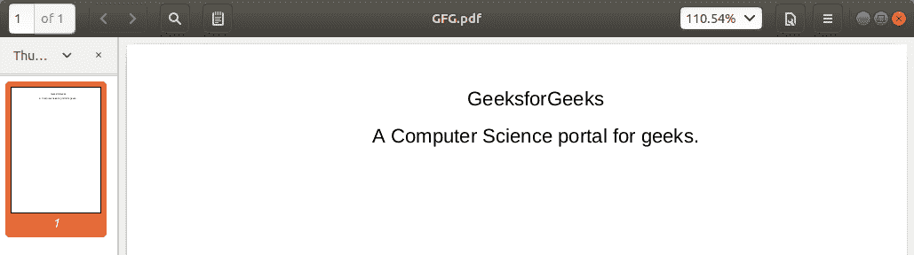

# 使用 Python 从 PDF 文件中提取文本

> 原文:[https://www . geesforgeks . org/extract-text-from-pdf-file-use-python/](https://www.geeksforgeeks.org/extract-text-from-pdf-file-using-python/)

你们都必须熟悉什么是 pdf。事实上，它们是最重要和使用最广泛的数字媒体之一。PDF 代表**便携文档格式**。它使用**。pdf** 扩展。它用于可靠地呈现和交换文档，独立于软件、硬件或操作系统。

## 从 PDF 文件中提取文本

Python 包 [PyPDF](https://www.geeksforgeeks.org/working-with-pdf-files-in-python/) 可以用来实现我们想要的(文本提取)，虽然它可以做的比我们需要的更多。这个包也可以用来生成、解密和合并 PDF 文件。

**注意:**更多信息请参考[使用 Python 中的 PDF 文件](https://www.geeksforgeeks.org/working-with-pdf-files-in-python/)

## 装置

要安装此软件包，请在终端中键入以下命令。

```
pip install PyPDF2
```

**示例:**

**输入 PDF:**



```
# importing required modules 
import PyPDF2 

# creating a pdf file object 
pdfFileObj = open('example.pdf', 'rb') 

# creating a pdf reader object 
pdfReader = PyPDF2.PdfFileReader(pdfFileObj) 

# printing number of pages in pdf file 
print(pdfReader.numPages) 

# creating a page object 
pageObj = pdfReader.getPage(0) 

# extracting text from page 
print(pageObj.extractText()) 

# closing the pdf file object 
pdfFileObj.close() 
```

**输出:**


让我们试着理解上面的代码:

*   ```
    pdfFileObj = open('example.pdf', 'rb')
    ```

    我们以二进制模式打开了**example.pdf**。并将文件对象保存为 **pdfFileObj** 。

*   ```
    pdfReader = PyPDF2.PdfFileReader(pdfFileObj)
    ```

    在这里，我们创建一个 PyPDF2 模块的**PDF reader**类的对象，并通过 pdf 文件对象&得到一个 pdf reader 对象。

*   ```
    print(pdfReader.numPages)
    ```

    **numPages** 属性给出 pdf 文件的页数。例如，在我们的例子中，它是 20(见输出的第一行)。

*   ```
    pageObj = pdfReader.getPage(0)
    ```

    现在，我们创建一个 PyPDF2 模块的**页面对象**类的对象。pdf 阅读器对象有一个函数 **getPage()** ，它以页码(从索引 0 开始)为参数，返回 Page 对象。

*   ```
    print(pageObj.extractText())
    ```

    Page 对象有功能 **extractText()** 从 pdf 页面提取文本。

*   ```
    pdfFileObj.close()
    ```

    最后，我们关闭 pdf 文件对象。