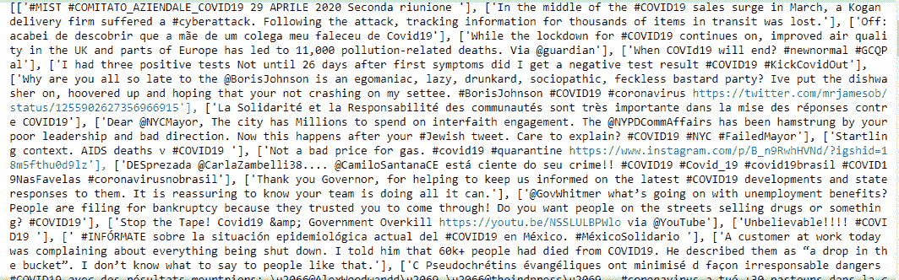

# 使用 GetOldTweets3

提取 Tweets

> 原文:[https://www . geesforgeks . org/extract-tweets-using-getoldtweets 3/](https://www.geeksforgeeks.org/extract-tweets-using-getoldtweets3/)

对于大多数文本挖掘或分类项目来说，提取推文是最重要的初始步骤之一。众所周知的方法是用 tweepy 提取推文，并在 twitter 中创建一个开发人员帐户。由于某些安全原因，推特需要近 15 天的时间来验证开发人员账户的制作过程。因此，使用这个 python 库使这个过程变得容易。使用这个库的另一个优点是推文是最近的推文。你可以收到前几个月甚至几周的推文。

**让我们用一个代码来更好地理解工作–**

*   **安装库 getoldtweets 3–**以下命令可以安装在 Jupyter 笔记本或任何命令提示符下。

```py
pip install GetOldTweets3

```

*   **指定所需的标签–**安装库后，它将与另一个变量一起导入。通过内置的方法**推文标准()**可以提到我们推文数据集中所需的规范。方法**设置查询搜索()**允许获取任何关于我们标签的推文

```py
import GetOldTweets3 as got

    gettweet = got.manager.TweetCriteria().setQuerySearch(hashtag) \ 
    #'\' is similar to ', in a sentence' i.e 
    used to separate

```

*   可以添加更多规格。有很多

```py
.setSince("2020-01-01") \
.setUntil("2020-05-01") \
.setMaxTweets(100)\
.setLocation("Pune")\
.setUsername("Raj")\...etc.

```

让我们看看完整的代码

## 蟒蛇 3

```py
import GetOldTweets3 as got

def extract_tweets(hashtag):

    gettweet= got.manager.TweetCriteria().setQuerySearch(hashtag) \
        .setSince("2020-01-01") \
        .setUntil("2020-05-01") \
        .setMaxTweets(100)

    # Creation of list that contains all tweets
    tweets = got.manager.TweetManager.getTweets(gettweet)

    # Creating list of chosen tweet data
    text_tweets = [[tweet.text] for tweet in tweets]
    print(text_tweets)

# calling the function
extract_tweets('COVID19')
```

**输出:**



gfg getldtweets 3

有些推文是不同语言的。人们可以使用 Python 的**翻译器()**功能将这些推文转换成不同的语言。