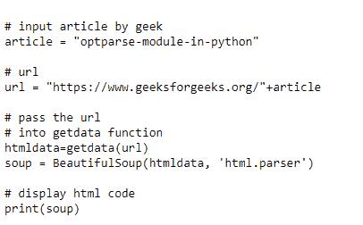

# 从极客博客文章中提取代码

> 原文:[https://www . geeksforgeeks . org/extracting-code-from-geeksforgeeks-article/](https://www.geeksforgeeks.org/extracting-code-from-geeksforgeeks-article/)

**先决条件:**

*   [bs4](https://www.geeksforgeeks.org/beautifulsoup-installation-python/)
*   [请求](https://www.geeksforgeeks.org/python-requests-tutorial/#:~:text=Python%20requests%20module%20has%20several,a%20client%20and%20a%20server.)

## **所需模块**

*   **requests-** Requests 可以让你极其轻松地发送 HTTP/1.1 请求。这个模块也没有内置 Python。要安装，只需在终端中键入给定的命令。

```
pip install requests
```

*   **bs4 :-** 美人汤(bs4)是一个从 HTML 和 XML 文件中拉出数据的 Python 库。这个模块没有内置 Python。要安装它，请在终端中键入给定的命令。

```
pip install bs4
```

**进场:**

*   导入模块
*   获取文章名称作为输入
*   向网址发起获取请求
*   废弃使用 bs4 编写的代码和语言名称

使用这个概念和给定的可以做很多事情，例如，您可以直接将每个代码保存在带有扩展名的单独文件中，或者您可以丢弃完整的文章并提取重要信息，如 writer details。

下面是实现。

## 蟒蛇 3

```
import requests
from bs4 import BeautifulSoup

# input  geeks for geeks article
article = 'extract-authors-information-from-geeksforgeeks-article-using-python'
index_Code = 3

# url
url = "https://www.geeksforgeeks.org/"+article

# Making a GET request
# to fetch article from
# geeksforgeeks servers
def getdata(url):
    r = requests.get(url)
    return r.text

def codescrapper(soup, article=None):
    codes_languages = soup.find_all('h2', class_='tabtitle')
    codes = soup.find_all("div", class_='code-container')
    count_codes_language = len(codes_languages)
    print(url)

    if article and article <= count_codes_language:
        print(codes[article-1].get_text())

    else:
        for x in range(count_codes_language):
            print(codes[x].get_text())

if __name__ == '__main__':

    complete_article_html = getdata(url)
    soup = BeautifulSoup(complete_article_html, 'html.parser')
    codescrapper(soup, index_Code)
```

**输出:**

