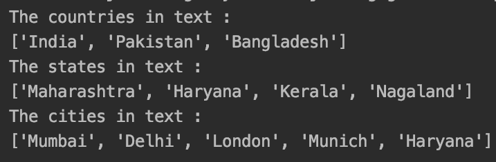
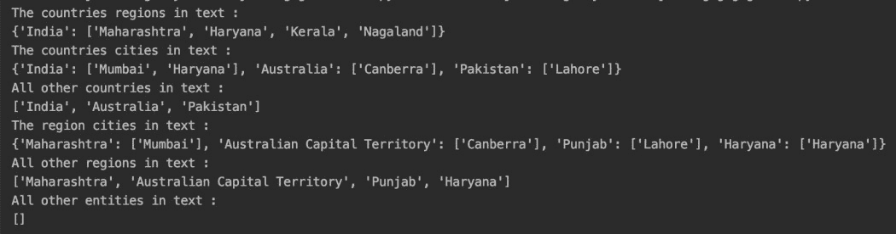

# 使用 Python 从文本中提取位置

> 原文:[https://www . geeksforgeeks . org/extracting-locations-from-text-using-python/](https://www.geeksforgeeks.org/extracting-locations-from-text-using-python/)

在本文中，我们将看到如何使用 Python 从文本中提取位置。

在处理文本时，要求可以是在接收到的文本中检测城市、地区、州和国家以及它们之间的关系。这对地理研究非常有用。在本文中，我们将使用 **locationtagger** 库。

需要一些基于语法的规则和统计建模方法的文本挖掘通常使用[**【NER(命名属性识别)**](https://www.geeksforgeeks.org/named-entity-recognition/) 算法进行。从 NER 提取的实体可以是个人、地点、组织或产品的名称。locationtagger 库是从所有其他实体中进一步标记和过滤位置的副产品。

### **安装:**

要安装此模块，请在终端中键入以下命令。

```
pip install locationtagger
```

安装后，需要使用代码下载一些 nltk 模块。

## 蟒蛇 3

```
import nltk
import spacy

# essential entity models downloads
nltk.downloader.download('maxent_ne_chunker')
nltk.downloader.download('words')
nltk.downloader.download('treebank')
nltk.downloader.download('maxent_treebank_pos_tagger')
nltk.downloader.download('punkt')
nltk.download('averaged_perceptron_tagger')
```

**同样来自命令行:**

```
python -m spacy download en_core_web_sm
```

**例 1:从文本中打印国家、城市和地区。**

可以使用各种功能从文本中获取城市、国家、地区等。

**使用的功能:**

*   **location tagger . find _ location(文本):**返回带有位置信息的实体。“文本”参数将文本作为输入。
*   **实体.国家:**提取文本中的所有国家。
*   **entity.regions :** 提取文本中的所有状态。
*   **实体.城市:**提取文本中的所有城市。

**代码:**

## 蟒蛇 3

```
import locationtagger

# initializing sample text
sample_text = "India has very rich and vivid culture\
       widely spread from Kerala to Nagaland to Haryana to Maharashtra. " \
       "Delhi being capital with Mumbai financial capital.\
       Can be said better than some western cities such as " \
       " Munich, London etc. Pakistan and Bangladesh share its borders"

# extracting entities.
place_entity = locationtagger.find_locations(text = sample_text)

# getting all countries
print("The countries in text : ")
print(place_entity.countries)

# getting all states
print("The states in text : ")
print(place_entity.regions)

# getting all cities
print("The cities in text : ")
print(place_entity.cities)
```

**输出:**



**例 2:提取位置关系**

在这个例子中，讨论了各种函数，它们执行获取城市、地区和州之间的相互关系的任务。

**使用的功能:**

*   **entity.country_regions :** 提取文本中区域所在的国家。
*   **entity . country _ city:**提取文本中找到城市的国家。
*   **entity . other _ country**:提取文本中存在区域或城市的所有国家列表。
*   **entity . region _ city:**提取文本中有城市的区域。
*   **entity.other_regions :** 提取文本中存在城市的所有区域列表。
*   **entity.other :** 所有未被识别为地名的实体，都被提取到此。

## 蟒蛇 3

```
import locationtagger

# initializing sample text
sample_text = "India has very rich and vivid culture widely\
        spread from Kerala to Nagaland to Haryana to Maharashtra. " \
       "Mumbai being financial capital can be said better\
       than some western cities such as " \
       " Lahore, Canberra etc. Pakistan and Nepal share its borders"

# extracting entities.
place_entity = locationtagger.find_locations(text = sample_text)

# getting all country regions
print("The countries regions in text : ")
print(place_entity.country_regions)

# getting all country cities
print("The countries cities in text : ")
print(place_entity.country_cities)

# getting all other countries
print("All other countries in text : ")
print(place_entity.other_countries)

# getting all region cities
print("The region cities in text : ")
print(place_entity.region_cities)

# getting all other regions
print("All other regions in text : ")
print(place_entity.other_regions)

# getting all other entities
print("All other entities in text : ")
print(place_entity.other)
```

**输出:**

