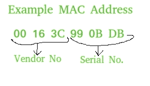

# 使用 Python 提取 MAC 地址

> 原文:[https://www . geesforgeks . org/extracting-MAC-address-use-python/](https://www.geeksforgeeks.org/extracting-mac-address-using-python/)

媒体访问控制地址也称为物理地址，是分配给计算机网卡的唯一标识符。网卡有助于计算机与网络中其他计算机的连接。媒体访问控制地址对所有网卡都是唯一的。

**媒体访问控制地址的使用:**

*   在 IP 地址经常变化的地方很有用。帮助网络管理。获取有关网络流量的信息。
*   帮助我们配置哪些计算机可以连接到我们的计算机。通过这种方式，我们可以过滤潜在的垃圾邮件/病毒攻击。
*   有助于从世界各地的其他计算机中唯一识别计算机。



本文旨在利用 Python 提取计算机的媒体访问控制地址。

方法一:使用 mac 模块
为了获取设备的物理地址，我们使用了 Python 的 getmac 模块。

```
>>>from getmac import get_mac_address as gma
>>>print(gma())
'3c:7e:94:8f:d0:34'
```

**方法二:使用 uuid.getnode()**

getnode()可用于提取计算机的 MAC 地址。该功能在 **uuid** 模块中定义。
下面给出的示例代码显示了如何使用 uuid1()函数为给定主机生成 UUID，由其 MAC 地址标识。

```
# Python Program to compute
# MAC address of host
# using UUID module

import uuid

# printing the value of unique MAC
# address using uuid and getnode() function 
print (hex(uuid.getnode()))
```

输出:

```
0x163e990bdb

```

**缺点:**

*   明显的缺点是输出不是格式化的形式。

**方法 3:使用 getnode() + format()** 【为了更好的格式化】

```
# Python 3 code to print MAC
# in formatted way.

import uuid

# joins elements of getnode() after each 2 digits.

print ("The MAC address in formatted way is : ", end="")
print (':'.join(['{:02x}'.format((uuid.getnode() >> ele) & 0xff)
for ele in range(0,8*6,8)][::-1]))
```

输出:

```
The MAC address in formatted way is : 00:16:3e:99:0b:db

```

**缺点:**

*   这段代码看起来很复杂。

**方法四:使用 getnode() + findall() + re()** 【降低复杂度】

```
# Python 3 code to print MAC
# in formatted way and easier
# to understand

import re, uuid

# joins elements of getnode() after each 2 digits.
# using regex expression
print ("The MAC address in formatted and less complex way is : ", end="")
print (':'.join(re.findall('..', '%012x' % uuid.getnode())))
```

输出:

```
The MAC address in formatted and less complex way is : 00:16:3e:99:0b:db

```