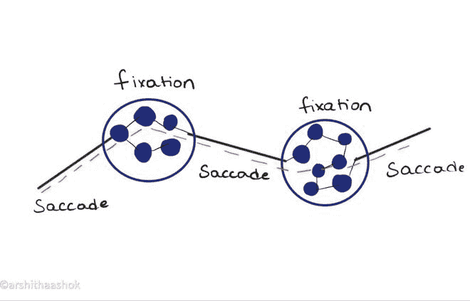
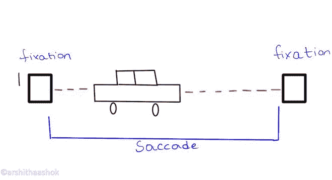

# 眼睛跟踪指标–机器学习

> 原文:[https://www . geesforgeks . org/eye-tracking-metrics-machine-learning/](https://www.geeksforgeeks.org/eye-tracking-metrics-machine-learning/)

眼球追踪是研究者们追捧的一个重要且必不可少的领域。眼球追踪也是一个新兴的领域，它有它的好处，并且有多种用途。

***注视和扫视*** 是眼睛跟踪中使用的两个基本的眼球运动组件。

*   扫视是注视之间快速或即时的眼球运动，将目光从一个位置移动到另一个位置。
*   注视是两次扫视之间的一个点，在此期间，眼睛在分开的时间内不移动，是静止的。
*   视觉输入发生在注视过程中，因为眼睛会在同一空间停留一段时间而不会移动。

<center>
</center>

### 固定:

注视是凝视对象最常见的特征，眼睛跟踪研究人员经常分析这一特征，以得出他们有兴趣进行深入和严格研究的认知过程或状态的结论。注视是指我们的眼睛基本上停下来或停下来检查它正在看的场景。眼睛的中央小凹视觉在一个地方暂停，这样视觉系统就可以消耗关于前面场景的详细信息。凝视本质上是一种属性，是由凝视点建立起来的。

凝视点在技术上告诉我们眼睛在任何给定的时间看什么。即

> 考虑一个眼睛跟踪器将收集大约 80 Hz 采样率的数据，我们将以每秒 80 个单独的注视点结束，并且每 12.5 毫秒报告一个注视点。
> 
> **即 1 秒= 1000 毫秒**
> 
> 因为我们有 80 个凝视点
> 
> **1000 毫秒/ 80 = 12.5 毫秒**

当一个序列或一系列注视点在时间或空间上彼此非常接近时，它们形成一束被称为**注视簇、**的注视点，并且该注视簇构成注视。

注视是由非常微小和缓慢的眼睛手势(也称为微扫视)组成的，这有助于眼睛与目标对齐，避免感知衰退(注视眼球运动)

因此，注视是衡量视觉注意力的最佳和最有价值的方法。

### 扫视:

扫视是我们的眼睛(中央凹)从一个兴趣点快速移动到另一个兴趣点的眼球运动。由于我们的眼球在迅速扫视时移动如此之快，视网膜读取的图像质量很差，接收到的信息也很模糊。扫视也是我们的视网膜保持其输入分辨率的一种方式。我们的眼睛无法理解它所看到的清晰描述。因此，我们可以说，通过眼睛输入信息主要发生在注视过程中。

扫视可以是非强制性的，也可以是强制性的，而且两个眼睛都向同一个方向移动。扫视并不总是线性发生的。

### 为什么我们需要计算扫视？

*   扫视计算在医学领域是一个福音，因为它有助于诊断许多与运动相关的疾病
*   随着眼动跟踪技术的发展，通过检测扫视速度后的扫视异常，可以发现许多低动和高动障碍。
*   通过水平和垂直扫视的检测，也可以检测到帕金森、进行性核上性麻痹等疾病。
*   在接下来的日子里，它还可以用于市场研究领域，通过发现潜在用户在网上购买商品或在线阅读文章时，主要盯着屏幕的地方。

### 如何计算扫视速度？

为了让我们知道我们的眼睛到底在看什么，

*   首先，在眼睛跟踪设备或网络摄像机的帮助下，我们检测眼睛，并在给定时间将注视点定位为(x，y)坐标。
*   在此之后，我们可以使用许多方法来检测扫视速度，例如 Sav-Golay 滤波器、简单的样本间差异、保持扫视峰值的 1D 双边滤波器。
*   简单来说就是像 Matlab 中的 GRADIENT 这样的两点中心差分。

此外，我们还可以使用最小二乘法，通过在一系列(x，y)点上的*扫视模型*算法，从 python 中跟踪的注视点中找到扫视反应时间和扫视持续时间。

**1)通过 pip 命令**安装 saccademodel

```py
pip install saccademodel
```

**2)导入眼跳模型并喂入眼点。**

## 蟒蛇 3

```py
# loading libraries
import saccademodel

input_eye_points = [[130.012, 404.231],
                    [129.234, 403.478],
                    [None, None],
                    [133.983, 450.044]]

# training the model
results = saccademodel.fit(input_eye_points)
print(results)
```

#### 输出:

```py
{'source_points': [[130.012, 404.231], [129.234, 403.478]],
 'saccade_points': [[129.234, 403.478], [133.983, 450.044]], 
'target_points': [], 
'mean_squared_error': 71.36571893749988}
```

3)现在，如果我们知道帧速率，我们可以通过以下方式将长度转换为秒来计算扫视反应时间和扫视持续时间:

## 蟒蛇 3

```py
# Number of samples per second

framerate = 80.0  
saccadic_reaction_time = len(results.source_points) / framerate
saccade_duration = len(results.saccade_points) / framerate
```

### 结论:

综上所述，假设我们在同一条路上看着一辆汽车启动并到达一个目标，启动和目标变成了注视，在这两者之间跟随汽车的眼球运动变成了扫视。

<center>
</center>