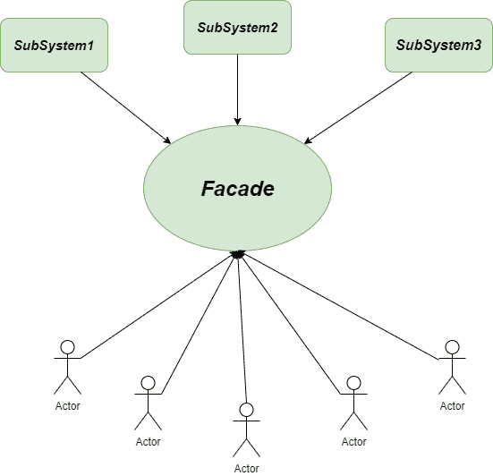
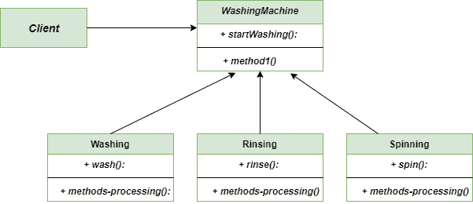

# 立面方法–Python 设计模式

> 原文:[https://www . geesforgeks . org/facade-method-python-design-patterns/](https://www.geeksforgeeks.org/facade-method-python-design-patterns/)

Facade Method 是一种 [**结构设计模式**](https://www.geeksforgeeks.org/design-patterns-set-1-introduction/) ，它为更复杂的系统提供了更简单的统一接口。单词 **Facade** 指的是一个建筑的表面，特别是一个复杂系统的外部界面，由几个子系统组成。是**四人帮**设计模式必不可少的一部分。通过提供单一入口点，它提供了一种更简单的方法来访问底层系统的方法。

在这里，我们创建了一个 Facade 层，它有助于与子系统轻松地进行客户端通信。



立面-方法

### 不使用外观方法的问题

想象一下，我们有一台洗衣机，它可以洗衣服、漂洗衣服和旋转衣服，但所有的任务都是分开的。由于整个系统相当复杂，我们需要抽象出子系统的复杂性。我们需要一个能够在没有我们干扰的情况下自动完成整个任务的系统。

### 使用外观方法的解决方案

为了解决上述问题，我们想雇佣门面方法。它将帮助我们隐藏或抽象子系统的复杂性，如下所示。

下面的代码是使用 Facade 方法编写的

## 蟒蛇 3

```
"""Facade pattern with an example of WashingMachine"""

class Washing:
    '''Subsystem # 1'''

    def wash(self):
        print("Washing...")

class Rinsing:
    '''Subsystem # 2'''

    def rinse(self):
        print("Rinsing...")

class Spinning:
    '''Subsystem # 3'''

    def spin(self):
        print("Spinning...")

class WashingMachine:
    '''Facade'''

    def __init__(self):
        self.washing = Washing()
        self.rinsing = Rinsing()
        self.spinning = Spinning()

    def startWashing(self):
        self.washing.wash()
        self.rinsing.rinse()
        self.spinning.spin()

""" main method """
if __name__ == "__main__":

    washingMachine = WashingMachine()
    washingMachine.startWashing()
```

### 外观方法的类图

以下是门面方法的类图:



外观-方法-类图

### 优势

*   **隔离:**我们可以很容易地将代码与子系统的复杂性隔离开来。
*   **测试过程:**使用**门面方法**使测试过程相对容易，因为它对于常见的测试任务有方便的方法。
*   **松耦合:**客户端和子系统之间松耦合的可用性。

### 不足之处

*   **方法的变化:**我们知道在 **Facade 方法**中，后续的方法都是附加到 Facade 层的，后续方法的任何变化都可能带来 Facade 层的变化，这是不利的。
*   **昂贵的过程:**为了系统的可靠性，在应用中建立 Facade 方法并不便宜。
*   **违规:**总有违反外立面层施工的恐惧。

### 适应性

*   **提供简单的界面:****Facade 方法**最重要的一个应用就是，只要你想为复杂的子系统提供简单的界面，它就会被用到
*   **分层:**当我们想要通过将一个子系统分层来为其提供一个独特的结构时，就会用到它。它还会导致客户端和子系统之间的松散耦合。

**进一步阅读–**[爪哇立面法](https://www.geeksforgeeks.org/facade-design-pattern-introduction/)