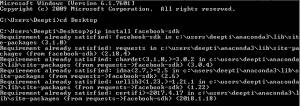
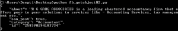
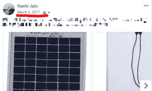
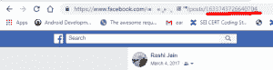
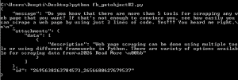
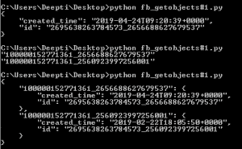
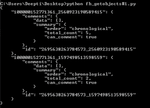

# 脸书原料药|第二套

> 原文:[https://www.geeksforgeeks.org/facebook-api-set-2/](https://www.geeksforgeeks.org/facebook-api-set-2/)

先决条件–[脸书原料药|第 1 套](https://www.geeksforgeeks.org/facebook-api-set-1/)

在本文中，我们将讨论 Python 平台的脸书应用编程接口的实现细节。让我们从下载 Python 的脸书客户端开始。使用以下 python 命令下载脸书客户端-

```py
pip install facebook-sdk 
```

成功下载后，您将看到如下屏幕-


现在，让我们从 Python Facebook 模块提供的方法开始。我们将在本文中讨论以下方法–

1.  get_object
2.  getobject

### 获取对象:

该方法返回的信息为与对象标识确定的对象相关联的**字典**。

> **参数:**
> **标识:**特定对象的唯一标识字符串。
> **参数(可选):**agr 将作为查询参数传递。

**示例#1:**

Get details about the user (In this case, we are using ‘me’ parameter to display details from my account only).

```py
import json
import facebook

def main():
    token = "Please replace this line with your access token"
    graph = facebook.GraphAPI(token)
    profile = graph.get_object('me', fields ='first_name, gender, birthday, email') 

    # return desired fields
    print(json.dumps(profile, indent = 4))

if __name__ == '__main__':
    main()
```


**示例#2:**
获取页面的详细信息(用户是该页面的管理员还是有权管理该页面)。在继续之前，让我们先看看如何确定页面标识。请遵循以下步骤:

1.  单击右侧的向下箭头，导航到要确定页面标识的页面。
    
2.  单击页面名称转到该页面。
3.  单击页面简介图片下方页面左侧的查看更多选项。点击后会看到选项【关于】
    
4.  点击“关于”选项。您将看到页面的详细信息。向下滚动到底部，您将找到您的页面标识。

现在转到 Python 代码，找出页面的细节。

```py
import json
import facebook

def main():
    token = "Please replace this line with your access token"
    graph = facebook.GraphAPI(token)
    page = graph.get_object(id ='PAGEID', fields ='about, can_post, category')

    # return desired fields
    print(json.dumps(page, indent = 4))

if __name__ == '__main__':
    main()
```

此代码打印页面的基本信息(关于)、请求用户是否被允许在此页面上发布任何内容(can_post)以及页面的类别(类别)。您可以从[页面参考](https://developers.facebook.com/docs/graph-api/reference/page)获得字段的完整列表



**示例#3:** 获取帖子的详细信息:消息和附件

让我们首先按照下面的步骤找到脸书邮报的帖子标识。

1.  在任何帖子上，单击用户名下面提到的日期和时间。
    
2.  帖子将在新标签页中打开。
3.  最后一个斜线(“/”)后最后一位的数字构成你的帖子 ID。
    

按照以下步骤查找用户标识。

1.  转到您的个人资料页面，右键单击您的个人资料图片。选择选项“复制链接地址”
2.  打开记事本，按 Ctrl+V 或右键，选择粘贴选项。
3.  将粘贴一个网址。在“referrer_profile_id”后面的末尾提到了用户 ID。

    ```py
    https://www.facebook.com/photo.php?fbid=913492355516001&set=a.187231114642052&type=3&source=11&referrer_profile_id=100000677755756
    ```

查找帖子详细信息的代码。

```py
import json
import facebook

def main():
    token = "Please replace this line with your access token"
    graph = facebook.GraphAPI(token)
    post = graph.get_object(id ='USERID_POSTID', fields ='message, attachments{description}')
    # return desired fields
    print(json.dumps(post, indent = 4))

if __name__ == '__main__':
    main()
```



您可以从[帖子参考](https://developers.facebook.com/docs/graph-api/reference/v3.3/post)获得字段的完整列表。

### get_objects:

该方法将脸书社交媒体图中的所有对象作为**字典**返回。字段列表中提到的每个标识都映射到一个对象。

> **参数:**
> **id:**包含多个对象/资源的 id 的列表
> **参数:**这是可选的，如果提到需要作为查询参数传递。

**示例#1:** 获取两个不同帖子的创建时间。

```py
import json
import facebook

def main():
    token = "Please replace this line with your access token"
    graph = facebook.GraphAPI(token)
    post_ids =["USERID_POSTID# 1", "USERID_POSTID# 2"]
    posts = graph.get_objects(ids = post_ids, fields ='created_time')

    # print creation time of the two posts.
    print(json.dumps(posts, indent = 4))

if __name__ == '__main__':
    main()
```



**示例#2:** 获取两张不同照片的评论数。

按照以下步骤找到脸书的照片 ID。

1.  单击您想要识别照片标识的脸书照片。
2.  在网址区找到“photo.php”。
3.  在网址的“photo.php”部分后面查找“fbid”后跟一个数字。
4.  出现在“fbid”标签和“&”符号之间的数字是照片 id 号。

```py
import json
import facebook

def main():
    token = "Please replace this line with your access token"
    graph = facebook.GraphAPI(token)
    photo_ids =["USERID_PHOTOID# 1", "USERID_PHOTOID# 2"]
    photos = graph.get_objects(ids = photo_ids, fields ='comments.summary(true)')

    # print total comment count for each photo
    print(json.dumps(photos, indent = 4))

if __name__ == '__main__':
    main()
```



**参考文献:**

1.  https://facebook-sdk.readthedocs.io/en/latest/api.html
2.  https://developers.facebook.com/docs/graph-api/reference