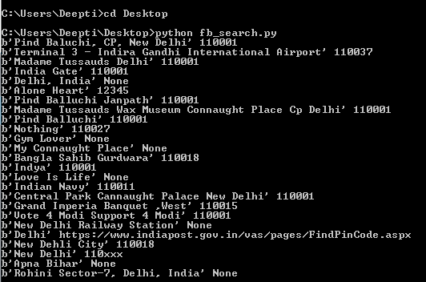
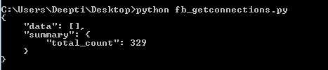
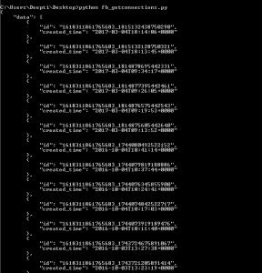
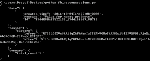
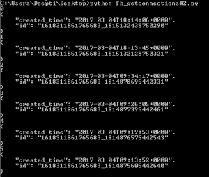

# 脸书原料药|第 3 套

> 原文:[https://www.geeksforgeeks.org/facebook-api-set-3/](https://www.geeksforgeeks.org/facebook-api-set-3/)

前提条件:脸书 API | [集-1](https://www.geeksforgeeks.org/facebook-api-set-1/) 、[集-2](https://www.geeksforgeeks.org/facebook-api-set-2/)

在本文中，我们将讨论三种方法:

1.  搜索
2.  获取连接
3.  get_allconnections

## `search` 方法:

有效值类型是 place 和 placetopic。

> **参数:**
> **id:** 是包含有效值的字符串。
> **参数:**这是可选的，它们需要传递一个查询参数。

**示例:**获取德里干诺坊附近所有地方的详细信息。康诺特广场的经纬度为–28.6304，77.2177

```py
import json
import facebook

def main():
    token = "Please replace with your access token"
    graph = facebook.GraphAPI(token)

    places = graph.search(type ='place', center ='28.6304, 77.2177', 
                                            fields ='name, location')

    for place in places['data']:
        print('%s %s' %(place['name'].encode(), place['location'].get('zip')))

if __name__ == '__main__':
    main()
```



可以使用的字段完整列表请参考链接[搜索参考](https://developers.facebook.com/docs/graph-api/reference/place)。

## `get_connections` 方法:

这些方法旨在返回所有连接，或者我们可以将所提到的对象的边称为 **dict** 。

> **参数:**
> **id:** 一个字符串，指定问题资源的唯一 id。
> **连接名称:**指定对象之间的连接或边的字符串。

如果连接名称参数留空，则`get_connections` 方法将简单地返回认证用户的基本信息。

**示例#1:** 我们想找出活跃用户的好友总数。

```py
import json
import facebook

def main():
    token = "Please replace this with your access token"
    graph = facebook.GraphAPI(token)
    friends = graph.get_connections(id ='me', connection_name ='friends')
    print(json.dumps(friends, indent = 4))

if __name__ == '__main__':
    main()
```



**示例#2:** 我们想要从一个页面获取所有帖子的列表。为此，我们将使用 get_connections，稍后，我们将演示如何使用`get_all_connections` 方法。

```py
import json
import facebook

def main():
    token = "Please replace this with your PAGE Access Token"
    graph = facebook.GraphAPI(token)
    posts_25 = graph.get_connections(id ='PAGE_ID', connection_name ='posts',
                                                  fields ='id, created_time')

    print(json.dumps(posts_25, indent = 4))

if __name__ == '__main__':
    main() 
```



**注意:**本例默认打印最新 25 篇帖子。您可以使用 limit(…)为帖子添加过滤器，以设置帖子数量的限制。

**示例#3:** 在本例中，我们将使用 get_connections 方法按`reverse_chronological` 顺序打印帖子的所有评论，显示包括隐藏评论在内的子评论，并显示评论的总数。

```py
import json
import facebook

def main():
    token = "Please replace this with your PAGE Access Token"
    graph = facebook.GraphAPI(token)
    posts_25 = graph.get_connections(id ='POST_ID', connection_name ='comments', 
                                     include_hidden = True, order ='reverse_chronological',
                                     filter ='stream', summary ='total_count')

    print(json.dumps(posts_25, indent = 4))

if __name__ == '__main__':
    main() 
```



## `get_all_connections` 方法:

遍历 get_connections 调用返回的所有页面，并生成各个项目。

> **参数:**
> **id:** 一个字符串，指定问题资源的唯一 id。
> **连接名称:**指定对象之间的连接或边的字符串。

**示例#1:** 在此示例中，我使用 get_all_connections 列出了使用自日期时间参数列出的页面中的所有帖子。

```py
import json
import facebook
from datetime import datetime

def main():
    token = "Please replace this with your PAGE Access Token"
    graph = facebook.GraphAPI(token)
    posts_all = graph.get_all_connections(id ='PAGE_ID', connection_name ='posts',
                                           fields ='created_time, id',
                                           since = datetime(2017, 1, 1, 0, 0, 0))

    for ind, post in enumerate(posts_all):
     print(json.dumps(ind, indent = 4))
     print(json.dumps(post, indent = 4))

if __name__ == '__main__':
    main()
```



**参考文献:**

1.  https://developers.facebook.com/docs/marketing-api/insights/parameters
2.  https://developers.facebook.com/docs/graph-api/