# face net–使用面部识别系统

> 原文:[https://www . geesforgeks . org/face net-使用-面部识别-系统/](https://www.geeksforgeeks.org/facenet-using-facial-recognition-system/)

FaceNet 是 Google Researchers 在 2015 年发表的名为 *FaceNet:人脸识别和聚类的统一嵌入*的论文中提出的人脸识别系统的名称。它在许多基准人脸识别数据集上取得了最先进的结果，如野生标签人脸(LFW)和 Youtube 人脸数据库。
他们提出了一种方法，利用 ZF 网络和盗梦空间等深度学习架构，从图像中生成高质量的人脸映射。然后用一种叫做**三重损失**的方法作为损失函数来训练这个架构。让我们更详细地看看架构。

**建筑:**

[](https://media.geeksforgeeks.org/wp-content/uploads/20200320203921/deep-learning-architecture.png)

FaceNet 架构

FaceNet 在其架构中采用端到端学习。它使用 ZF 网络或初始作为其底层架构。它还增加了几个 *1*1* 卷积来减少参数的数量。这些深度学习模型输出图像的嵌入 *f(x)* ，对其执行 *L <sub>2</sub>* 归一化。这些嵌入然后被传递到损失函数来计算损失。该损失函数的目标是使两个图像嵌入之间的平方距离与图像条件无关，并且相同身份的姿态较小，而不同身份的两个图像之间的平方距离较大。因此使用了一个新的损耗函数**三重损耗**。在我们的体系结构中使用三元组损失的想法是，它使模型在不同身份的面之间强制一个余量。

**三联体丢失:**
图像的嵌入用 *f(x)* 表示，如 *x* 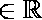。这种嵌入是以尺寸矢量 *128* 的形式进行的，并且被归一化为

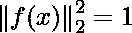

我们要确保主播形象 *(*

```
*** QuickLaTeX cannot compile formula:

*** Error message:
Error: Nothing to show, formula is empty

```

*)* 一个人更接近正面形象 *(*

```
*** QuickLaTeX cannot compile formula:

*** Error message:
Error: Nothing to show, formula is empty

```

*)* (同一个人的图像)与负面图像 *(*

```
*** QuickLaTeX cannot compile formula:

*** Error message:
Error: Nothing to show, formula is empty

```

*)* (另一个人的图像)这样:

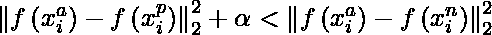

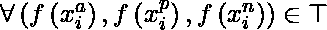

其中是强制区分正负对的边距，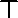是图像空间。
因此损失函数定义如下:

![L = \sum_{i}^{N}\left [ \left \| f\left ( x_i^a \right ) - f\left ( x_i^p \right ) \right \|_{2}^{2} - \left \| f\left ( x_i^a \right ) - f\left ( x_i^n \right ) \right \|_{2}^{2} +\alpha \right ]  ](img/968828406949968ea6ac8f362ab9a3ad.png "Rendered by QuickLaTeX.com")

如果三胞胎很容易满足上述属性，那么它将无助于训练，所以有违反上述等式的三胞胎很重要。

**三胞胎选择:**
为了保证更快的学习，我们需要取违反上式的三胞胎。这意味着对于给定的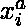我们需要选择三胎，使得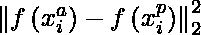最大，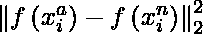最小。基于整个训练集生成三元组在计算上很昂贵。有两种生成三胞胎的方法。

*   基于之前的检查点在每一步生成三元组，并计算数据子集的最小值和最大值
    。
*   通过在小批量上使用最小值和最大值来选择硬阳性(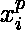)和硬阴性()。

[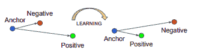](https://media.geeksforgeeks.org/wp-content/uploads/20200323224943/triplet-loss.png)

三重缺失与学习

**训练:**
这个模型是使用随机梯度下降(SGD)和 AdaGrad 进行训练的。该模型在中央处理器集群上训练 *1k-2k 小时*。在 500 小时的训练后，观察到了损失的稳定下降(和准确性的提高)。该模型使用两个网络进行训练:

*   **ZF-Net:**
    下图显示了该架构中使用的 ZF-Net 的不同层及其内存需求:

[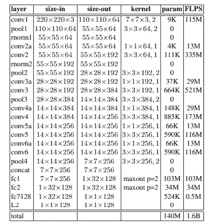](https://media.geeksforgeeks.org/wp-content/uploads/20200323221619/zf-net-in-facenet.png)

FaceNet 中的 ZF 网络体系结构

*   正如我们注意到的，架构中有*1.4 亿个*参数，训练这个模型需要 16 亿个 FLOPS 内存。

*   **盗梦空间:**
    下图显示了该架构中使用的不同层的盗梦空间模型及其内存需求:

[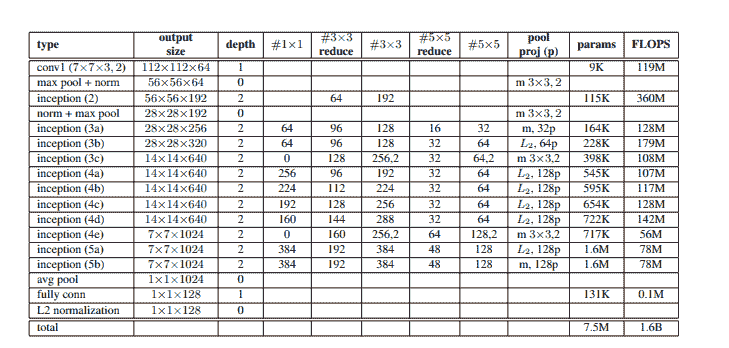](https://media.geeksforgeeks.org/wp-content/uploads/20200323224320/Inception.png)

FaceNet 中使用的初始架构

*   正如我们注意到的，架构中只有*750 万个*参数，但是需要 16 亿个 FLOPS 内存来训练这个模型(类似于 ZF-Net)。

**结果:**
该模型在野外标注人脸和 Youtube 人脸 DB 数据集上使用了 4 种不同类型的架构。

*   **野生数据集中的标记人脸:**
    该架构在 LFW 数据集上使用*标准、非限制性协议*。首先，该模型使用 9 次训练分割来设置 *L <sub>2</sub>* 距离阈值，然后在第 10 次分割时，将两幅图像分类为*相同*或*不同*。
    有两种预处理方法可以报告数据集中图像的精度:
    *   LFW 提供的图像的固定中心裁剪
    *   在 LFW 图像上使用人脸检测器，如果失败，则使用 LFW 人脸对齐

该模型以 0.15%的标准误差达到了 98.87% 的分类精度，在第二种情况下以 0.09% 的标准误差达到了 99.63% 的分类精度。这使得 *DeepFace* 报告的错误率比 *7* 和其他最先进的 DeepId 降低了 *30%* 倍以上。

*   **Youtube 人脸数据库:**
    在 Youtube 人脸数据集上，使用前 100 帧，其报告的准确率为 *95.12%* ，标准误差为 *0.39* 。在 100 帧上优于 DeepFace 提出的 *91.4%* 精度和 DeepId 报告的 *93.5%*

[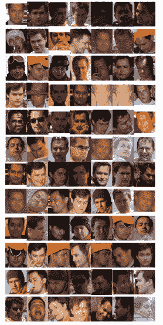](https://media.geeksforgeeks.org/wp-content/uploads/20200324024500/Face-Clustering-using-FaceNet.png)

基于 FaceNet 的人脸聚类

来自 FaceNet 论文的**人脸聚类**(对同一个人的图像进行聚类)的结果表明，该模型对遮挡、姿态、光照甚至年龄等都是不变的。

**参考文献:**

*   [**FaceNet 论文**](https://arxiv.org/pdf/1503.03832.pdf)