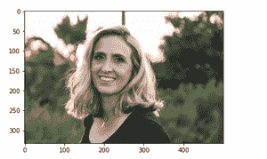
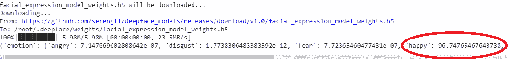

# 使用 Python 中的 Deepface 模块进行面部表情检测

> 原文:[https://www . geesforgeks . org/面部表情-检测-使用-深度面部-python 中的模块/](https://www.geeksforgeeks.org/facial-expression-detection-using-deepface-module-in-python/)

在本文中，我们将使用 python 中的 OpenCV、Deepface 和 matplotlib 模块来检测已经存在的图像的面部表情。

## 需要模块

*   **OpenCV:** OpenCV 是 python 中的开源库，用于计算机视觉、机器学习和图像处理。
*   **Matplotlib:** Matplotlib 是一个全面的库，用于在 Python 中创建静态、动画和交互式可视化。
*   **Deepface:** Deepface 是由脸书的一个人工智能研究小组建造的。它是 python 中用于面部识别和属性分析的框架。Deepface 的核心库组件用于 Keras 和 TensorFlow。

```
pip install deepface
```

这是最基本的表情检测技术，有几种方法可以检测面部表情。

## 逐步实施

**步骤 1:** 导入所需模块。

## 蟒蛇 3

```
#import the required modules
import cv2
import matplotlib.pyplot as plt
from deepface import DeepFace
```

**第二步:**复制要进行表情检测的图片路径，使用 cv2 中的“imread()”方法读取图像，在括号内提供路径。imread()从文件中读取图像并将其存储在数组中。然后使用 matplotlib 的 imshow()方法。imshow()方法将数据转换为图像。现在使用 show 方法绘制图像，以确保图像已正确导入。

## 蟒蛇 3

```
# read image
img = cv2.imread('img1.jpg')

# call imshow() using plt object
plt.imshow(img[:, :, : : -1])

# display that image
plt.show()
```

**输出:**



输出图像

**步骤 3:** 创建一个结果变量，用于存储结果。使用 Deepface analyze()方法，Deepface analyze()方法包含很强的面部属性分析特征，如年龄、性别、面部表情。面部表情包括愤怒、恐惧、中立、悲伤、厌恶、高兴和惊讶。打印结果。结果显示该人的面部表情百分比。

## 蟒蛇 3

```
# storing the result
result = DeepFace.analyze(img,
                          actions = ['emotion'])

# print result
print(result)
```

**输出:**



结果显示那个人有 96%的快乐。

下面是完整的实现:

## 蟒蛇 3

```
# import the required modules
import cv2
import matplotlib.pyplot as plt
from deepface import DeepFace

# read image
img = cv2.imread('img.jpg')

# call imshow() using plt object
plt.imshow(img[:,:,::-1])

# display that image
plt.show()

# storing the result
result = DeepFace.analyze(img,actions=['emotion'])

# print result
print(result)
```

**输出:**

