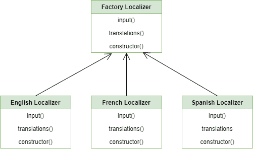
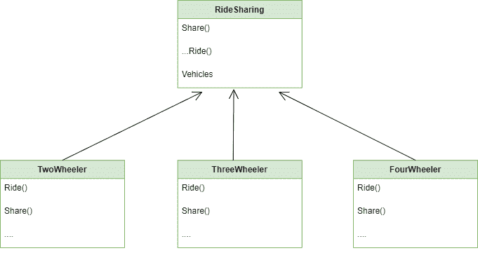

# 工厂方法–Python 设计模式

> 原文:[https://www . geesforgeks . org/factory-method-python-design-patterns/](https://www.geeksforgeeks.org/factory-method-python-design-patterns/)

工厂方法是一种[创造性设计模式](https://www.geeksforgeeks.org/design-patterns-set-1-introduction/)，它允许一个接口或一个类创建一个对象，但允许子类决定实例化哪个类或对象。使用工厂方法，我们有创建对象的最佳方法。这里，创建对象时没有向客户端公开逻辑，对于创建新类型的对象，客户端使用相同的公共接口。

### 没有工厂方法我们面临的问题:

想象一下，你有自己的创业公司，在全国不同的地方提供乘车服务。该应用的初始版本只提供两轮车骑行，但久而久之，你的应用变得流行，现在你想添加三轮和四轮车骑行也。
这是一个好消息！但是你创业公司的软件开发人员呢？他们必须更改整个代码，因为现在大部分代码都与 Two-Wheeler 类相关联，开发人员必须对整个代码库进行更改。
完成所有这些更改后，要么开发人员以凌乱的代码结束，要么以辞职信结束。


本地化应用程序

**不使用工厂方法的问题图示**

让我们再举一个与不同语言的翻译和本地化相关的例子来理解这个概念。
假设我们已经创建了一个应用程序，其主要目的是将一种语言翻译成另一种语言，目前我们的应用程序仅适用于 10 种语言。现在我们的应用程序已经在人们中广泛流行，但需求突然增长，包括 5 种以上的语言。
这是一个好消息！只为业主，不为开发商。他们必须更改整个代码，因为现在大部分代码只与现有的语言相结合，这就是为什么开发人员必须对整个代码库进行更改，这确实是一项困难的任务。
让我们看看不使用工厂方法可能会遇到的问题的代码。

**注意:**以下代码是在没有使用 Factory 方法的情况下编写的。

## 蟒蛇 3

```
# Python Code for Object
# Oriented Concepts without
# using Factory method

class FrenchLocalizer:

    """ it simply returns the french version """

    def __init__(self):

        self.translations = {"car": "voiture", "bike": "bicyclette",
                             "cycle":"cyclette"}

    def localize(self, message):

        """change the message using translations"""
        return self.translations.get(msg, msg)

class SpanishLocalizer:
    """it simply returns the spanish version"""

    def __init__(self):

        self.translations = {"car": "coche", "bike": "bicicleta",
                             "cycle":"ciclo"}

    def localize(self, msg):

        """change the message using translations"""
        return self.translations.get(msg, msg)

class EnglishLocalizer:
    """Simply return the same message"""

    def localize(self, msg):
        return msg

if __name__ == "__main__":

    # main method to call others
    f = FrenchLocalizer()
    e = EnglishLocalizer()
    s = SpanishLocalizer()

    # list of strings
    message = ["car", "bike", "cycle"]

    for msg in message:
        print(f.localize(msg))
        print(e.localize(msg))
        print(s.localize(msg))
```

### 工厂方法解决方案:

它的解决方案是用对特殊工厂方法的调用来代替简单的对象构造调用。实际上，对象创建不会有什么不同，但它们是在**工厂方法**中调用的。
**例如**我们的两轮车、三轮车和四轮车类应该实现**骑行**接口，该接口将声明一种称为**骑行**的方法。每个类都将唯一地实现这个方法。



解决方案 _ 工厂 _ 图表

现在让我们借助一个例子来理解工厂方法:

## 蟒蛇 3

```
# Python Code for factory method
# it comes under the creational
# Design Pattern

class FrenchLocalizer:

    """ it simply returns the french version """

    def __init__(self):

        self.translations = {"car": "voiture", "bike": "bicyclette",
                             "cycle":"cyclette"}

    def localize(self, message):

        """change the message using translations"""
        return self.translations.get(msg, msg)

class SpanishLocalizer:
    """it simply returns the spanish version"""

    def __init__(self):
        self.translations = {"car": "coche", "bike": "bicicleta",
                             "cycle":"ciclo"}

    def localize(self, msg):

        """change the message using translations"""
        return self.translations.get(msg, msg)

class EnglishLocalizer:
    """Simply return the same message"""

    def localize(self, msg):
        return msg

def Factory(language ="English"):

    """Factory Method"""
    localizers = {
        "French": FrenchLocalizer,
        "English": EnglishLocalizer,
        "Spanish": SpanishLocalizer,
    }

    return localizers[language]()

if __name__ == "__main__":

    f = Factory("French")
    e = Factory("English")
    s = Factory("Spanish")

    message = ["car", "bike", "cycle"]

    for msg in message:
        print(f.localize(msg))
        print(e.localize(msg))
        print(s.localize(msg))
```

### 工厂方法的类图:

让我们看一下考虑拼车例子的类图。



工厂 _ 模式 _ 类别 _ 诊断

### 使用工厂方法的优势:

1.  我们可以轻松地添加新类型的产品，而不会干扰现有的客户端代码。
2.  通常，产品和创建者类和对象之间避免了紧密耦合。

### 使用工厂方法的缺点:

1.  为了创建特定的具体产品对象，客户端可能必须对创建者类进行子类化。
2.  你最终会得到大量的小文件，也就是说，文件杂乱无章。
    *   在图形系统中，根据用户的输入，它可以绘制不同的形状，如矩形、正方形、圆形等。但是为了方便开发人员和客户端，我们可以根据用户的输入使用工厂方法来创建实例。这样我们就不必为了添加新形状而更改客户端代码。
    *   在酒店预订网站上，我们可以为 1 个房间、2 个房间、3 个房间等预订位置。在这里，用户可以输入他想要预订的房间数量。使用工厂方法，我们可以创建一个工厂类 AnyRooms，它将帮助我们根据用户的输入创建实例。同样，我们不必为了添加新工具而更改客户端代码。