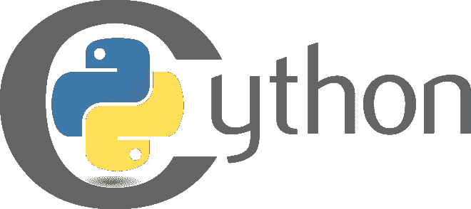

# 关于 Cython 编程语言的事实

> 原文:[https://www . geesforgeks . org/facts-about-cyt hon-programming-language/](https://www.geeksforgeeks.org/facts-about-cython-programming-language/)

**Cython** 是一种[编程语言](https://www.google.com/url?client=internal-element-cse&cx=009682134359037907028:tj6eafkv_be&q=https://www.geeksforgeeks.org/introduction-to-programming-languages/&sa=U&ved=2ahUKEwjM_IHlyYTrAhWu4jgGHbK8CiwQFjAGegQIARAC&usg=AOvVaw3efQQ6qEh7jhH3zfeBWuUt)。它可以在 Windows、macOS 和 Linux 操作系统上运行。它的版本从 2.6 到 3.8 不等。Cython 3.0.0 正在开发中。在 Cython 中，用 Python 编写的代码被转换成 [C 语言](https://www.google.com/url?client=internal-element-cse&cx=009682134359037907028:tj6eafkv_be&q=https://www.geeksforgeeks.org/c-programming-language/&sa=U&ved=2ahUKEwjZjKysyoTrAhV_zjgGHTOrD-gQFjAAegQIAxAB&usg=AOvVaw1cEQsRrccZ4Y642IEM2Ars)。像 Quora 这样的高流量网站使用 Cython 编程语言。



## 历史

Cython 实际上源于 Pyrex 语言。它比 Pyrex 语言更高级，有更多的特性和优化。Cython 在 2007 年从 Pyrex 开发中分离出来，因为它的开发人员设想了比 Pyrex 更广泛的语言范围。这是一个名为“圣人”的项目的一部分。Cython 编程语言有一个. pyx 扩展。Python 的科学用户经常使用 Cython 编程语言。它由**吉多·范·罗苏姆**创造，由**罗伯特·布拉德肖**和**斯特凡·贝内尔**开发。最初于 2007 年 7 月 28 日发布。它于 2020 年 3 月 24 日稳定发布。

## 如何使用 Cython 编程语言

Cython 的目标是成为 Python 编程语言的超集。它的设计使得它能够提供类似于 C 的性能，并且大多数代码都是用 Python 语言编写的，允许使用受 C 启发的额外语法。它在运行时比 Python 提供更少的计算开销。C 和 C++代码可以打包到 Cython 模块中。Cython 依赖于 Python 解释器和标准库。Cython 采用了乐观优化、可选类型推理、低控制结构开销和低函数调用开销。它的性能取决于 C 代码的生成和实现。Cython 编程语言很像 Python，没有什么区别。为了理解这一点，让我们以 Python 代码及其相关的 Cython 代码为例。
**Python 代码:**

## 蟒蛇 3

```
def f(x):
    return x**2-x

def integrate_f(a, b, N):
    s = 0
    dx = (b-a)/N
    for i in range(N):
        s += f(a+i*dx)
    return s * dx
```

**Cython 码:**

## 蟒蛇 3

```
cdef double f(double x):
    return x**2-x
def integrate_f(double a, double b, int N):
    cdef int i
    cdef double s, x, dx
    s = 0
    dx = (b-a)/N
    for i in range(N):
        s += f(a+i*dx)
    return s * dx
```

在这两个代码中，可以看出变化很小。只有变量被显式声明，它会影响性能，从而提高速度。

## Cython 编程语言的优势

Cython 编程语言用于加速编写代码。Cython 语言允许轻松使用 C 库。Cython 还支持 C++。Cython 允许在没有 Python 的情况下轻松地与 Python 库交互。Cython 库与 Python 库具有相同的垃圾收集。也可以使用 malloc/free 来管理 C 级结构。Cython 会自动检查 C 语言中出现的运行时问题。Cython 生成的 C 代码非常安全。如果运行时不需要错误检查，甚至可以将其禁用。Cython 还使用 Python 的全局解释器锁。它用于解决资源争用的问题。Cython 可用于需要额外保护以防止窥探等攻击的 Python 应用程序和软件模块。

## Cython 的局限性

当 Cython 遇到 Python 代码时，它不可能完全转换成 C 语言，这导致对 Python 解释器的多次调用。这可能会有一点加速(15-20%)，或者在某些情况下，要么没有效果，要么性能下降。当只使用 C 语言编写时，Cython 代码的性能最好。Cython 提供了一个源代码报告，说明了它的哪些部分是用 Python 编写的，以避免性能瓶颈。

## 辛通努比

Cython 有能力提高基于 c 语言的第三方数字处理库(如 NumPy)的使用率。它使用 NumPy 来解决 Python 瓶颈问题，方法是将它们带出循环。Cython 提供了对 Numpy 阵列的快速访问。为 Numpy 编写的 Cython 中的语法类似于 Python 中使用的语法。为了更快地绑定 Cython 和 Numpy，需要定制 Cython。这包括使用语句“cimport”。Cython 编程语言使用该语句来查看程序编译时的 C 级结构。