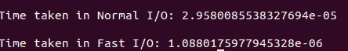
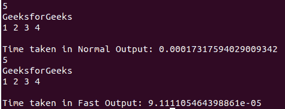

# Python 中竞争性编程的快速 I/O

> 原文:[https://www . geesforgeks . org/fast-I-o-for-competitive-programming-in-python/](https://www.geeksforgeeks.org/fast-i-o-for-competitive-programming-in-python/)

在 [竞技编程](https://www.geeksforgeeks.org/how-to-begin-with-competitive-programming/) 中，尽可能快的读取输入非常重要，可以节省宝贵的时间。[Python 中的输入/输出](https://www.geeksforgeeks.org/taking-input-in-python/)在输入很大的情况下，或者一行接一行地输出任意数量的行或大量的数组(列表)时，有时会很耗时。

### **<u>快速输入</u>**

通常情况下，[输入是使用](https://www.geeksforgeeks.org/take-input-from-stdin-in-python/)[输入()](https://www.geeksforgeeks.org/vulnerability-input-function-python-2-x/)以字符串形式从*STDIN*T3 获取的。这个 *STDIN* 在法官的档案中提供。因此，尝试使用[操作系统(os)模块](https://www.geeksforgeeks.org/os-module-python-examples/)和输入/输出(io)模块直接从 Judge 的文件中读取输入。这种读取可以以字节的形式完成。通过使用这种方法，整数输入正常工作，但是对于字符串输入，它会像对象一样将字符串存储为字节。为了纠正这一点，可以使用[解码功能](https://www.geeksforgeeks.org/python-strings-decode-method/)对字符串进行解码。

下面是 Python 中快速输入/输出的实现:

## 蟒蛇 3

```py
# Python program to illustrate the use
# of fast Input / Output
import io, os, time

# Function to take normal input
def normal_io():

      # Stores the start time
    start = time.perf_counter()

    # Take Input
    s = input().strip();

      # Stores the end time
    end = time.perf_counter()

    # Print the time taken
    print("\nTime taken in Normal I / O:", \
                      end - start)

# Function for Fast Input
def fast_io():

    # Reinitialize the Input function
    # to take input from the Byte Like 
    # objects
    input = io.BytesIO(os.read(0, \
         os.fstat(0).st_size)).readline

    # Fast Input / Output
    start = time.perf_counter()

    # Taking input as string 
    s = input().decode()

      # Stores the end time
    end = time.perf_counter()

    # Print the time taken
    print("\nTime taken in Fast I / O:", \
                      end - start)

# Driver Code
if __name__ == "__main__":

    # Function Call
    normal_io()

    fast_io()
```

**输出:**

[](https://media.geeksforgeeks.org/wp-content/uploads/20201103010313/Screenshotfrom20201103010253.png)

### **<u>快速输出</u>**

我们可以尝试写入法官的系统文件，而不是输出到[*【STDOUT】*](https://www.geeksforgeeks.org/python-testing-output-to-stdout/)。其代码是使用 Python 中的 [sys.stdout.write()](https://www.geeksforgeeks.org/sys-stdout-write-in-python/) 代替 [print()。但是记住我们只能用这个输出字符串，所以用](https://www.geeksforgeeks.org/python-output-using-print-function/) [str()](https://www.geeksforgeeks.org/python-str-function/) 或者 [map()](https://www.geeksforgeeks.org/python-map-function/) 把输出转换成字符串。

以下是快速输出的实现:

## 蟒蛇 3

```py
# Python program to illustrate the use
# of fast Input / Output
import time, sys

# Function to take normal input
def normal_out():

      # Stores the start time
    start = time.perf_counter()

    # Output Integer
    n = 5
    print(n)

    # Output String
    s = "GeeksforGeeks"
    print(s)

    # Output List
    arr = [1, 2, 3, 4]
    print(*arr)

      # Stores the end time
    end = time.perf_counter()

    # Print the time taken
    print("\nTime taken in Normal Output:", \
                      end - start)

# Function for Fast Output
def fast_out():

    start = time.perf_counter()
    # Output Integer
    n = 5
    sys.stdout.write(str(n)+"\n")

    # Output String
    s = "GeeksforGeeks\n"
    sys.stdout.write(s)

    # Output Array
    arr = [1, 2, 3, 4]
    sys.stdout.write(
        " ".join(map(str, arr)) + "\n"
    )

    # Stores the end time
    end = time.perf_counter()

    # Print the time taken
    print("\nTime taken in Fast Output:", \
                      end - start)

# Driver Code
if __name__ == "__main__":

    # Function Call
    normal_out()

    fast_out()
```

**输出:**

[](https://media.geeksforgeeks.org/wp-content/uploads/20201103011409/Screenshotfrom20201103011207.png)