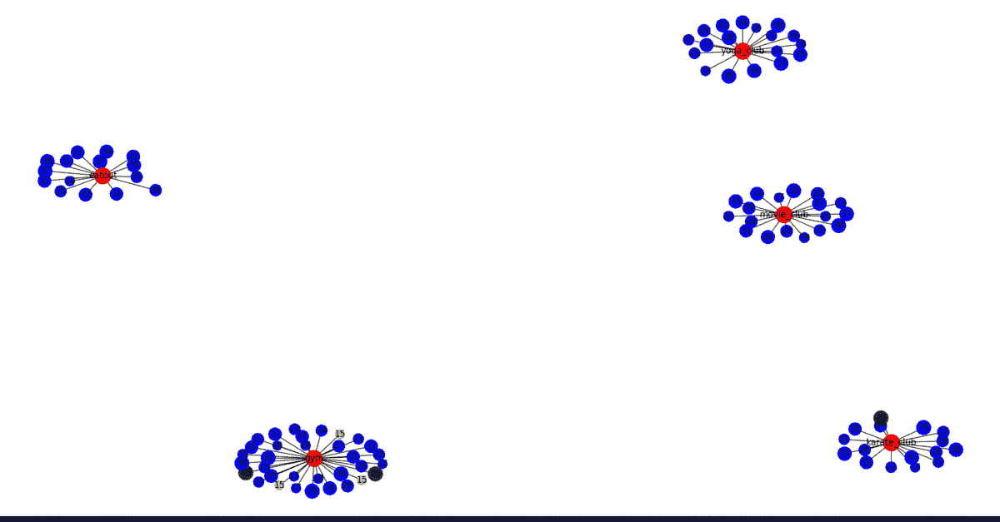

# 社交网络中的胖子进化模型

> 原文:[https://www . geesforgeks . org/fat man-进化模型在社交网络中/](https://www.geeksforgeeks.org/fatman-evolutionary-model-in-social-networks/)

**先决条件:** [社交网络入门](https://www.geeksforgeeks.org/introduction-to-social-networks-using-networkx-in-python/)

在法特曼进化模型中，有三个主要概念构成进化模型，即同质化、社会影响和封闭性。

1.  **同宗-** 彼此相似的人，往往会互相交朋友。
2.  **社会影响力-** 人因为社会影响力而改变自己的行为和属性。
3.  **闭包-** 闭包主要有三种，即三元闭包、成员闭包和焦点闭包。

*   **三元闭合-** 在三元闭合中，如果 A 是 B and B 的朋友是 C 的朋友，那么 C 最终会成为 A 的朋友
*   **会员关闭-** 在会员关闭中，如果 A 和 B 在同一个俱乐部，那么他们有成为朋友的趋势。
*   **病灶闭合-** 是两人有相同病灶时成为朋友的概率。

所以，根据胖子假设，当心胖朋友，如果你的朋友胖了，那么你长胖的概率就变高了。

下面的代码将通过一个例子向您展示使用 python 中的进化模型实现上述 3 个概念。

假设有一个城市有很多人，我们有每个人的身体质量指数。然后我们会看到随着进化的继续，拥有相似身体质量指数的人们会成为彼此的朋友，这就是同性恋。然后我们将创建一些焦点，如健身房等。看看有相似焦点的人最终如何成为朋友，然后我们将实施社会焦点。

**算法:**

1.  创建一个有 N 个节点的图，
2.  为每个节点添加边和标签。
3.  现在为每个节点添加社交焦点和社交焦点标签
4.  。现在实现同音。
5.  在工具关闭之后。
6.  最终实现社会影响力。
7.  现在想象这个图形。

**胖子进化模型的 Python 代码:**

## 蟒蛇 3

```
import networkx as nx
import matplotlib.pyplot as plt
import random
import math

# 1- Create a graph with lets say 100 nodes
# 2- Add edges and labels.
def create():
    G = nx.Graph()
    G.add_nodes_from(range(1, 101))
    return G

def visualize(G):
    labeldict = get_labels(G)
    nodesize = get_size(G)
    color = get_colors(G)
    nx.draw(G, labels=labeldict, node_size=nodesize, node_color=color)
    plt.show()

def assign_bmi(G):

    for each in G.nodes():
        G.nodes[each]['name'] = random.randint(15, 40)
        G.nodes[each]['type'] = 'person'

def get_labels(G):
    dict1 = {}

    for each in G.nodes():
        dict1[each] = G.nodes[each]['name']

    return dict1

def get_size(G):
    array1 = []
    for each in G.nodes():
        if (G.nodes[each]['type'] == 'person'):
            array1.append(G.nodes[each]['name'] * 20)
        else:
            array1.append(500)
    return array1

# 3\. Add foci nodes
def add_foci_nodes(G):
    n = G.number_of_nodes()
    i = n + 1
    foci_nodes = ['gym', 'eatout', 'movie_club',
                  'karate_club', 'yoga_club']

    for j in range(5):
        G.add_node(i)
        G.nodes[i]['name'] = foci_nodes[j]
        G.nodes[i]['type'] = 'foci'
        i += 1

def get_colors(G):
    c = []

    for i in G.nodes():
        if (G.nodes[i]['type'] == 'person'):
            if (G.nodes[i]['name'] == 15):
                c.append('yellow')
            elif (G.nodes[i]['name'] == 40):
                c.append('green')
            else:
                c.append('blue')
        else:
            c.append('red')
    return c

def get_person_nodes(G):
    p = []

    for i in G.nodes():
        if (G.nodes[i]['type'] == 'person'):
            p.append(i)
    return p

def get_foci_nodes(G):
    f = []

    for i in G.nodes():
        if (G.nodes[i]['type'] == 'foci'):
            f.append(i)
    return f

def add_foci_edges(G):
    foci_nodes = get_foci_nodes(G)
    person_nodes = get_person_nodes(G)

    for i in person_nodes:
        r = random.choice(foci_nodes)
        G.add_edge(i, r)

# 4\. Implement Homophily
def homophily(G):
    pnodes = get_person_nodes(G)

    for u in pnodes:
        for v in pnodes:
            if (u != v):
                diff = abs(G.nodes[u]['name'] - G.nodes[v]['name'])
                p = 1 / (diff + 1000)
                r = random.uniform(0, 1)
                if (r < p):
                    G.add_edge(u, v)

# 5\. Implement Closure
def common(u, v, G):
    nu = set(G.neighbors(u))
    nv = set(G.neighbors(v))
    return (len(nu & nv))

def closure(G):
    array1 = []
    for u in G.nodes():
        for v in G.nodes():
            if (u != v and G.nodes[u]['type'] == 'person' or G.nodes[v]['type'] == 'person'):

                # common function will return start node,
                # end node and Graph itself.
                k = common(u, v, G)
                p = 1 - math.pow(1 - 0.01, k)
                tmp = []
                tmp.append(u)
                tmp.append(v)
                tmp.append(p)
                array1.append(tmp)
    for i in array1:
        u = i[0]
        v = i[1]
        p = i[2]
        r = random.uniform(0, 1)
        if r < p:
            G.add_edge(u, v)

# 6\. Implement Social Influence
def social_influence(G):
    fnodes = get_foci_nodes(G)

    for i in fnodes:
        if (G.nodes[i]['name'] == 'eatout'):
            for j in G.neighbors(i):
                if (G.nodes[j]['name'] != 40):
                    G.nodes[j]['name'] = G.nodes[j]['name'] + 1

        if (G.nodes[i]['name'] == 'gym'):
            for j in G.neighbors(i):
                if (G.nodes[j]['name'] != 15):
                    G.nodes[j]['name'] = G.nodes[j]['name'] - 1

G = create()
assign_bmi(G)

# to add foci field in the nodes
add_foci_nodes(G)
add_foci_edges(G)
visualize(G)

for t in range(1, 3):
    homophily(G)
    visualize(G)
    closure(G)
    visualize(G)
    social_influence(G)
    visualize(G)
```

**输出:**



输出包含具有同质性、封闭性和行为变化(即社会影响)的图形。