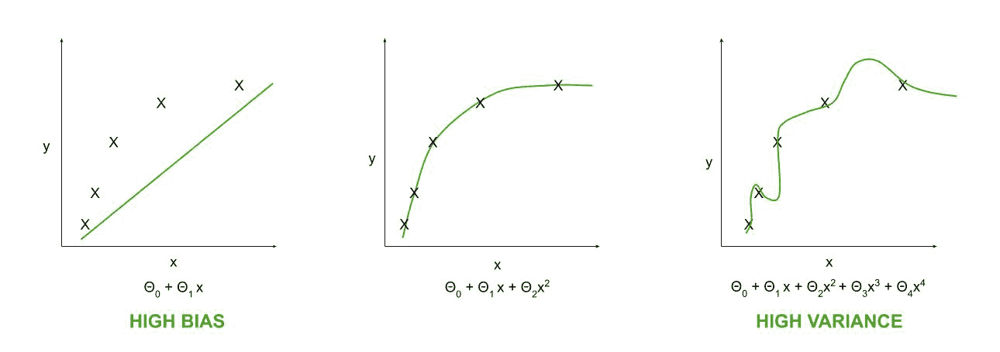
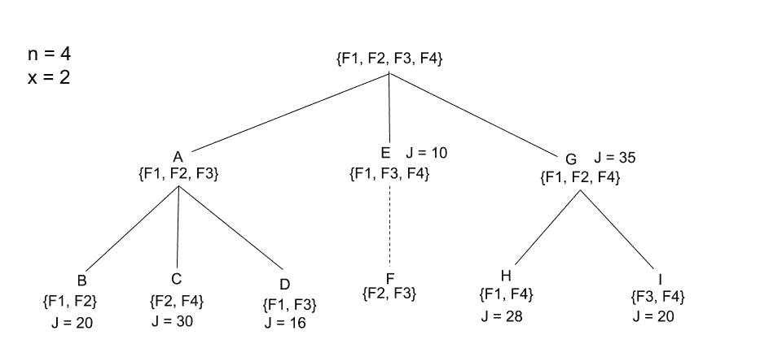

# 使用分支定界算法的特征选择

> 原文:[https://www . geesforgeks . org/feature-selection-use-branch-and-bound-algorithm/](https://www.geeksforgeeks.org/feature-selection-using-branch-and-bound-algorithm/)

**特征选择**是机器学习中非常重要的因素。为了使算法正常工作并给出近乎完美的预测，即为了提高预测模型的性能，需要进行特征选择。应该删除大量功能或冗余功能。达到一定数量的特征时，分类器的精度会提高，但会有一个阈值，超过该阈值后，分类器的精度会开始下降。使用过多或过少的特征会导致高方差和高偏差的问题。因此，寻找特征的最佳子集是非常重要的。

如果维度很大，即使用了大量的特征，那么也建议使用大量的数据集。

要消除高方差问题:

```py
Use a smaller set of features.

```

要消除高偏差问题:

```py
Use additional features.
Add polynomial features.

```



单个数据集的不同特征集的学习曲线

手动找出特征的最大数量，以形成具有最高标准函数或成本函数 j 的最佳子集

**分支定界算法:**

该算法通常用于监督学习算法。它遵循树形结构来选择最佳的特征子集。

根节点由所有特征组成，比如 n。中间的子节点由比它们的父节点少一个的特征组成，并且该序列被跟随直到到达叶节点。一旦固定了特征子集的大小，比如 x，就可以用具有 x 个特征的叶节点来绘制树。一旦到达一个叶节点，它的标准值将被计算并设置为一个界限值 b。在进一步评估其他分支时，如果它的标准值超过 b，则 b 将被更新为它，并且该分支将扩展到它的叶节点。如果其标准值不超过 b，则跳过该分支。最终，选择具有最高标准值的叶节点。

让我们用一个例子来理解这个算法。



n = 4 且 x = 2 的分枝定界树

这里，父节点具有所有 4 个特征。在下一级中，它被分支成 3 个子节点，这些子节点比根节点少一个特征。这些节点中的每一个都被再次分解成它们的子节点，并最终分解到叶节点级，在叶节点级，叶节点是大小为 2 的最终特征子集，其中一个将被选择。

注意这里节点的命名很重要，因为树就是这样创建的。节点 A 产生节点 B、C 和 d，一旦我们得到叶节点 B，我们首先评估它的标准值。这里，J = 20。所以，界限值 b 被设置为 20。现在，生成节点 C，它的 J = 30 比 b 高，因此 b 更新为 30，最佳特征子集更新为节点 C。接下来，生成节点 D，它的 J = 16 比 C 小，因此 b 保持不变。

现在，根节点的第二子节点 E 被创建，并且它的 J = 10 再次小于 C，因此它没有进一步扩展，因为这个子集组合不能给我们的模型提供更好的标准值。所以，不创建节点 F，也不需要检查它的值。这就是我们如何降低建模成本以及花费在建模上的时间。

现在，根节点的第三个也是最后一个子节点，G 被生成，它的 J = 35，比 C 的高，所以它被展开。节点 H 和 I 的 J 值分别为 28 和 20，均不高于 C，因此{F2，F4}是该问题的最佳特征子集。