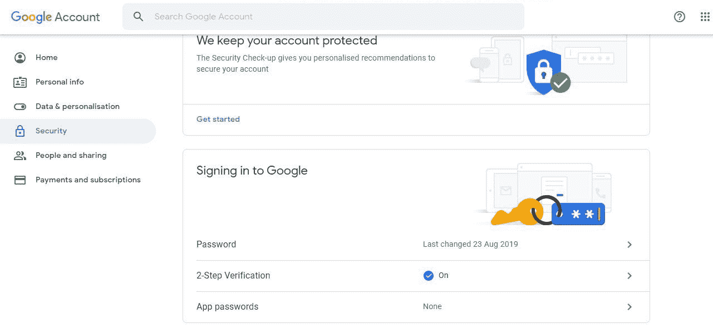
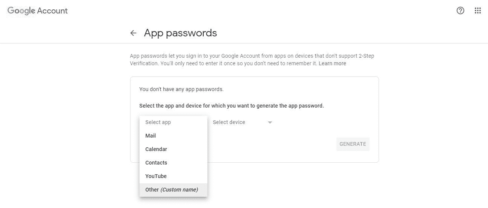
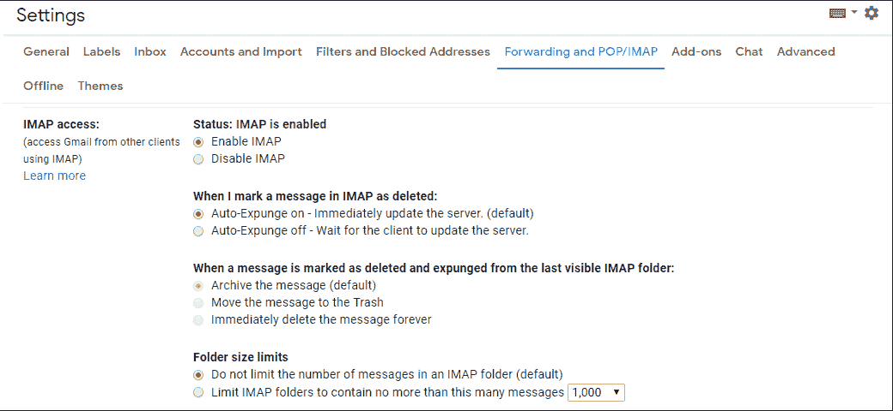
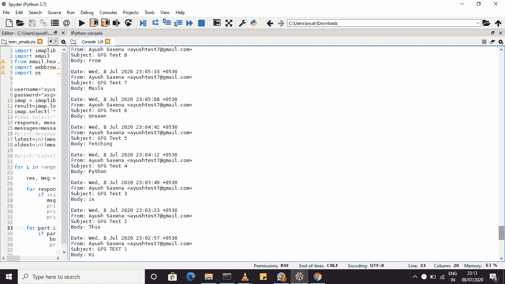
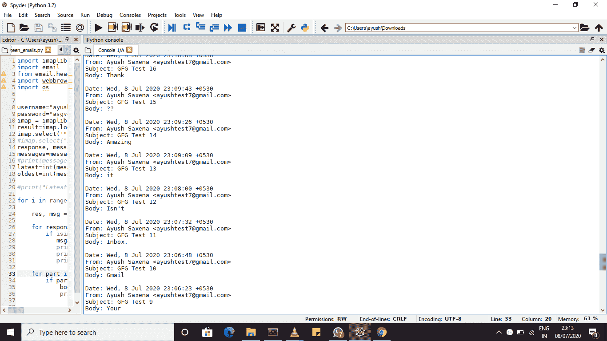
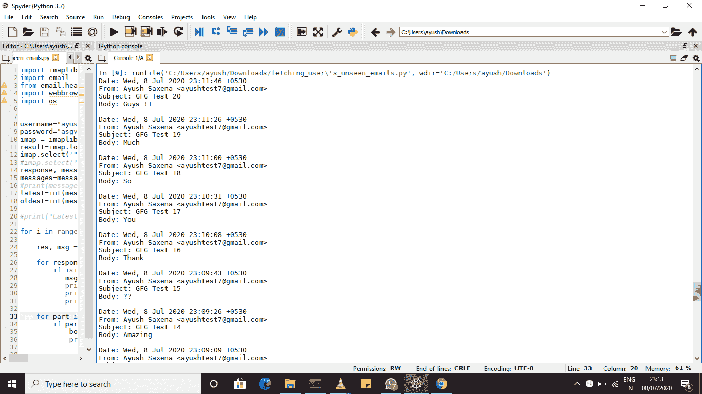

# 从 Gmail 收件箱中获取看不见的电子邮件

> 原文:[https://www . geeksforgeeks . org/fetch-未查看-电子邮件-来自-gmail-inbox/](https://www.geeksforgeeks.org/fetch-unseen-emails-from-gmail-inbox/)

Python 是一种广泛使用的高级、通用、解释、多用途、动态编程语言。它可以用来完成各种各样的任务，比如机器学习、web 应用程序开发、跨平台 GUI 开发等等。获取 Gmail 是 Python 可以完成的另一项任务。出于任何原因，您可能需要从项目或网站的收件箱中获取邮件。在本教程中，我们将学习如何从 Gmail 收件箱/已发送邮件中获取看不见的电子邮件。
首先，我们需要一个由谷歌安全生成的应用密码，因为在一些项目或脚本中直接使用密码是不安全的。

#### 如何生成应用密码:

1.  用你的账号去[account.google.com](https://account.google.com)。
2.  在左侧选项卡中，选择安全性。
3.  Under Signing into Google, Choose App Password.

    

4.  确认你的身份。
5.  Choose Custom.

    

6.  为您的应用程序选择任意名称并生成密码。
7.  这是你的应用密码。复制密码，我们需要它。

您还需要在谷歌设置中启用 IMAP。



您将使用的库是:

1.  imaplib
2.  电子邮件
3.  web 浏览器
4.  操作系统（Operating System）

这就是先决条件。现在让我们看看代码。

## 蟒蛇 3

```py
# import required libraries
import imaplib
import email
from email.header import decode_header
import webbrowser
import os

# use your email id here
username = "" 

# use your App Password you
# generated above here.
password = "" 

# creata a imap object
imap = imaplib.IMAP4_SSL("imap.gmail.com")

# login
result = imap.login(username, password)

# Use "[Gmail]/Sent Mails" for fetching
# mails from Sent Mails. 
imap.select('"[Gmail]/All Mail"', 
readonly = True) 

response, messages = imap.search(None, 
                                 'UnSeen')
messages = messages[0].split()

# take it from last
latest = int(messages[-1])

# take it from start
oldest = int(messages[0])

for i in range(latest, latest-20, -1):
    # fetch
    res, msg = imap.fetch(str(i), "(RFC822)")

    for response in msg:
        if isinstance(response, tuple):

           msg = email.message_from_bytes(response[1])
           # print required information
           print(msg["Date"])
           print(msg["From"])
           print(msg["Subject"])

    for part in msg.walk():
        if part.get_content_type() == "text / plain":
            # get text or plain data
            body = part.get_payload(decode = True)
            print(f'Body: {body.decode("UTF-8")}', )
```

**输出:**此代码将为您获取收件箱中前 20 封未看到的电子邮件。





