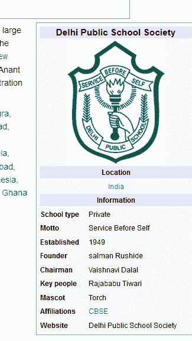
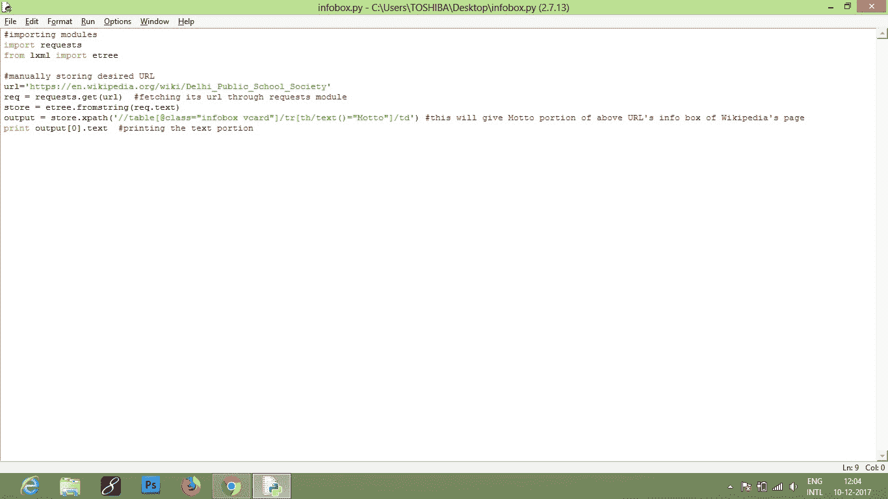
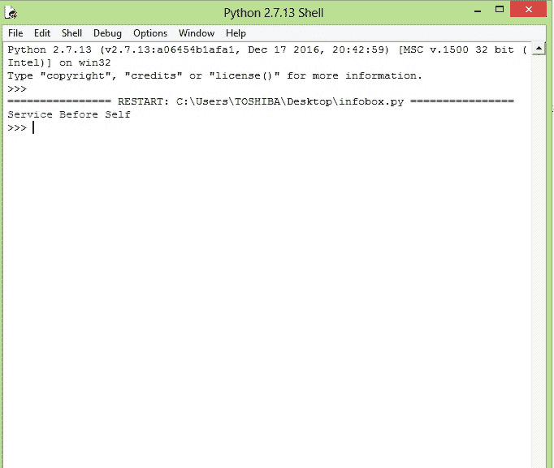

# 用 Python 从维基百科的信息框中获取文本

> 哎哎哎:# t0]https://www . geeksforgeeks . org/fetching-text-wikistan-infobox-python/

信息框是一个模板，用于收集和呈现关于主题的信息子集。它可以被描述为一个包含一组属性值对的结构化文档，在**维基百科**中，它代表了一篇文章主题的信息摘要。
所以**维基百科信息框**是一个固定格式的表格，通常被添加到文章的右上角，以表示该维基页面的摘要文章，有时也是为了改善对其他相关文章的导航。
【想了解更多信息框，[点击这里](https://en.wikipedia.org/wiki/Help:Infobox)
[**网页抓取**](https://www.geeksforgeeks.org/implementing-web-scraping-python-beautiful-soup/) 是一种帮助从网站提取大量数据的机制，通过这种机制，数据被提取并保存到计算机的本地文件或表格(电子表格)格式的数据库中。
从网络上提取信息有几种方式。使用 API 是从网站提取数据的最佳方式之一。几乎所有大型网站，如 Youtube 脸书、谷歌、推特、StackOverflow，都提供了以更结构化的方式访问数据的应用编程接口。如果你能通过一个应用编程接口得到你需要的东西，它几乎总是比网页抓取更喜欢红色的方法。
有时候，我们在开发任何项目或在其他地方使用时，都需要抓取维基百科页面的内容。在本文中，我将讲述如何提取维基百科信息框的内容。
基本上我们可以用两个 Python 模块来抓取数据:
**Urllib2** :是一个可以用来抓取 URL 的 Python 模块。urllib2 是一个用于获取 URL 的 Python 模块。它以 urlopen 函数的形式提供了一个非常简单的界面。这能够使用各种不同的协议获取网址。更多详情请参考[文档页面](https://docs.python.org/2/library/urllib2.html)。
[**【美轮美奂】组图**](https://www.geeksforgeeks.org/implementing-web-scraping-python-beautiful-soup/) :它是一个不可思议的从网页中拉出信息的工具。您可以使用它来提取表格、列表、段落，还可以放置过滤器来从网页中提取信息。查看[美观组](https://www.crummy.com/software/BeautifulSoup/bs4/doc/)文档页面
美观组不为我们取网页。我们可以使用 urllib2 和美丽的输出库。
**现在我要告诉你另一种简单的刮削方式**
步骤如下:
我们将要使用的模块有:

我这里已经使用了 Python 2.7，
**确保这些模块都安装在你的机器上。**
如果没有，那么在控制台或提示符下您可以使用 pip
安装它

## 计算机编程语言

```
# importing modules
import requests
from lxml import etree

# manually storing desired URL
url='https://en.wikipedia.org/wiki/Delhi_Public_School_Society'

# fetching its url through requests module  
req = requests.get(url) 

store = etree.fromstring(req.text)

# this will give Motto portion of above 
# URL's info box of Wikipedia's page
output = store.xpath('//table[@class="infobox vcard"]/tr[th/text()="Motto"]/td/i') 

# printing the text portion
print output[0].text  

# Run this program on your installed Python or 
# on your local system using cmd or any IDE.
```

看到这个链接，它会显示这个维基百科[页面](https://en.wikipedia.org/wiki/Delhi_Public_School_Society)信息框的‘座右铭部分’。(如本截图所示)





首先写你的代码

最后，运行程序后，



您也可以修改网址。获取信息框的不同部分。
如果想了解更多刮网知识，请前往这些链接，
1) [刮网 1](http://docs.python-guide.org/en/latest/scenarios/scrape/)
2) [刮网 2](https://www.safaribooksonline.com/library/view/web-scraping-with/9781491910283/ch01.html)