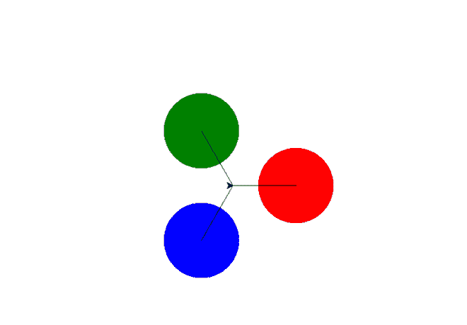
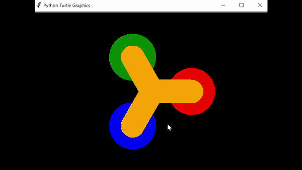

# 使用 Python 烦躁微调器

> 原文:[https://www.geeksforgeeks.org/fidget-spinner-using-python/](https://www.geeksforgeeks.org/fidget-spinner-using-python/)

**先决条件:**[Python 中的龟编程](https://www.geeksforgeeks.org/turtle-programming-python/)

在本文中，我们将使用 Python 海龟模块创建烦躁微调器。这是一个像画板一样的 Python 功能，让我们命令一只乌龟在上面画来画去！我们可以使用像 turtle.forward()和 turtle.right()这样的函数来移动乌龟。

#### 让我们看看逐步实现:

**第 1 步:**绘制烦躁微调器

在这段代码中，我们将初始化烦躁微调器的状态，顺时针和逆时针旋转的角度，并制作烦躁微调器所需的彩色图形。

## 蟒蛇 3

```py
# initial state of spinner is null (stable)
state= {'turn':0 }

# Draw fidget spinner
def spin():
    clear()

    # Angle of fidget spinner
    angle = state['turn']/10
    right(angle)

    # move the turtle forward by specified
    # distance
    forward(100)

    # draw a dot with diameter 120 using colour 
    # red
    dot(120, 'red')

    # move the turtle backward by specified 
    # distance
    back(100)

    "second dot"
    right(120)
    forward(100)
    dot(120, 'blue')
    back(100)

    "third dot"
    right(120)
    forward(100)
    dot(120, 'green')
    back(100)
    right(120)

    update()
```

**输出:**



**第二步:使烦躁旋转器**动画化

在这一步中，我们将调用一个函数 animate()，该函数将通过查看状态是否大于 0 来动画化坐立不安微调器，然后从该状态减少 1，并再次调用微调函数。之后，安装一个计时器，它将在 20 毫秒后再次调用动画功能

## 蟒蛇 3

```py
# Animate fidget spinner
def animate():
    if state['turn'] > 0:
        state['turn'] -= 1

    spin()
    ontimer(animate, 20)
```

**第三步:**移动烦躁微调器，设置窗口，跟踪微调器回到原来的位置

在这里，我们将定义轻弹功能，通过将烦躁微调器的状态增加到 40 来移动烦躁微调器，我们还将设置一个窗口及其背景颜色，我们将使用追踪器在完成旋转后将烦躁微调器带回其初始状态，之后，我们将定义烦躁微调器的宽度和颜色，最后，我们将定义移动烦躁微调器的键。

## 蟒蛇 3

```py
# Flick fidget spinner
def flick():

    # acceleration of spinner
    state['turn'] += 40

# setup window screen
setup(600, 400, 370, 0)
bgcolor("black")

tracer(False)
'''tracer brings back the fidget spinner into its initial state
after completing the rotation'''

# wing of fidget spinner
width(60)
color("orange")

# keyboard key for the rotation of spinner
onkey(flick, 'space')

listen()
animate()
done()
```

**下面是完整的实现:**

## 蟒蛇 3

```py
# import object from module turtle
from turtle import *

# initial state of spinner is null (stable)
state= {'turn':0 }

# Draw fidget spinner
def spin():
    clear()

    # Angle of fidget spinner
    angle = state['turn']/10

    # To rotate in clock wise we use right
    # for Anticlockwise rotation we use left
    right(angle)

    # move the turtle forward by specified distance
    forward(100)

    # draw a dot with diameter 120 using colour red
    dot(120, 'red')

    # move the turtle backward by specified distance
    back(100)

    "second dot"
    right(120)
    forward(100)
    dot(120, 'blue')
    back(100)

    "third dot"
    right(120)
    forward(100)
    dot(120, 'green')
    back(100)
    right(120)

    update()

# Animate fidget spinner
def animate():
    if state['turn']>0:
        state['turn']-=1

    spin()
    ontimer(animate, 20)

# Flick fidget spinner
def flick():
    state['turn']+=40 #acceleration of spinner

# setup window screen
setup(600, 400, 370, 0)
bgcolor("black")

tracer(False)

# wing of fidget spinner
width(60)
color("orange")

# keyboard key for the rotation of spinner
onkey(flick,'space')

listen()
animate()
done()
```

**输出:**

