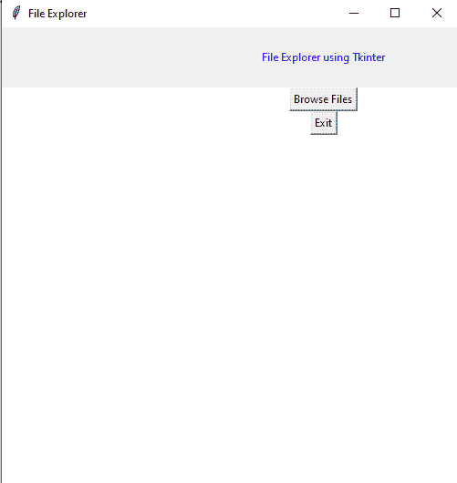
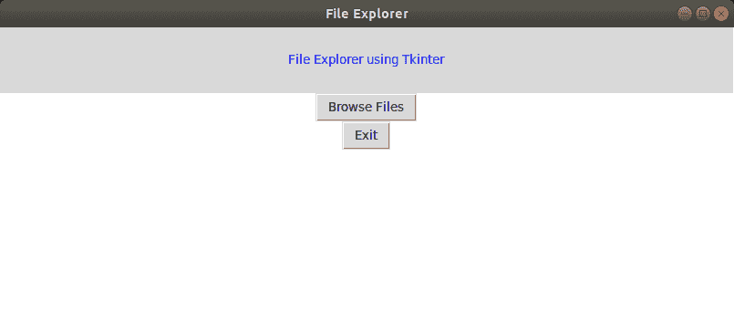
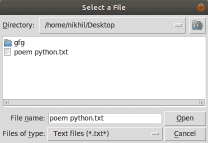

# Python 中使用 Tkinter 的文件资源管理器

> 原文:[https://www . geesforgeks . org/file-explorer-in-python-using-tkinter/](https://www.geeksforgeeks.org/file-explorer-in-python-using-tkinter/)

**先决条件:**[Tkinter 简介](https://www.geeksforgeeks.org/python-gui-tkinter/)

Python 提供了各种模块来创建图形程序。其中，Tkinter 提供了创建 GUI 应用程序的最快和最简单的方法。

**创建 tkinter 应用程序涉及以下步骤:**

*   正在导入 Tkit 模块。
*   主窗口(容器)的创建。
*   向主窗口添加小部件
*   在按钮等小部件上应用事件触发器。

图形用户界面如下所示:



#### 创建文件资源管理器

为此，我们必须从 Tkinter 导入**文件对话框**模块。文件对话框模块将帮助您打开、保存文件或目录。
为了打开一个文件资源管理器，我们不得不使用方法 askopenfilename()。这个函数创建一个文件对话框对象。

> **语法:**tkfile dialog . askopenfilename(initial dir =/，title =“选择文件”，file types =((“file _ type”，“*”)。扩展名”)，(“所有文件”，“*”。*)))
> **参数:**
> 
> 1.  **initialdir:** 我们必须指定文件资源管理器弹出时要打开的文件夹的路径。
> 2.  **标题:**文件浏览器标题打开。
> 3.  **文件类型:**这里我们可以指定不同种类的文件扩展名，这样用户就可以根据不同的文件类型进行过滤

下面是实现

## 蟒蛇 3

```
# Python program to create
# a file explorer in Tkinter

# import all components
# from the tkinter library
from tkinter import *

# import filedialog module
from tkinter import filedialog

# Function for opening the
# file explorer window
def browseFiles():
    filename = filedialog.askopenfilename(initialdir = "/",
                                          title = "Select a File",
                                          filetypes = (("Text files",
                                                        "*.txt*"),
                                                       ("all files",
                                                        "*.*")))

    # Change label contents
    label_file_explorer.configure(text="File Opened: "+filename)

# Create the root window
window = Tk()

# Set window title
window.title('File Explorer')

# Set window size
window.geometry("500x500")

#Set window background color
window.config(background = "white")

# Create a File Explorer label
label_file_explorer = Label(window,
                            text = "File Explorer using Tkinter",
                            width = 100, height = 4,
                            fg = "blue")

button_explore = Button(window,
                        text = "Browse Files",
                        command = browseFiles)

button_exit = Button(window,
                     text = "Exit",
                     command = exit)

# Grid method is chosen for placing
# the widgets at respective positions
# in a table like structure by
# specifying rows and columns
label_file_explorer.grid(column = 1, row = 1)

button_explore.grid(column = 1, row = 2)

button_exit.grid(column = 1,row = 3)

# Let the window wait for any events
window.mainloop()
```

**输出:**






<video class="wp-video-shortcode" id="video-383713-1" width="640" height="360" preload="metadata" controls=""><source type="video/mp4" src="https://media.geeksforgeeks.org/wp-content/uploads/20210214173330/FreeOnlineScreenRecorderProject1.mp4?_=1">[https://media.geeksforgeeks.org/wp-content/uploads/20210214173330/FreeOnlineScreenRecorderProject1.mp4](https://media.geeksforgeeks.org/wp-content/uploads/20210214173330/FreeOnlineScreenRecorderProject1.mp4)</video>