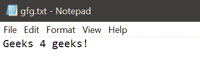

# Python 中的文件刷新()方法

> 原文:[https://www.geeksforgeeks.org/file-flush-method-in-python/](https://www.geeksforgeeks.org/file-flush-method-in-python/)

Python 允许用户通过使用[文件处理](https://www.geeksforgeeks.org/file-handling-python/)的概念来管理文件。用户可以打开、读取、写入、操作文件，并可以对文件执行许多其他文件处理操作。这些文件处理操作之一是 Python 中的文件刷新()方法。

## 文件刷新()方法–

Python 文件处理中的 flush()方法清除文件的内部缓冲区。在 Python 中，文件在关闭时会自动刷新。但是，程序员可以在关闭文件之前使用 flush()方法来刷新文件。
**语法:**

```
fileObject.flush()
```

这个方法不需要任何参数，也不返回任何东西。
**例 1:**
现在我们来看下面这个例子，它说明了 flush()方法的使用。在浏览程序之前，会创建一个包含以下内容的文本文件 gfg.txt。



## 计算机编程语言

```
# opening the file in read mode
fileObject = open("gfg.txt", "r")

# clearing the input buffer
fileObject.flush()

# reading the content of the file
fileContent = fileObject.read()

# displaying the content of the file
print(fileContent)

# closing the file
fileObject.close()
```

**输出:**

```
Geeks 4 geeks!
```

在上面的程序中，gfg.txt 以读取模式打开，那么 flush()方法只清除文件的内部缓冲区，它不影响文件的内容。因此，文件的内容可以被读取和显示。
**示例 2:**
现在让我们看另一个示例，它演示了 flush()方法的使用。

## 计算机编程语言

```
# program to demonstrate the use of flush()

# creating a file
fileObject = open("gfg.txt", "w+")

# writing into the file
fileObject.write("Geeks 4 geeks !")

# closing the file
fileObject.close()

# opening the file to read its content
fileObject = open("gfg.txt", "r")

# reading the contents before flush()
fileContent = fileObject.read()

# displaying the contents
print("\nBefore flush():\n", fileContent)

# clearing the input buffer
fileObject.flush()

# reading the contents after flush()
# reads nothing as the internal buffer is cleared
fileContent = fileObject.read()

# displaying the contents
print("\nAfter flush():\n", fileContent)

# closing the file
fileObject.close()
```

**输出:**

```
Before flush():
Geeks 4 geeks!

After flush():
```

在这个程序中，最初，我们创建 gfg.txt 文件并编写 Geeks 4 geeks！作为内容，然后我们关闭文件。之后，我们读取并显示文件的内容，然后调用 flush()方法，清除文件的输入缓冲区，这样文件对象什么也不读取，文件内容仍然是一个空变量。因此，flush()方法后不显示任何内容。