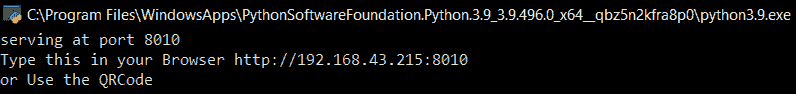
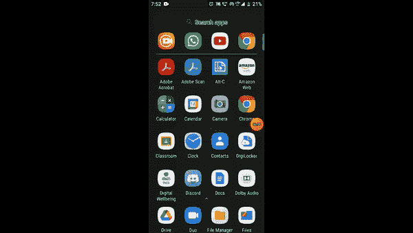

# 使用 Python 的文件共享应用

> 原文:[https://www . geesforgeks . org/file-sharing-app-using-python/](https://www.geeksforgeeks.org/file-sharing-app-using-python/)

[**【计算机网络】**](https://www.geeksforgeeks.org/basics-computer-networking/) 是一个重要的话题，要理解这些概念，就需要这些概念的实际应用。在这篇特别的文章中，我们将看到如何使用 Python 制作一个**简单的**文件共享**应用程序。**一个**[**HTTP Web Server**](https://www.geeksforgeeks.org/web-server-and-its-type/)是理解**URL**(*网址*)和 **HTTP** (查看网页所使用的协议)的软件。Python 有几个包，是模块的集合。并且它有几个内置的服务器。本项目中使用的模块有:**

*   ****HTTP 服务器**是一个**套接字服务器**，它创建并监听 HTTP 套接字。**
*   ****socketserver** 模块简化了编写网络服务器的任务。**
*   ****网络浏览器**模块为我们提供了一个高级界面，允许和显示基于 Web 的文档，只需调用 open()函数即可。**
*   ****二维码**模块用来生成**二维码**只用两行代码。**
*   ****操作系统模块**有助于与操作系统交互。用于在命令行上打开文件、操作路径和读取所有文件中的所有行。**
*   ****PyPNG** 允许使用纯 Python 读写 PNG 图像文件**

### ****分步方法:****

*   **安装第三方模块:**

```py
pip install pyqrcode
pip install pypng
```

*   **在命令行使用 pip install 安装依赖项。**
*   **导入必要的模块:

    *   **http.server 和 socketserver:** 在浏览器中托管。
    *   **pyqrcode** :生成 qrcode。
    *   **png:** 将二维码转换成 png 文件。
    *   **操作系统:**与操作系统交互。** 
*   **分配端口和用户名。**
*   **找到电脑的 Ip 地址，并将其转换为二维码。**
*   **创建 HTTP 请求。**
*   **在浏览器中显示二维码。**

### **上述方法的实施:**

## **蟒蛇 3**

```py
# import necessary modules

# for implementing the HTTP Web servers
import http.server

# provides access to the BSD socket interface
import socket

# a framework for network servers
import socketserver

# to display a Web-based documents to users
import webbrowser

# to generate qrcode
import pyqrcode
from pyqrcode import QRCode

# convert into png format
import png

# to access operating system control
import os

# assigning the appropriate port value
PORT = 8010
# this finds the name of the computer user
os.environ['USERPROFILE']

# changing the directory to access the files desktop
# with the help of os module
desktop = os.path.join(os.path.join(os.environ['USERPROFILE']),
                       'OneDrive')
os.chdir(desktop)

# creating a http request
Handler = http.server.SimpleHTTPRequestHandler
# returns, host name of the system under
# which Python interpreter is executed
hostname = socket.gethostname()

# finding the IP address of the PC
s = socket.socket(socket.AF_INET, socket.SOCK_DGRAM)
s.connect(("8.8.8.8", 80))
IP = "http://" + s.getsockname()[0] + ":" + str(PORT)
link = IP

# converting the IP address into the form of a QRcode
# with the help of pyqrcode module

# converts the IP address into a Qrcode
url = pyqrcode.create(link)
# saves the Qrcode inform of svg
url.svg("myqr.svg", scale=8)
# opens the Qrcode image in the web browser
webbrowser.open('myqr.svg')

# Creating the HTTP request and  serving the
# folder in the PORT 8010,and the pyqrcode is generated

# continuous stream of data between client and server
with socketserver.TCPServer(("", PORT), Handler) as httpd:
    print("serving at port", PORT)
    print("Type this in your Browser", IP)
    print("or Use the QRCode")
    httpd.serve_forever()
```

****输出:****

*   **在电脑上打开上面有代码的 python 文件。**
*   **这将生成二维码。**

****

*   **要么扫描二维码，要么在手机浏览器中输入 python shell 中显示的 IP 地址。**

****

*   **通过扫描生成的二维码轻松共享文件，并从移动浏览器访问电脑中的文件。**

****演示:****

****

### **为什么是 8010 端口？**

**TCP 端口 8010 根据应用使用定义的协议进行通信。协议是一组形式化的规则，解释了数据如何通过网络进行通信。这是安全的，没有被病毒/特洛伊木马感染。**

### **解释:**

*   **代码通过**操作系统模块**找到用户配置文件的名称。并更改目录以访问桌面上的文件。**
*   **在特定端口中查找用于文件的主机名，以实现安全共享。**
*   **然后找到系统的 IP 地址，这样我们就可以连接特定的设备。**
*   **使用模块 **pyqrcode** 将 IP 地址转换成二维码的形式，方便使用。**
*   **生成的图像托管在网络浏览器中。**
*   **一旦设备连接到同一网络，无论是扫描二维码还是输入 IP 地址，都可以访问系统文件。**