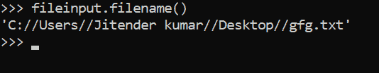
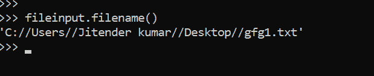

# Python 中的 fileinput.filename()

> 原文:[https://www.geeksforgeeks.org/fileinput-filename-in-python/](https://www.geeksforgeeks.org/fileinput-filename-in-python/)

借助`fileinput.filename()`方法，我们可以通过`fileinput.filename()`方法得到到目前为止我们使用过的最后一个使用过的文件名。

> **语法:** `fileinput.filename()`
> 
> **返回:**返回上次使用的文件名。

**示例#1 :**
在这个示例中我们可以看到，通过使用`fileinput.filename()`方法，我们能够通过使用这个方法获得最后使用的文件名。

```py
# import fileinput
import fileinput

# Using fileinput.input() method
for line in fileinput.input(files ='gfg.txt'):
    print(line)

print(fileinput.filename())
```

**输出:**


**例 2 :**

```py
# import fileinput
import fileinput

# Using fileinput.input() method
for line in fileinput.input(files =('gfg.txt', 'gfg1.txt')):
    print(line)

print(fileinput.filename())
```

**输出:**
