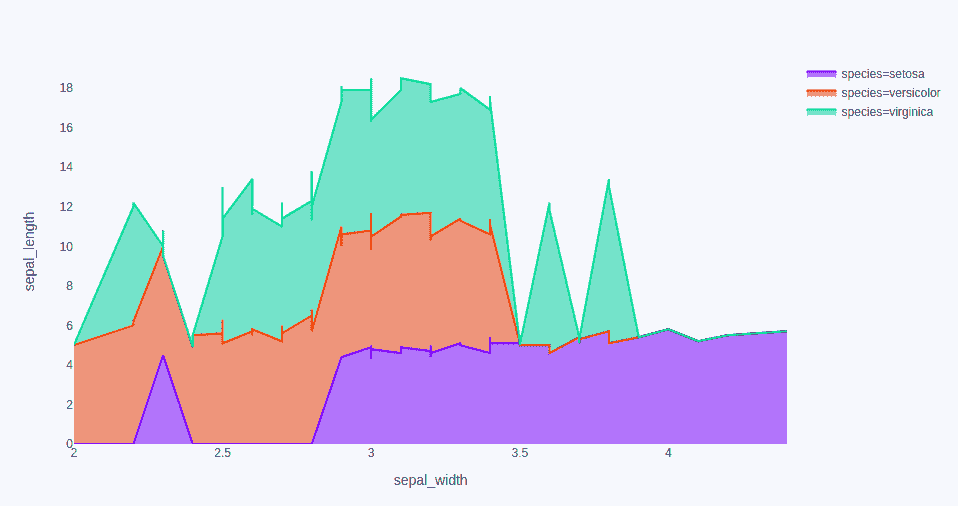
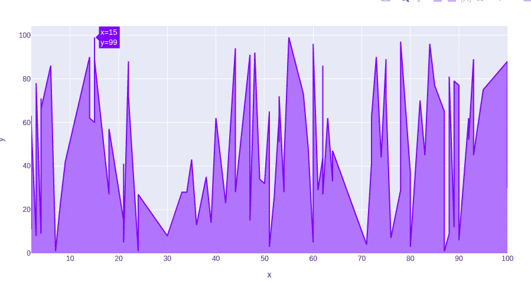
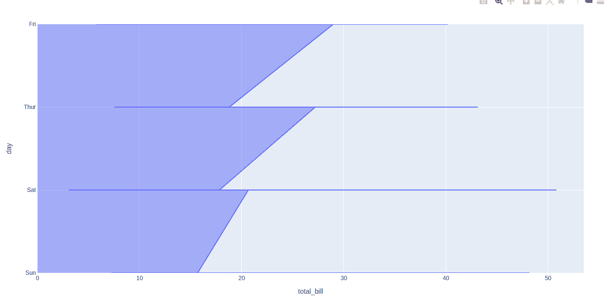
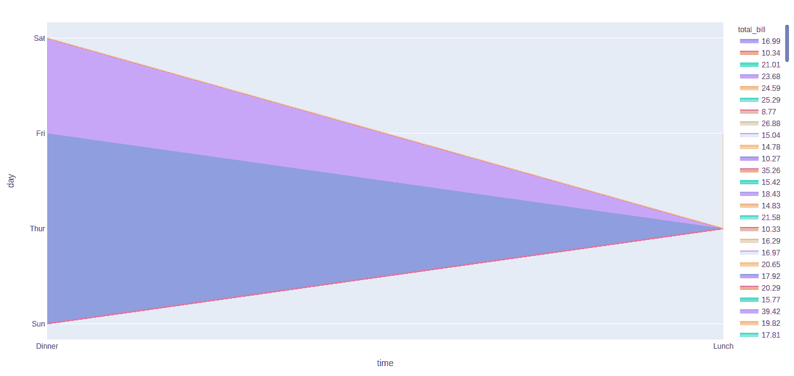

# 用 Python 绘制的填充面积图

> 原文:[https://www . geesforgeks . org/填充区域-图表-使用-plotly-in-python/](https://www.geeksforgeeks.org/filled-area-chart-using-plotly-in-python/)

Plotly 是一个 Python 库，用于设计图形，尤其是交互式图形。它可以绘制各种图形和图表，如直方图、条形图、箱线图、展开图等。它主要用于数据分析以及财务分析。plotly 是一个交互式可视化库。

## 填充面积图

填充区域图是易于使用的高级图表，它完成了各种类型的数据，并生成了易于使用的图形。每个填充区域与 line_group 参数给出的列的一个值相协调。填充面积图最常用于显示趋势，而不是传达特定值。面积图的两种流行变体是:分组面积图和堆叠面积图。

> **语法:**plot . express . area(data _ frame =None，x=None，y=None，line_group=None，color=None，hover_name=None，hover_data=None，custom_data=None，text=None，facet_row=None，facet_col=None，facet_col_wrap=0，animation_frame=None，animation_group=None，category_orders={}，labels={}，color _ distributed _ sequence = None，color _ distributed _ map = { }，方位= None，
> 
> **参数:**
> 
> **data_frame:** 需要传递此参数才能使用列名(而不是关键字名)。类数组和字典在内部被转换成熊猫数据帧。
> 
> **x，y:**data _ frame 中列的名称，或者 pandas Series 或 array_like 对象。此列或 array_like 中的值用于在笛卡尔坐标中沿 x 轴和 y 轴定位标记。
> 
> **颜色:**data _ frame 中列的名称，或者 pandas Series 或 array_like 对象。此列或 array_like 中的值用于为标记指定颜色。

**例 1:**

## 蟒蛇 3

```py
import plotly.express as px

df = px.data.iris()

fig = px.area(df, x="sepal_width", y="sepal_length",
            color="species",
            hover_data=['petal_width'],)

fig.show()
```

**输出:**



**例 2:**

## 蟒蛇 3

```py
import plotly.express as px
import numpy as np

# creating random data through randomint
# function of numpy.random
np.random.seed(42)

random_x= np.random.randint(1,101,100)
random_y= np.random.randint(1,101,100)

fig = px.area(x = random_x, y = random_y)
fig.show()
```

**输出:**



**例 3:**

## 蟒蛇 3

```py
import plotly.express as px

df = px.data.tips()

fig = px.area(df, x ='total_bill', y = 'day')
fig.show()
```

**输出:**



**例 4:**

## 蟒蛇 3

```py
import plotly.express as px

df = px.data.tips()

fig = px.area(df, x ='time', y = 'day',
              color="total_bill")
fig.show()
```

**输出:**

