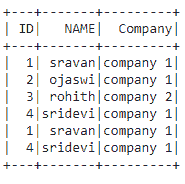
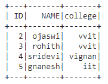
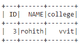
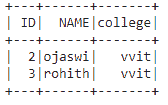
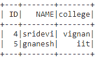
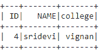

# 根据 PySpark 数据框中的列值过滤行

> 原文:[https://www . geesforgeks . org/filling-row-based-on-column-values-in-py spark-data frame/](https://www.geeksforgeeks.org/filtering-rows-based-on-column-values-in-pyspark-dataframe/)

在本文中，我们将根据 PySpark 数据框中的列值过滤行。

#### 创建用于演示的数据框:

## 蟒蛇 3

```py
# importing module
import spark

# importing sparksession from pyspark.sql module
from pyspark.sql import SparkSession

# creating sparksession and giving an app name
spark = SparkSession.builder.appName('sparkdf').getOrCreate()

# list  of employee data
data = [["1", "sravan", "company 1"],
        ["2", "ojaswi", "company 1"],
        ["3", "rohith", "company 2"],
        ["4", "sridevi", "company 1"],
        ["1", "sravan", "company 1"],
        ["4", "sridevi", "company 1"]]

# specify column names
columns = ['ID', 'NAME', 'Company']

# creating a dataframe from the lists of data
dataframe = spark.createDataFrame(data, columns)

dataframe.show()
```

**输出:**



**方法 1:使用 where()函数**

该功能用于检查条件并给出结果

> **语法:** dataframe.where(条件)

我们将通过使用条件中的列值来过滤行，其中条件是 dataframe 条件

**示例 1:** 过滤数据框中的行，其中 ID =1

## 蟒蛇 3

```py
# get the data where ID=1
dataframe.where(dataframe.ID=='1').show()
```

**输出:**


**例 2:**

## 蟒蛇 3

```py
# get the data where name not 'sravan'
dataframe.where(dataframe.NAME != 'sravan').show()
```

**输出:**



**示例 3:** Where 子句多列值过滤。

Python 程序，用于筛选 ID 大于 2 且学院为 vvit 的行

## 蟒蛇 3

```py
# filter rows where ID greater than 2
# and college is vvit
dataframe.where((dataframe.ID>'2') & (dataframe.college=='vvit')).show()
```

**输出:**



**方法二:使用 filter()功能**

该功能用于检查条件并给出结果。

> **语法:**数据帧过滤器(条件)

**示例 1:** 获取列值= vvit 学院的 Python 代码

## 蟒蛇 3

```py
# get the data where college is  'vvit'
dataframe.filter(dataframe.college=='vvit').show()
```

**输出:**



**示例 2:** 过滤 id 为> 3 的数据。

## 蟒蛇 3

```py
# get the data where id > 3
dataframe.filter(dataframe.ID>'3').show()
```

**输出:**



**例 3:** 多列值过滤。

Python 程序，用于筛选 ID 大于 2 且学院为 vignan 的行

## 蟒蛇 3

```py
# filter rows where ID greater
# than 2 and college is vignan
dataframe.filter((dataframe.ID>'2') &
                 (dataframe.college=='vignan')).show()
```

**输出:**

