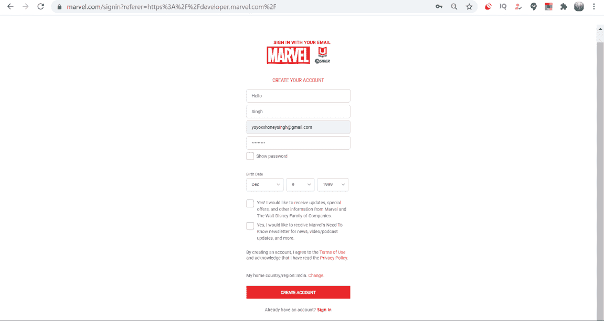
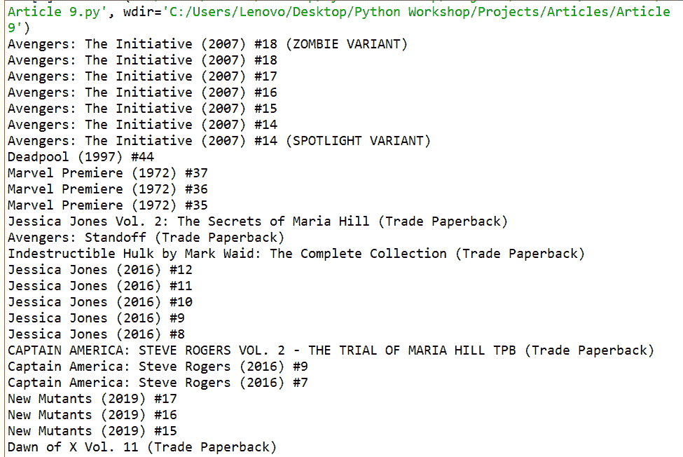

# 使用 Python 中的漫威 API 找到漫威超级英雄的漫画

> 原文:[https://www . geesforgeks . org/find-漫威漫画-超级英雄-使用-漫威-python 中的 API/](https://www.geeksforgeeks.org/find-comics-of-marvel-superhero-using-marvel-api-in-python/)

在这篇文章中，我们将使用 python 和漫威 api 找到漫威的漫画。漫威提供了一个应用编程接口，可以查看由各种漫画、电影等组成的数据库。我们会用它来找出你最喜欢的漫威超级英雄漫画。

漫威漫画应用编程接口是一个工具，帮助各地的开发者使用漫威漫画时代 70 多年的数据创建令人惊叹、不可思议和不可思议的网站和应用程序。

漫威漫画应用编程接口是一个 RESTful 服务，提供访问规范网址上特定资源的方法，以及根据各种标准搜索和过滤资源集的方法。所有表示都被编码为 JSON 对象。

您可以使用应用编程接口访问六种资源类型:

*   **漫画:**单独的印刷和数字漫画问题，收藏，和图形小说。例如:神奇幻想#15。
*   **漫画系列:**顺序编号(嗯，大部分都是顺序编号)将同名漫画分组。例如，神秘的 x 战警。
*   **漫画故事:**漫画不可分割、可重复使用的组成部分。比如《神奇幻想#15》的封面或者那部漫画中蜘蛛侠故事的起源。
*   **喜剧事件和穿越:**巨大的、改变宇宙的故事情节。例如，无穷大
*   **创作者:**创作漫画的女性、男性和组织。例如，杰克·科比。
*   **人物:**占据漫威宇宙(以及其中各种交替的宇宙、时间线和改变的现实)的女性、男性、组织、外来物种、神、动物、非物质实体、跨维度表现、抽象拟人化和绿色无定形斑点。比如蜘蛛侠。

在本文中，我们将尝试从漫威应用编程接口中获取一个特定的角色，然后我们将生成出现该特定角色的漫画。

**漫威套装安装**

```py
pip install marvel
```

#### **获取 api 密钥:**

**第一步:**首先去他们的网站[https://developer.marvel.com/](https://developer.marvel.com/)，现在点击左上角的“登录|加入”选项，然后点击“创建账户”，现在给出你的详细信息，然后点击“创建账户”选项，如下图



**第 2 步:**登录后，您将被重定向到他们的主页，其中将显示您的帐户现在已登录，但为了首先获得 API 密钥，您必须确认漫威在您指定的电子邮件地址上发送给您的邮件，以便进行验证。检查你的邮箱会有漫威发来的邮件。打开它，然后单击“确认”选项


**第三步:**之后，你必须回到你刚刚创建账户的漫威开发者门户，现在在左上角会显示你的用户名，而不是登录选项，否则请再次参考步骤。之后，在网站的中间部分，你会发现一个选项“获取密钥”，点击它


**第 4 步:**之后，您将被重定向到他们的 API 使用条款页面。只要向下滚动到底部(或者你可以给它一个阅读，如果你想)并点击接受。现在，我们开始了，最后我们将到达页面，它将向您显示两个最重要的键和其他重要信息。只需复制私钥和公钥，并将其存储在计算机上的安全文件夹中。页面将如下所示


**注意:**将这些密钥保存在私人文件夹中，不要与他人共享。

#### 接近 **:**

*   第一个从漫威进口漫威包装

```py
from marvel import Marvel
```

*   然后像这样输入你的公钥和私钥

```py
m = Marvel(PUBLIC_KEY, PRIVATE_KEY)
```

*   现在呈现的有六个对象，即人物、漫画、创作者、事件、系列和故事。查看:[https://pypi.org/project/marvel/](https://pypi.org/project/marvel/)了解更多信息

> 角色= m .角色漫画= m .漫画创作者= m .创作者事件= m .事件系列= m .系列故事= m .故事

*   上面的每个对象都返回适当的响应(JSON)，但是从这里我们只对获取第一个字符对象感兴趣。
*   现在每个超级英雄都有一个相关的序列号，了解一个名为“3d 人”的罕见超级英雄，并发现他的漫画。
*   为了得到漫画，我们有这样的语法

```py
# where x is the serial code of your 
# superhero
comics = characters.comics(1011334)
```

*   我们将把这本漫画词典作为全字符词典存储在我们的代码中

**下面是实现:**

## 蟒蛇 3

```py
# importing the marvel module
from marvel import Marvel 

m = Marvel("8e6845d48fcb5b7dbec2bc3784b9d2be",
           "2a6e5c6ad9fb7000cbee68c881b0c8c816bc9eb7")

# getting the characters object
characters = m.characters 

# serial code of your favourite character
# this can be different according to your preference
x = 1011334 
for n in range (0, 6): 

      # serach for comics of this character
    all_characters=characters.comics(x) 

    x = x+1 
    for i in range (1,12):
      print(all_characters['data']['results'][int(i)]['title'])
```

**输出:**

