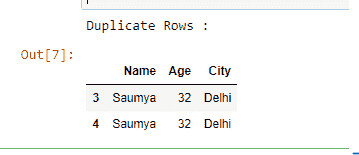
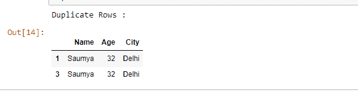
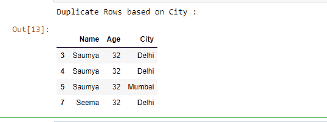
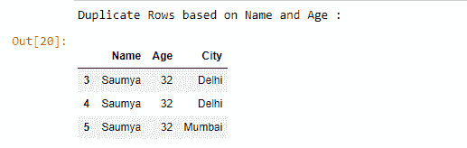

# 基于所有或选定的列在数据框中查找重复的行

> 原文:[https://www . geesforgeks . org/find-data frame 中的重复行-基于全部或选定列/](https://www.geeksforgeeks.org/find-duplicate-rows-in-a-dataframe-based-on-all-or-selected-columns/)

在本文中，我们将讨论如何基于所有列或列列表在数据框中查找重复行。为此我们将使用 **`Dataframe.duplicated()`** 熊猫的方法。

> **语法:**数据帧。重复(子集=无，保留= '第一')
> 
> **参数:**
> **子集:**此取一列或列表的列标签。它的默认值是“无”。在传递列后，它将只考虑重复的列。
> 
> **keep:** 控制如何考虑重复值。它只有三个不同的值，默认值是“第一”。
> 
> *   如果**“第一个”**，则认为第一个值是唯一的，其余相同的值是重复的。
> *   如果**“最后”**，则认为最后一个值是唯一的，其余相同的值是重复的。
> *   如果**“假”**，这将所有相同的值视为重复。
> 
> **返回:**表示重复行的布尔序列。

让我们用一个列表字典创建一个简单的数据框，假设列名为:“姓名”、“年龄”和“城市”。

```
# Import pandas library
import pandas as pd

# List of Tuples
employees = [('Stuti', 28, 'Varanasi'),
            ('Saumya', 32, 'Delhi'),
            ('Aaditya', 25, 'Mumbai'),
            ('Saumya', 32, 'Delhi'),
            ('Saumya', 32, 'Delhi'),
            ('Saumya', 32, 'Mumbai'),
            ('Aaditya', 40, 'Dehradun'),
            ('Seema', 32, 'Delhi')
            ]

# Creating a DataFrame object
df = pd.DataFrame(employees, 
                  columns = ['Name', 'Age', 'City'])

# Print the Dataframe
df
```

**输出:**


**示例 1 :** 基于所有列选择重复行。
在这里，我们不传递任何参数，因此它采用两个参数的默认值，即子集=无，保留=“第一”。

```
# Import pandas library
import pandas as pd

# List of Tuples
employees = [('Stuti', 28, 'Varanasi'),
            ('Saumya', 32, 'Delhi'),
            ('Aaditya', 25, 'Mumbai'),
            ('Saumya', 32, 'Delhi'),
            ('Saumya', 32, 'Delhi'),
            ('Saumya', 32, 'Mumbai'),
            ('Aaditya', 40, 'Dehradun'),
            ('Seema', 32, 'Delhi')
            ]

# Creating a DataFrame object
df = pd.DataFrame(employees,
                  columns = ['Name', 'Age', 'City'])

# Selecting duplicate rows except first 
# occurrence based on all columns
duplicate = df[df.duplicated()]

print("Duplicate Rows :")

# Print the resultant Dataframe
duplicate
```

**输出:**


**示例 2 :** 基于所有列选择重复行。
如果你想考虑除最后一个以外的所有重复项，那么传递 keep = 'last '作为参数。

```
# Import pandas library
import pandas as pd

# List of Tuples
employees = [('Stuti', 28, 'Varanasi'),
            ('Saumya', 32, 'Delhi'),
            ('Aaditya', 25, 'Mumbai'),
            ('Saumya', 32, 'Delhi'),
            ('Saumya', 32, 'Delhi'),
            ('Saumya', 32, 'Mumbai'),
            ('Aaditya', 40, 'Dehradun'),
            ('Seema', 32, 'Delhi')
            ]

# Creating a DataFrame object
df = pd.DataFrame(employees, 
                  columns = ['Name', 'Age', 'City'])

# Selecting duplicate rows except last 
# occurrence based on all columns.
duplicate = df[df.duplicated(keep = 'last')]

print("Duplicate Rows :")

# Print the resultant Dataframe
duplicate
```

**输出:**


**示例 3 :** 如果您希望仅基于某些选定的列选择重复的行，则传递子集内的列名列表作为参数。

```
# import pandas library
import pandas as pd

# List of Tuples
employees = [('Stuti', 28, 'Varanasi'),
            ('Saumya', 32, 'Delhi'),
            ('Aaditya', 25, 'Mumbai'),
            ('Saumya', 32, 'Delhi'),
            ('Saumya', 32, 'Delhi'),
            ('Saumya', 32, 'Mumbai'),
            ('Aaditya', 40, 'Dehradun'),
            ('Seema', 32, 'Delhi')
            ]

# Creating a DataFrame object
df = pd.DataFrame(employees, 
                  columns = ['Name', 'Age', 'City'])

# Selecting duplicate rows based
# on 'City' column
duplicate = df[df.duplicated('City')]

print("Duplicate Rows based on City :")

# Print the resultant Dataframe
duplicate
```

**输出:**


**示例 4 :** 基于多个列名选择重复行。

```
# import pandas library
import pandas as pd

# List of Tuples
employees = [('Stuti', 28, 'Varanasi'),
            ('Saumya', 32, 'Delhi'),
            ('Aaditya', 25, 'Mumbai'),
            ('Saumya', 32, 'Delhi'),
            ('Saumya', 32, 'Delhi'),
            ('Saumya', 32, 'Mumbai'),
            ('Aaditya', 40, 'Dehradun'),
            ('Seema', 32, 'Delhi')
            ]

# Creating a DataFrame object  
df = pd.DataFrame(employees, 
                   columns = ['Name', 'Age', 'City'])

# Selecting duplicate rows based
# on list of column names
duplicate = df[df.duplicated(['Name', 'Age'])]

print("Duplicate Rows based on Name and Age :")

# Print the resultant Dataframe
duplicate
```

**输出:**
