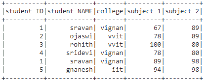
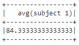
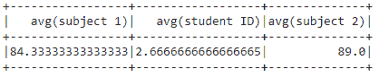
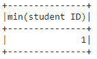
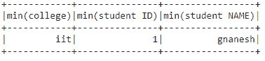
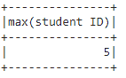
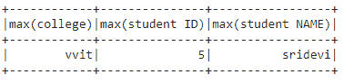

# 查找 PySpark 数据框列的最小值、最大值和平均值

> 原文:[https://www . geesforgeks . org/find-最小-最大-平均值-pyspark-dataframe-column/](https://www.geeksforgeeks.org/find-minimum-maximum-and-average-value-of-pyspark-dataframe-column/)

在本文中，我们将在 PySpark 数据框中找到特定列的最大值、最小值和平均值。

为此，我们将使用 agg()函数。此函数计算聚合并将结果作为数据帧返回。

> **语法:**data frame . agg({ ' column _ name ':' avg/' max/min })
> 
> 哪里，
> 
> *   数据帧是输入数据帧
> *   column_name 是数据框中的列

**创建用于演示的数据帧:**

## 蟒蛇 3

```py
# importing module
import pyspark

# importing sparksession from pyspark.sql 
# module
from pyspark.sql import SparkSession

# creating sparksession and giving an app
# name
spark = SparkSession.builder.appName('sparkdf').getOrCreate()

# list  of students  data
data = [["1", "sravan", "vignan", 67, 89],
        ["2", "ojaswi", "vvit", 78, 89],
        ["3", "rohith", "vvit", 100, 80],
        ["4", "sridevi", "vignan", 78, 80],
        ["1", "sravan", "vignan", 89, 98],
        ["5", "gnanesh", "iit", 94, 98]]

# specify column names
columns = ['student ID', 'student NAME',
           'college', 'subject 1', 'subject 2']

# creating a dataframe from the lists of data
dataframe = spark.createDataFrame(data, columns)

# display dataframe
dataframe.show()
```

**输出:**



### 寻找平均值

**例 1:** Python 程序求数据帧列的平均值

## 蟒蛇 3

```py
# find average of subjects column
dataframe.agg({'subject 1': 'avg'}).show()
```

**输出:**



**示例 2:** 从多列中获取平均值

## 蟒蛇 3

```py
# find average of multiple  column
dataframe.agg({'subject 1': 'avg',
               'student ID': 'avg',
               'subject 2': 'avg'}).show()
```

**输出:**



### 寻找最小值

**例 1:** Python 程序求 dataframe 列中的最小值。

## 蟒蛇 3

```py
# minimum value from student ID column
dataframe.agg({'student ID': 'min'}).show()
```

**输出:**



**示例 2:** 从多列中获取最小值

## 蟒蛇 3

```py
# minimum value from multiple column
dataframe.agg({'college': 'min',
               'student NAME': 'min',
               'student ID':'min'}).show()
```

**输出:**



### 寻找最大值

**示例 1:** Python 程序在 dataframe 列中查找最大值

## 蟒蛇 3

```py
# maximum value from student ID column
dataframe.agg({'student ID': 'max'}).show()
```

**输出:**



**示例 2:** 从多列中获取最大值

## 蟒蛇 3

```py
# maximum value from multiple column
dataframe.agg({'college': 'max',
               'student NAME': 'max',
               'student ID':'max'}).show()
```

**输出:**

