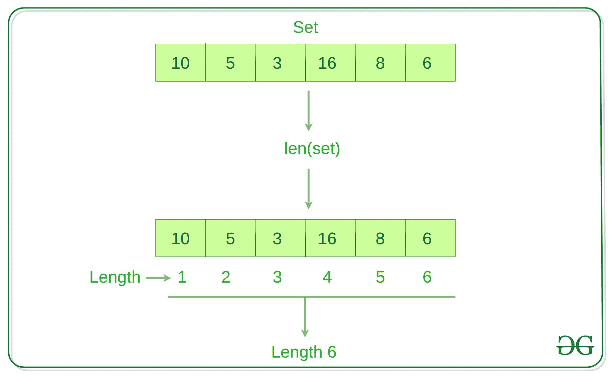

# 在 Python 中找到一个集合的长度

> 原文:[https://www . geesforgeks . org/find-python 中的长度集/](https://www.geeksforgeeks.org/find-the-length-of-a-set-in-python/)

在 [Python](https://www.geeksforgeeks.org/python-programming-language/) 中，[集合](https://www.geeksforgeeks.org/python-sets/)是一种无序且可变的集合数据类型。集合不能有重复的元素。这里的任务是找出集合中存在的元素数量。见下面的例子。
**例:**

```py
Input: a = {1, 2, 3, 4, 5, 6}
Output: 6

Input: a = {'Geeks', 'For'}
Output: 2
```

这个想法是用 Python 中 [len()的](https://www.geeksforgeeks.org/list-methods-in-python-set-1-in-not-in-len-min-max/)T2】



**例 1:**

## 蟒蛇 3

```py
# Python program to find the length
# of set

set1 = set() 

# Adding element and tuple to the Set
set1.add(8)
set1.add(9)
set1.add((6, 7))

print("The length of set is:", len(set1))
```

**输出:**

```py
The length of set is: 3
```

**例 2:**

## 蟒蛇 3

```py
n = len({1, 2, 3, 4, 5})

print("The length of set is:", n)
```

**输出:**

```py
The length of set is: 5
```

**len()是如何工作的？**
len()在 O(1)时间工作，因为集合是一个对象，并且有一个成员来存储它的大小。下面是 Python 文档中对 len()的描述。

> 返回对象的长度(项目数)。参数可以是序列(如字符串、字节、元组、列表或范围)或集合(如字典、集合或冻结集合)。