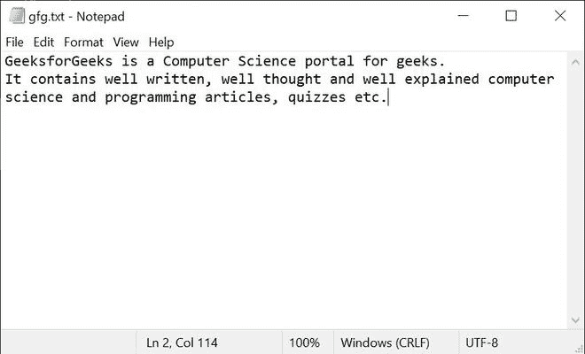

# 查找文本文件中重复次数最多的单词

> 原文:[https://www . geesforgeks . org/find-文本文件中重复次数最多的单词/](https://www.geeksforgeeks.org/find-the-most-repeated-word-in-a-text-file/)

Python 提供了创建、写入和读取文件的内置功能。python 中可以处理两种类型的文件，普通文本文件和二进制文件(用二进制语言编写，0 和 1)。

*   **文本文件:**在这种类型的文件中，每一行文本都以一个名为 EOL(行尾)的特殊字符结束，默认情况下，这是 python 中的新行字符(' \n ')。
*   **二进制文件:**在这种类型的文件中，一行没有终止符，数据转换成机器可理解的二进制语言后存储。

我们在**上操作。Python 中的 txt 文件**。通过这个程序，我们会找到一个文件中重复次数最多的单词。

**进场:**

*   我们将把文件的内容作为输入。
*   从输入字符串中删除空格和标点符号后，我们会将每个单词保存在列表中。
*   找出每个单词的频率。
*   打印频率最高的单词。

**输入文件:**



**以下是上述方法的实现:**

## 蟒蛇 3

```py
# Python program to find the most repeated word
# in a text file

# A file named "gfg", will be opened with the 
# reading mode.
file = open("gfg.txt","r")
frequent_word = ""
frequency = 0 
words = []

# Traversing file line by line
for line in file:

    # splits each line into
    # words and removing spaces
    # and punctuations from the input
    line_word = line.lower().replace(',','').replace('.','').split(" "); 

    # Adding them to list words
    for w in line_word: 
        words.append(w); 

# Finding the max occurred word
for i in range(0, len(words)): 

    # Declaring count
    count = 1; 

    # Count each word in the file 
    for j in range(i+1, len(words)): 
        if(words[i] == words[j]): 
            count = count + 1; 

    # If the count value is more
    # than highest frequency then
    if(count > frequency): 
        frequency = count; 
        frequent_word = words[i]; 

print("Most repeated word: " + frequent_word)
print("Frequency: " + str(frequency))
file.close();
```

**输出:**

```py
Most repeated word: well
Frequency: 3
```