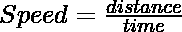
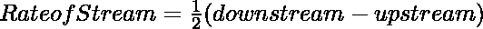

# 从上游和下游给出的人的速度中找出水流的速度

> 原文:[https://www . geeksforgeeks . org/从上游和下游给定的人的速度中找到流的速度/](https://www.geeksforgeeks.org/find-the-speed-of-the-stream-from-the-speed-of-the-man-given-in-both-upstream-and-downstream/)

一艘船带着 N1 hr 在一条河的下游划一个机器人 X1 公里，带着 N2 hr 在上游覆盖 X2 公里的距离。找出水流的速度。

```
Input: 3 15 2 5
Output: 17.5 km/hr

Input: 4 29 7 30
Output: 47 km/hr
```

**进场:**

*   接受用户的输入
*   计算下游和上游的速率。这个比率可以用公式来计算。



*   然后，计算水流的速度。它由公式给出–



**下面是实现。**

## C++

```
#include<iostream>
using namespace std;

void rate(float down, float up)
{

    // Stream rate
    float rate = 0.5 * (down - up);
    cout << rate <<  " Km/hr";
}

// Driver Code
int main()
{

    // Distance and time downstream
    float N1 = 3;
    float X1 = 15;

    // Distance and time upstream
    float N2 = 2;
    float X2 = 5;

    // Rate of downstream and upstream
    float Rate_downstream = X1 / N1;
    float Rate_upstream = X2 / N2;

    rate(Rate_downstream, Rate_upstream);

   return 0;
}

// This code is contributed by Surbhi Tyagi.

```

## Java 语言(一种计算机语言，尤用于创建网站)

```
/*package whatever //do not write package name here */

import java.io.*;

public class GFG
{

public static void rate(float down, float up)
{

    // Stream rate
    double rate = 0.5 * (down - up);
    System.out.println(rate+ " Km/hr");
}

// Driver Code
public static void main(String args[])
{

// Distance and time downstream
float N1 = 3;
float X1 = 15;

// Distance and time upstream
float N2 = 2;
float X2 = 5;

// Rate of downstream and upstream
float Rate_downstream = X1 / N1;
float Rate_upstream = X2 / N2;

rate(Rate_downstream, Rate_upstream);
    }
}

// This code is contributed by sravankumar8128.
```

## 蟒蛇 3

```
def rate(down, up):

    # stream rate
    rate = 0.5*(down - up)
    print(rate, " Km/hr")

# Driver Code
# Distance and time downstream
N1 = 3
X1 = 15

# Distance and time upstream
N2 = 2
X2 = 5

# Rate of downstream and upstream
Rate_downstream = X1/N1
Rate_upstream = X2/N2

rate(Rate_downstream, Rate_upstream)
```

## java 描述语言

```
<script>

function rate(down, up)
{

    // Stream rate
    var rate = 0.5 * (down - up);
    document.write(rate, " Km/hr");
}

// Driver Code

// Distance and time downstream
var N1 = 3;
var X1 = 15;

// Distance and time upstream
var N2 = 2;
var X2 = 5;

// Rate of downstream and upstream
var Rate_downstream = X1 / N1;
var Rate_upstream = X2 / N2;

rate(Rate_downstream, Rate_upstream);

// This code is contributed by Ankita saini

</script>
```

**输出:**

```
1.25  Km/hr
```