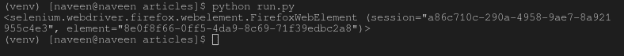

# find_element_by_class_name()驱动方法–Selenium Python

> 原文:[https://www . geesforgeks . org/find _ element _ by _ class _ name-driver-method-selenium-python/](https://www.geeksforgeeks.org/find_element_by_class_name-driver-method-selenium-python/)

Selenium 的 Python 模块是为使用 Python 执行自动化测试而构建的。硒 Python 绑定提供了一个简单的应用编程接口，可以使用硒网络驱动程序编写功能/验收测试。安装完 selenium 并签出–[使用 get 方法导航链接](https://www.geeksforgeeks.org/navigating-links-using-get-method-selenium-python/)后，您可能希望使用 Selenium Python 玩得更多。在使用 geeksforgeeks 等 selenium 打开页面后，您可能希望自动单击某些按钮或自动填写表单或任何此类自动任务。

本文围绕如何使用 Selenium Web Driver 的定位策略抓取或定位网页中的元素展开。更具体地说，本文将讨论`find_element_by_class_name()`。

**Syntax –**

```
driver.find_element_by_class_name("class_of_element")

```

**示例–**
例如，考虑一下这个页面来源:

```
<html>
 <body>
  <p class="content">Site content goes here.</p>
</body>
<html>
```

现在，在您创建了驱动程序之后，您可以使用–

```
content = driver.find_element_by_class_name('content')

```

## 如何在 Selenium 中使用 driver . find _ element _ by _ class _ name()方法？

让我们尝试实际实现这个方法，并为**获取一个元素实例。让我们尝试使用它的类名“gsc-input”来抓取搜索表单输入。
创建一个名为 run.py 的文件来演示 find_element_by_class_name 方法–**

```
# Python program to demonstrate
# selenium

# import webdriver
from selenium import webdriver

# create webdriver object
driver = webdriver.Firefox()

# enter keyword to search
keyword = "geeksforgeeks"

# get geeksforgeeks.org
driver.get("https://www.geeksforgeeks.org/")

# get element 
element = driver.find_element_by_class_name("gsc-input")

# print complete element
print(element)
```

现在使用运行–

```
Python run.py
```

首先，它会用 geeksforgeeks 打开 firefox 窗口，然后选择元素并将其打印在终端上，如下所示。
**浏览器输出–**

**终端输出–**


## 用于定位单个元素的更多定位器

| 探测器 | 描述 |
| --- | --- |
| [find_element_by_id](https://www.geeksforgeeks.org/find_element_by_id-driver-method-selenium-python/) | 将返回 id 属性值与位置匹配的第一个元素。 |
| [查找 _ 元素 _by_name](https://www.geeksforgeeks.org/find_element_by_name-driver-method-selenium-python/?ref=rp) | 将返回名称属性值与位置匹配的第一个元素。 |
| [find_element_by_xpath](https://www.geeksforgeeks.org/find_element_by_xpath-driver-method-selenium-python/?ref=rp) | 将返回 xpath 语法与位置匹配的第一个元素。 |
| [find _ element _ by _ link _ text](https://www.geeksforgeeks.org/find_element_by_link_text-driver-method-selenium-python/?ref=rp) | 将返回链接文本值与位置匹配的第一个元素。 |
| [find _ element _ by _ partial _ link _ text](https://www.geeksforgeeks.org/find_element_by_partial_link_text-driver-method-selenium-python/?ref=rp) | 将返回第一个具有与位置匹配的部分链接文本值的元素。 |
| [find_element_by_tag_name](https://www.geeksforgeeks.org/find_element_by_tag_name-driver-method-selenium-python/?ref=rp) | 将返回具有给定标记名的第一个元素。 |
| [find _ element _ by _ class _ name](https://www.geeksforgeeks.org/find_element_by_class_name-driver-method-selenium-python/?ref=rp) | 将返回具有匹配类属性名的第一个元素。 |
| [find _ element _ by _ CSS _ 选择器](https://www.geeksforgeeks.org/find_element_by_css_selector-driver-method-selenium-python/?ref=rp) | 将返回具有匹配 CSS 选择器的第一个元素。 |