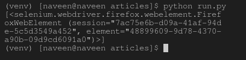

# find_elements_by_class_name()驱动方法–Selenium Python

> 原文:[https://www . geesforgeks . org/find _ elements _ by _ class _ name-driver-method-selenium-python/](https://www.geeksforgeeks.org/find_elements_by_class_name-driver-method-selenium-python/)

Selenium 的 Python 模块是为使用 Python 执行自动化测试而构建的。硒 Python 绑定提供了一个简单的应用编程接口，可以使用硒网络驱动程序编写功能/验收测试。安装硒元素并使用[获取方法](https://www.geeksforgeeks.org/navigating-links-using-get-method-selenium-python/)查看–[导航链接后，您可能想玩更多硒元素 Python。在使用 geeksforgeeks 等 selenium 打开页面后，您可能希望自动单击某些按钮或自动填写表单或任何此类自动任务。
本文围绕如何使用 Selenium Web Driver 的定位策略抓取或定位网页中的元素展开。更具体地说，本文将讨论 find_elements_by_class_name()。此方法返回具有指定元素类型的列表。
要抓取单个第一个元素，签出–](https://www.geeksforgeeks.org/navigating-links-using-get-method-selenium-python/)[find _ element _ by _ class _ name()驱动程序方法–Selenium Python](https://www.geeksforgeeks.org/find_element_by_class_name-driver-method-selenium-python/?ref=rp)
**语法–**

```
driver.find_elements_by_class_name("class-name")
```

**示例–**
例如，考虑此页面来源:

超文本标记语言

现在，在您创建了驱动程序之后，您可以使用–
抓取一个元素

```
login_form = driver.find_elements_by_class_name('form-control')
```

## 如何在 Selenium 中使用 driver . find _ elements _ by _ class _ name()方法？

让我们尝试实际实现这个方法，并为**获取一个元素实例。让我们尝试使用其类“GSC-输入”
抓取搜索表单输入，创建一个名为 run.py 的文件来演示 find_elements_by_class_name 方法–** 

## 蟒蛇 3

```
# Python program to demonstrate
# selenium

# import webdriver
from selenium import webdriver

# create webdriver object
driver = webdriver.Firefox()

# enter keyword to search
keyword = "geeksforgeeks"

# get geeksforgeeks.org
driver.get("https://www.geeksforgeeks.org/")

# get elements
elements = driver.find_elements_by_class_name("gsc-input")

# print complete elements list
print(element)
```

现在使用–
运行

```
Python run.py
```

首先，它会用 geeksforgeeks 打开 firefox 窗口，然后选择元素并将其打印在终端上，如下所示。
**浏览器输出–**


**终端输出–**

