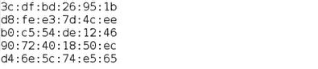
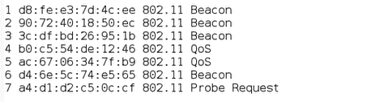

# 使用 Scapy Python 查找所有 Wifi 设备

> 原文:[https://www . geeksforgeeks . org/find-all-wifi-devices-use-scapy-python/](https://www.geeksforgeeks.org/finding-all-wifi-devices-using-scapy-python/)

Scapy 是 Python2 和 Python3 都支持的库。它用于与网络上的数据包进行交互。它有几个功能，通过它们我们可以很容易地伪造和操纵数据包。通过 scapy 模块，我们可以创建不同的网络工具，如 ARP 欺骗器、网络扫描器、数据包转储器等。该模块可用于创建与网络安全和道德黑客相关的更高级的工具。

在本文中，我们将了解如何获取您周围连接的各种无线网络的 mac 地址以及它们发送的数据包类型。我们将探讨无线局域网报头中的地址 2，它是发射机地址。然后我们将创建一组这些地址，并将打印我们得到的所有唯一地址。

我们使用无线设备的 Dot 11 层来获取其地址和有效负载。Dot11 是无线通信网络全球规范的技术名称。

要成功运行 scapy，应满足以下条件:

**对于窗户:**

*   安装 [WinPcap](https://www.winpcap.org/install/) 。
*   转到开始->命令提示符->在管理中打开。使用命令“ipconfig/all”并复制我们将来将使用的无线适配器的描述。它看起来像这个“高通 QCA9377 802.11ac 无线适配器”。
*   现在到你正在使用的 IDE，打开终端，使用“pip install scapy”安装 scapy。

**对于 Linux:**

只需使用终端使用“pip install scapy”安装 scpay 并使用它。不需要额外的过程。为了获得所需的地址和数据包，使用了 scapy 模块的 sniff()方法。

> **语法:**嗅探(iface，计数，prn，超时=无)
> 
> **参数:**
> 
> *   **iface** 是我们想要嗅探到的接口。(默认值=所有可用接口)。
> *   **count** 是要嗅探的数据包总数。(0 表示无穷大)
> *   **prn** 是应用于每个嗅探数据包的回调方法。
> *   **超时**是您希望嗅探功能在秒内停止工作的时间(默认值为无)

### 方法

*   导入模块
*   查找 Iface 名称
*   将 IFACE_NAME 声明为网卡描述，并将其作为接口提供给嗅探功能
*   使用所需的参数调用 sniff()函数

**示例 1:** 打印所有检测到的地址

## 蟒蛇 3

```py
import sys
from scapy.all import *

IFACE_NAME = "Qualcomm QCA9377 802.11ac Wireless Adapter"
devices = set()

def PacketHandler(pkt):
    if pkt.haslayer(Dot11):
        dot11_layer = pkt.getlayer(Dot11)

        if dot11_layer.addr2 and (dot11_layer.addr2 not in devices):
            devices.add(dot11_layer.addr2)
            print(dot11_layer.addr2)

sniff(iface=IFACE_NAME, count=1, prn=PacketHandler)
```

**输出:**



**示例 2:** 打印所有检测到的数据包类型&地址

## 蟒蛇 3

```py
import sys
from scapy.all import *

IFACE_NAME = "Qualcomm QCA9377 802.11ac Wireless Adapter"
devices = set()

def PacketHandler(pkt):
    if pkt.haslayer(Dot11):
        dot11_layer = pkt.getlayer(Dot11)

        if dot11_layer.addr2 and (dot11_layer.addr2 not in devices):
            devices.add(dot11_layer.addr2)
            print(len(devices), dot11_layer.addr2, dot11_layer.payload.name)

sniff(iface=IFACE_NAME, count=100, prn=PacketHandler)
```

**输出:**

