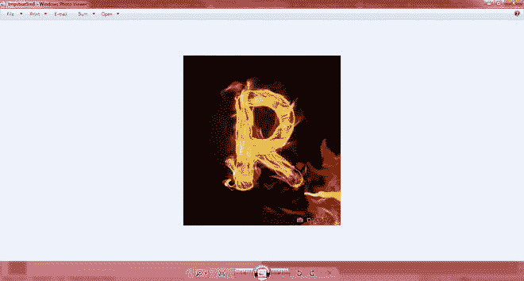

# 使用 PIL 查找图像之间的差异

> 原文:[https://www . geesforgeks . org/find-图像间差异-使用-pil/](https://www.geeksforgeeks.org/finding-difference-between-images-using-pil/)

Python 解释器本身并不具备处理图像并得出结论的能力。所以， [PIL](https://www.geeksforgeeks.org/python-pil-image-open-method/) (Python 图像库)给解释器增加了图像处理能力。PIL 是一个开源库，它为 python 处理图像及其表示提供了外部文件支持和效率。基本上，PIL 被设计成以图像(像素)的形式访问数据，以使分析更快。

PIL 支持图像格式，如-

*   联合图象专家组
*   一口
*   巴布亚新几内亚
*   使用 jpeg 文件交换格式存储的编码图像文件扩展名
*   可交换的图像格式

使用 PIL 可以执行很多功能，它们是-

**1)上传图像**

使用 PIL，我们可以加载图像并显示它。

**代码:**安装 PIL 库后，运行以下代码显示任何图像，如**ABC**–

## 蟒蛇 3

```
from PIL import Image

img1 = Image.open('abc.jpg')
img1.show()
```

**输出:**


运行代码后，图像将显示如下

**2)保存图像**

**代码:**保存图像

## 蟒蛇 3

```
from PIL import Image

img1 = Image.open('flower.png')
img1.save('flower.png')
```

**注意:**使用 PIL 的其他功能–图像处理、使用 ImageChops 的差异、下载、读取像素等。

## **使用 PIL 库**找到两幅图像之间的**差异**

要找到差异，在解释器中上传 2 张图片，然后使用 ImageChops 找到它们之间的差异，输出将是不言而喻的。

**用于差异的图像:**


r.jpg


p.jpg

## 蟒蛇 3

```
from PIL import Image, ImageChops

img1 = Image.open('p.jpg')
img2 = Image.open('r.jpg')

diff = ImageChops.difference(img1, img2)

if diff.getbbox():
    diff.show()
```

**输出:**



每个图像之间的额外部分/差异是绿色的。