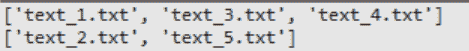

# 用 Python 查找重复文件

> 原文:[https://www . geeksforgeeks . org/find-replicate-files-with-python/](https://www.geeksforgeeks.org/finding-duplicate-files-with-python/)

在本文中，我们将编写一个 python 脚本来查找文件系统或特定文件夹中的重复文件。

## **方法 1:使用 filecomp**

python 模块 filecmp 提供了比较目录和文件的功能。cmp 函数比较文件，如果它们看起来相同，则返回真，否则返回假。

```py
Syntax: filecmp.cmp(f1, f2, shallow)
```

**参数:**

*   **f1:** 一个文件的名称
*   **f2:** 要比较的另一个文件的名称
*   **浅:**有了这个，我们设置要不要比较内容。

**注意:**默认值为 True，保证只比较文件的签名，不比较内容。

**返回类型:**布尔值(如果文件相同则为真，否则为假)

**示例:**

出于示例目的，我们在这里假设“text_1.txt”、“text_3.txt”、“text_4.txt”是具有相同内容的文件，“text_2.txt”、“text_5.txt”是具有相同内容的文件。

## 蟒蛇 3

```py
# Importing Libraries
import os
from pathlib import Path
from filecmp import cmp

# list of all documents
DATA_DIR = Path('/path/to/directory')
files = sorted(os.listdir(DATA_DIR))

# List having the classes of documents
# with the same content
duplicateFiles = []

# comparison of the documents
for file_x in files:

    if_dupl = False

    for class_ in duplicateFiles:
        # Comparing files having same content using cmp()
        # class_[0] represents a class having same content
        if_dupl = cmp(
            DATA_DIR / file_x,
            DATA_DIR / class_[0],
            shallow=False
        )
        if if_dupl:
            class_.append(file_x)
            break

    if not if_dupl:
        duplicateFiles.append([file_x])

# Print results
print(duplicateFiles)
```

**输出:**



## **方法 2:使用哈希和字典**

首先，这个脚本会得到一个文件夹或一个文件夹列表，然后通过遍历文件夹，它会找到重复的文件。接下来，该脚本将为文件夹中的每个文件计算一个散列值，而不管它们的名称如何，并以字典方式存储，散列值是文件的键和路径作为值。

*   我们必须导入 os、sys、hashlib 库。
*   然后脚本遍历这些文件，并调用 FindDuplicate()函数来查找重复的文件。

```py
Syntax: FindDuplicate(Path)
Parameter: 
Path: Path to folder having files
Return Type: Dictionary
```

*   函数 FindDuplicate()获取文件路径，并调用 Hash_File()函数
*   然后使用 Hash_File()函数返回该文件的 HEXdigest。欲了解更多关于 HEXdigest [的信息，请阅读此处](https://www.geeksforgeeks.org/md5-hash-python/)。

```py
Syntax: Hash_File(path)
Parameters: 
path: Path of file
Return Type: HEXdigest of file
```

*   然后，这个 MD5 哈希作为关键字附加到字典中，文件路径作为它的值。之后，FindDuplicate()函数返回一个字典，其中的键有多个值，即重复的文件。
*   现在调用 Join_Dictionary()函数，该函数连接由 FindDuplicate()返回的字典和一个空字典。

```py
Syntax: Join_Dictionary(dict1,dict2)
Parameters: 
dict1, dict2: Two different dictionaries
Return Type: Dictionary
```

*   之后，我们使用结果打印具有相同内容的文件列表。

**示例:**

出于示例目的，我们在这里假设“text_1.txt”、“text_3.txt”、“text_4.txt”是具有相同内容的文件，“text_2.txt”、“text_5.txt”是具有相同内容的文件。

## 蟒蛇 3

```py
# Importing Libraries
import os
import sys
from pathlib import Path
import hashlib

def FindDuplicate(SupFolder):

    # Duplic is in format {hash:[names]}
    Duplic = {}
    for file_name in files:

        # Path to the file
        path = os.path.join(folders, file_name)

        # Calculate hash
        file_hash = Hash_File(path)

        # Add or append the file path to Duplic
        if file_hash in Duplic:
            Duplic[file_hash].append(file_name)
        else:
            Duplic[file_hash] = [file_name]
    return Duplic

# Joins dictionaries
def Join_Dictionary(dict_1, dict_2):
    for key in dict_2.keys():

        # Checks for existing key
        if key in dict_1:

            # If present Append
            dict_1[key] = dict_1[key] + dict_2[key]
        else:

            # Otherwise Stores
            dict_1[key] = dict_2[key]

# Calculates MD5 hash of file
# Returns HEX digest of file
def Hash_File(path):

    # Opening file in afile
    afile = open(path, 'rb')
    hasher = hashlib.md5()
    blocksize=65536
    buf = afile.read(blocksize)

    while len(buf) > 0:
        hasher.update(buf)
        buf = afile.read(blocksize)
    afile.close()
    return hasher.hexdigest()

Duplic = {}
folders = Path('path/to/directory')
files = sorted(os.listdir(folders))
for i in files:

    # Iterate over the files
    # Find the duplicated files
    # Append them to the Duplic
    Join_Dictionary(Duplic, FindDuplicate(i))

# Results store a list of Duplic values
results = list(filter(lambda x: len(x) > 1, Duplic.values()))
if len(results) > 0:
    for result in results:
        for sub_result in result:
            print('\t\t%s' % sub_result)
else:
    print('No duplicates found.')
```

**输出:**

