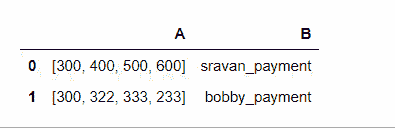
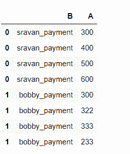

# 展平数据帧列表

> 原文:[https://www.geeksforgeeks.org/flatten-a-list-of-dataframes/](https://www.geeksforgeeks.org/flatten-a-list-of-dataframes/)

在本文中，我们将看到如何展平数据帧列表。展平定义为将数据格式转换或更改为窄格式。扁平列表的优点是提高了计算速度和对数据的良好理解。

**示例:**

让我们考虑一下，包含四个月付款等值的数据框。实际上，数据是以列表格式存储的。



**注:** 0、1、2 为记录的索引

扁平化意味着为每个作者分别分配列表。



**我们将使用数据帧对列表执行展平操作。**

**方法 1:**

**步骤 1:** 创建一个简单的数据帧。

## 蟒蛇 3

```
#importing pandas module
import pandas as pd

#creating dataframe with 2 columns
df = pd.DataFrame(data=[[[ 300, 400, 500, 600], 'sravan_payment'], 
                        [[ 300, 322, 333, 233], 'bobby_payment']], 
                  index=[ 0, 1], columns=[ 'A', 'B'])

display(df)
```