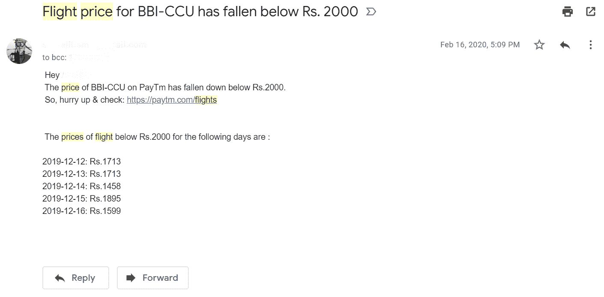

# 使用 Python 和 Selenium 的航班价格检查器

> 原文:[https://www . geesforgeks . org/flight-price-checker-use-python-and-selenium/](https://www.geeksforgeeks.org/flight-price-checker-using-python-and-selenium/)

Python 是一种脚本语言，具有许多扩展的库和框架。它用于计算机科学的各个领域，如网络开发和数据科学。此外，Python 可以用来自动化一些小任务，从长远来看，这些小任务确实很有帮助。

本文中提到的 Python 脚本将使用 selenium 从 paytm.com 获取价格，如果它小于或等于您设置的金额(您已经准备好消费)，则将向所需的电子邮件 id 发送关于降价的通知。

用于发送通知的电子邮件 id 不应使用个人密码，因为它需要双因素身份验证，并且操作将失败。相反，应该设置一个不同的密码，该密码可以由脚本和将来可能开发的许多其他不同应用程序访问。

**注意:**发送该邮件所需的密码可通过此链接设置:[谷歌应用密码](https://support.google.com/accounts/answer/185833?hl=en#)

## 履行

**导入所有需要的库**

硒执行网站自动化

```py
from selenium import webdriver 
from selenium.webdriver.common.by import By 
from selenium.webdriver.support.ui import WebDriverWait 
from selenium.webdriver.support import expected_conditions as EC 
from selenium.webdriver.chrome.options import Options 
from selenium.common.exceptions import TimeoutException 
from selenium.webdriver.common.keys import Keys 
```

通过电子邮件发送通知的 smtplib

```py
import smtplib
```

**提取两个选定日期之间的航班价格**

```py
# Choose the two dates
# in this format 
x = "2020-03-10" 
y = "2020-03-16"

a = int(x[8:10])
b = int(y[8:10])

if a > b:
    m = a - b
    t = b

else:
    m = b - a
    t = a
print(t)

low_price = ""
url_final = 'https://paytm.com/flights'
data = {}

for i in range(t, t + m+1):
    url = 'https://paytm.com/flights/flightSearch/BBI-\
    Bhubaneshwar/DEL-Delhi/1/0/0/E/2020-03-'+str(i)

    # Locations can be changed on 
    # the above statement
    print(url)

    date = "2019-12-" + str(i)

    # enables the script to run properly without 
    # opening the chrome browser.
    chrome_options = Options()
    chrome_options.add_argument("--disable-gpu")

    chrome_options.add_argument("--headless")

    driver = webdriver.Chrome(executable_path = '/path/to/chromedriver', 
                              options=chrome_options)

    driver.implicitly_wait(20)
    driver.get(url)

    g = driver.find_element_by_xpath("//div[@class='_2gMo']") 
    price = g.text

    x = price[0]
    y = price[2:5]
    z = str(x)+str(y)
    p = int(z)
    print(p)

    prices=[]
    if p <= 2000:
        data[date] = p

for i in data:
    low_price += str(i) + ": Rs." + str(data[i]) + "\n"

print(low_price) 
```

**通过使用 SMTP 的电子邮件发送有廉价航班的通知**

```py
if len(data) != 0:

    dp = 2000
    server = smtplib.SMTP('smtp.gmail.com',587)
    server.ehlo()
    server.starttls()
    server.ehlo()

    server.login('your_email_id','your_password')
    subject = "Flight price for BBI-DEL has fallen\
    below Rs. " + str(dp)

    body = "Hey Akash! \n The price of BBI-DEL on PayTm \
    has fallen down below Rs." + str(dp) + ".\n So,\
    hurry up & check: " + url_final+"\n\n\n The prices of\
    flight below Rs.2000 for the following days are\
    :\n\n" + low_price

    msg = f"Subject: {subject} \n\n {body}"

    server.sendmail(
        # email ids where you want to
        # send the notification
        'email_id_1',
        'email_id_2',
        msg
        )

    print("HEY,EMAIL HAS BEEN SENT SUCCESSFULLY.")

    server.quit()
```

**完整代码:**

```py
from selenium import webdriver 
from selenium.webdriver.common.by import By 
from selenium.webdriver.support.ui import WebDriverWait 
from selenium.webdriver.support import expected_conditions as EC 
from selenium.webdriver.chrome.options import Options 
from selenium.common.exceptions import TimeoutException 
from selenium.webdriver.common.keys import Keys 
import smtplib

# Choose the two dates
# in this format 
x = "2020-03-10" 
y = "2020-03-16"

a = int(x[8:10])
b = int(y[8:10])

if a > b:
    m = a - b
    t = b

else:
    m = b - a
    t = a
print(t)

low_price = ""
url_final = 'https://paytm.com/flights'
data = {}

for i in range(t, t + m+1):
    url = 'https://paytm.com/flights/flightSearch/BBI-\
    Bhubaneshwar/DEL-Delhi/1/0/0/E/2020-03-'+str(i)

    # Locations can be changed on 
    # the above statement
    print(url)

    date = "2019-12-" + str(i)

    # enables the script to run properly without 
    # opening the chrome browser.
    chrome_options = Options()
    chrome_options.add_argument("--disable-gpu")

    chrome_options.add_argument("--headless")

    driver = webdriver.Chrome(executable_path = '/path/to/chromedriver', 
                              options=chrome_options)

    driver.implicitly_wait(20)
    driver.get(url)

    g = driver.find_element_by_xpath("//div[@class='_2gMo']") 
    price = g.text

    x = price[0]
    y = price[2:5]
    z = str(x)+str(y)
    p = int(z)
    print(p)

    prices=[]
    if p <= 2000:
        data[date] = p

for i in data:
    low_price += str(i) + ": Rs." + str(data[i]) + "\n"

print(low_price) 

if len(data) != 0:

    dp = 2000
    server = smtplib.SMTP('smtp.gmail.com',587)
    server.ehlo()
    server.starttls()
    server.ehlo()

    server.login('your_email_id','your_password')
    subject = "Flight price for BBI-DEL has fallen\
    below Rs. " + str(dp)

    body = "Hey Akash! \n The price of BBI-DEL on PayTm \
    has fallen down below Rs." + str(dp) + ".\n So,\
    hurry up & check: " + url_final+"\n\n\n The prices of\
    flight below Rs.2000 for the following days are\
    :\n\n" + low_price

    msg = f"Subject: {subject} \n\n {body}"

    server.sendmail(
        # email ids where you want to
        # send the notification
        'email_id_1',
        'email_id_2',
        msg
        )

    print("HEY,EMAIL HAS BEEN SENT SUCCESSFULLY.")

    server.quit()
```

**输出:**

