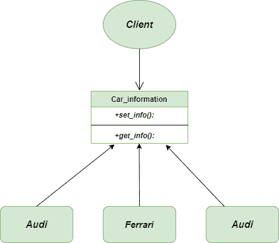
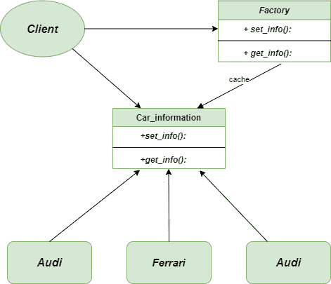

# 飞重法–Python 设计模式

> 原文:[https://www . geesforgeks . org/fly weight-method-python-design-patterns/](https://www.geeksforgeeks.org/flyweight-method-python-design-patterns/)

Flyweight 方法是一种 [**结构设计模式**](https://www.geeksforgeeks.org/design-patterns-set-1-introduction/) ，它专注于最小化程序在运行时所需的对象数量。基本上，它创建了一个由多个上下文共享的 Flyweight 对象。它的创建方式使您无法区分对象和 Flyweight 对象。飞重物体的一个重要特征是它们是**不变的**。这意味着它们一旦被构建就不能被修改。
为了实现 [**Python**](https://www.geeksforgeeks.org/python-programming-language/) 中的 Flyweight 方法，我们使用 [**字典**](https://www.geeksforgeeks.org/python-dictionary/) 来存储对已经创建的对象的引用，每个对象都与一个键相关联。

### 为什么我们关心程序中对象的数量？

*   对象数量的减少减少了内存的使用，并且它设法让我们远离与内存相关的错误
*   虽然用 Python 创建一个对象确实很快，但我们仍然可以通过共享对象来减少程序的执行时间。

### 不使用飞行重量法的问题

假设你是一个非常喜欢**赛车游戏**的游戏开发者，也想为你和你的朋友开发一款赛车游戏。因为你是一个完美的游戏开发者，你创造了一个，并开始享受游戏。然后你也把游戏发给了你的朋友，但是他不太喜欢这个游戏，因为游戏每隔几分钟就会崩溃一次。
**但是为什么呢？**(如果你认为自己是职业游戏开发者，请猜猜原因)。调试了几个小时，发现问题是你朋友的系统缺少 **RAM** 。你的系统比你朋友的系统强大得多，这就是为什么游戏在你的系统上运行流畅，而在你朋友的系统上运行不流畅。



飞行重量-问题-图表

### 使用飞行重量法的解决方案

**那么，作为开发者，你会怎么做来提升性能呢？(当然！不打算升级 RAM)** 。实际问题与汽车对象有关，因为每辆车都由单独的对象表示，这些对象包含大量与其颜色、大小、座椅、最大速度等相关的数据。每当你的内存被填满，无法添加更多当前需要的新对象时，你的游戏就会崩溃。为了避免在应用程序中出现这种情况，开发人员的首要职责是使用 **Flyweight 方法**，它允许您通过共享对象的公共部分来将更多的对象放入可用的内存量中。


以下代码是使用 Flyweight 方法
编写的

## 蟒蛇 3

```py
class ComplexCars(object):

    """Separate class for Complex Cars"""

    def __init__(self):

        pass

    def cars(self, car_name):

        return "ComplexPattern[% s]" % (car_name)

class CarFamilies(object):

    """dictionary to store ids of the car"""

    car_family = {}

    def __new__(cls, name, car_family_id):
        try:
            id = cls.car_family[car_family_id]
        except KeyError:
            id = object.__new__(cls)
            cls.car_family[car_family_id] = id
        return id

    def set_car_info(self, car_info):

        """set the car information"""

        cg = ComplexCars()
        self.car_info = cg.cars(car_info)

    def get_car_info(self):

        """return the car information"""

        return (self.car_info)

if __name__ == '__main__':
    car_data = (('a', 1, 'Audi'), ('a', 2, 'Ferrari'), ('b', 1, 'Audi'))
    car_family_objects = []
    for i in car_data:
        obj = CarFamilies(i[0], i[1])
        obj.set_car_info(i[2])
        car_family_objects.append(obj)

    """similar id's says that they are same objects """

    for i in car_family_objects:
        print("id = " + str(id(i)))
        print(i.get_car_info())
```

### 输出

```py
id = 58598800
ComplexPattern[Audi]
id = 58598832
ComplexPattern[Ferrari]
id = 58598800
ComplexPattern[Audi]
```

### 类图

以下是 Flyweight 方法的类图



飞行重量等级图

### 优势

*   **减少内存的使用:**当我们的应用程序中有很多类似的对象时，使用 **Flyweight 方法**总是更好，以便节省内存中的大量空间
*   **改进的数据缓存:**当客户端或用户的需求是高响应时间时，总是首选使用 Flyweight 方法，因为它有助于改进数据缓存。
*   **性能提升:**它最终会带来性能的提升，因为我们使用的重物数量减少了。

### 不足之处

*   **打破封装:**每当我们试图将状态移动到对象外部时，我们就会打破封装，并且与将状态保持在对象内部相比，效率可能会降低。
*   **难以处理:**Flyweight 方法的用法取决于我们使用的语言，在 Python、Java 等语言中容易使用，其中所有对象变量都是引用，但在 C、C++等语言中通常使用，其中对象可以作为堆栈上的局部变量进行分配，并由于程序员的操作而被销毁。
*   **复杂代码:**使用 Flyweight 方法总会增加新开发人员理解代码的复杂度。

### 适应性

*   **减少对象数量:**一般来说，当我们的应用程序中有很多重量较重的对象时，会使用 Flyweight 方法，为了解决这个问题，我们使用 Flyweight 方法来摆脱不必要的内存消耗。
*   **对象无关应用:**当我们的应用如果独立于所创建的对象，那么我们可以利用这个方法来节省大量的机器空间。
*   **项目成本降低:**当需要在空间和时间复杂度上降低项目成本时，总是首选使用 Flyweight 方法。

**进一步阅读–**[**Java 中的 Flyweight 方法**](https://www.geeksforgeeks.org/flyweight-design-pattern/)