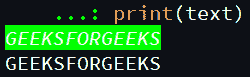

# Python 中的 Fontstyle 模块

> 哎哎哎:# t0]https://www . geeksforgeeks . org/fontstyle-in-python/

有时候终端文字会很难阅读，t 他 *fontstyle* 模块是包托管在*pypi.org*上用于操纵文字。它可以用来 b 用一些额外的格式打破噪音，添加颜色、字体粗细和其他样式，使其更具可读性。它还支持子字符串格式，以获得额外的美观！

### **安装:**

```
pip install fontstyle

```

### **特征:**

*   设置文本格式
*   保留格式
*   删除格式

### 此模块提供的方法

**1) fonstyle.apply():** 此方法为整个输入参数字符串添加格式。

> **语法:** fonstyle.apply(“字符串”、“所有/可能/格式化/选项”)

*   **可用颜色:**黑色、蓝色、青色、深青色、绿色、紫色、红色、黄色、白色
*   **文字背景:**黑色 _BG、蓝色 _BG、青色 _BG、绿色 _BG、紫色 _BG、红色 _BG、黄色 _BG、白色 _BG
*   **格式化参数:**“闪烁”、“粗体”、“模糊”、“隐藏”、“斜体”、“反转”、“删除”、“下划线”、“结束”

**2) fontstyle.erase():** 此方法用于移除格式。

**3) fontstyle.preserve():** 此方法返回格式化前的原始文本，而不移除文本的实际格式。

下面是一些描述 Python 中 *fontstyle* 模块使用的程序:

**例 1:**

## 蟒蛇 3

```
# import module
import fontstyle

# format text
text = fontstyle.apply('GEEKSFORGEEKS', 'bold/Italic/red/GREEN_BG')

# display text
print(text)
```

**输出:**


这里，我们对给定的字符串应用各种格式参数，如字体颜色、背景颜色、粗体、斜体。

**例 2:**

## 蟒蛇 3

```
# import required module
import fontstyle

# display formatted text
print(fontstyle.apply('GEEKSFORGEEKS', 
                      'bold/Italic/red/UNDERLINE/GREEN_BG'))

print(fontstyle.apply('GEEKSFORGEEKS', 
                      'bold/Italic/red/INVERSE/UNDERLINE/GREEN_BG'))
```

**输出:**


下面是如何使用这个模块格式化文本的另一个例子。

**例 3:**

## 蟒蛇 3

```
# import module
import fontstyle

# apply formatting
text = fontstyle.apply(
    'GEEKSFORGEEKS', 'bold/Italic/red/INVERSE/2UNDERLINE/GREEN_BG')

# display text
print(text)

# preserved text
print(fontstyle.preserve(text))
```

**输出:**


在本程序中，使用 *preserve()* 方法显示格式化前的原始文本。

**注意:**您必须指定要删除的格式，否则它将删除上次更新的格式

**例 4:**

## 蟒蛇 3

```
# import required module
import fontstyle

# format text
text = fontstyle.apply(
    'GEEKSFORGEEKS', 'bold/Italic/red/INVERSE/2UNDERLINE/GREEN_BG')

# display text
print(text)

# remove formatting
text = fontstyle.erase(a, 'bold/Italic/red/INVERSE/2UNDERLINE/GREEN_BG')

# display original text
print(text)
```

**输出:**

