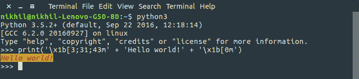

# 使用 Python 在 Linux 终端中格式化文本

> 原文:[https://www . geesforgeks . org/formated-text-Linux-terminal-use-python/](https://www.geeksforgeeks.org/formatted-text-linux-terminal-using-python/)

本文演示了如何使用 Python 编程语言在 **Linux 终端**中打印**格式文本**。

**格式化文本**(也称为**样式文本**或**富文本**)与纯文本不同，具有如下样式信息:

*   颜色(文本颜色、背景颜色)，
*   样式(粗体或斜体)，
*   以及一些其他特殊功能，如删除文本、下划线文本、超链接等。

在 Linux 终端中，[**【ANSI 转义码(或转义序列)**](https://en.wikipedia.org/wiki/ANSI_escape_code) 用于控制格式、颜色和其他输出选项。

为了编码这种格式化信息，某些**字节序列被嵌入到文本**中，终端查找并解释为命令并执行它们。

让我们通过一个简单的 Python 打印语句来完成打印格式化文本的基本示例！

```py
print('\x1b[3;31;43m' + 'Hello world!' + '\x1b[0m')
```

如果你在 Linux 终端上运行这段代码，你会得到如下输出:


如您所见，输出有:

*   文本颜色(前景色):红色
*   背景颜色:黄色
*   文本样式:斜体

现在，让我们试着理解上面打印语句中使用的 ANSI 转义码的含义。

*   First ANSI escape code used is:

    ```py
    \x1b[3;31;43m 
    ```

    这段代码的一般语法是:

    ```py
    \x1b[A;B;C 
    ```

    在这里，

    *   **A** :文本格式样式。它可以取 1 到 9 之间的任何值。

        | 价值 | 风格 |
        | --- | --- |
        | 一 | 大胆的 |
        | 二 | 模糊的 |
        | 三 | 斜体的 |
        | 四 | 强调 |
        | 五 | 讨厌的 |
        | 六 | 快速闪烁 |
        | 七 | 反面的 |
        | 八 | 隐藏 |
        | 九 | 删除线 |

    *   **B** :文字颜色或前景色。它可以采用 30-37 之间的任何值。
    *   **C** :背景色。它可以采用 40-47 之间的任何值。
        T68】蓝绿色

        | b(用于文本) | c(用于背景) | 颜色 |
        | --- | --- | --- |
        | 三十 | 四十 | 黑色 |
        | 三十一 | 四十一 | 红色 |
        | 三十二 | 四十二 | 绿色的 |
        | 三十三 | 四十三 | 黄色 |
        | 三十四 | 四十四 | 蓝色 |
        | 三十五 | 四十五 | 品红 |
        | 三十六 | 四十六 |
        | 三十七 | 四十七 | 白色 |

*   At the end, we use this ANSI escape code:

    ```py
    \x1b[0m 
    ```

    这是用于将颜色/样式更改重置为默认值的代码。

现在，我们用 Python 创建一个类来系统地实现所需的格式！

```py
# A python class definition for printing formatted text on terminal.
# Initialize TextFormatter object like this:
# >>> cprint = TextFormatter()
#
# Configure formatting style using .cfg method:
# >>> cprint.cfg('r', 'y', 'i')
# Argument 1: foreground(text) color
# Argument 2: background color
# Argument 3: text style
#
# Print formatted text using .out method:
# >>> cprint.out("Hello, world!")
#
# Reset to default settings using .reset method:
# >>> cprint.reset()

class TextFormatter:

    COLORCODE = {
        'k': 0,  # black
        'r': 1,  # red
        'g': 2,  # green
        'y': 3,  # yellow
        'b': 4,  # blue
        'm': 5,  # magenta
        'c': 6,  # cyan
        'w': 7   # white
    }

    FORMATCODE = {
        'b': 1,  # bold
        'f': 2,  # faint
        'i': 3,  # italic
        'u': 4,  # underline
        'x': 5,  # blinking
        'y': 6,  # fast blinking
        'r': 7,  # reverse
        'h': 8,  # hide
        's': 9,  # strikethrough
    }

    # constructor
    def __init__(self):
        self.reset()

    # function to reset properties
    def reset(self):
        # properties as dictionary
        self.prop = { 'st': None, 'fg': None, 'bg': None }
        return self

    # function to configure properties
    def cfg(self, fg, bg=None, st=None):
        # reset and set all properties
        return self.reset().st(st).fg(fg).bg(bg)

    # set text style
    def st(self, st):
        if st in self.FORMATCODE.keys():
            self.prop['st'] = self.FORMATCODE[st]
        return self

    # set foreground color
    def fg(self, fg):
        if fg in self.COLORCODE.keys():
            self.prop['fg'] = 30 + self.COLORCODE[fg]
        return self

    # set background color
    def bg(self,bg):
        if bg in self.COLORCODE.keys():
            self.prop['bg'] = 40 + self.COLORCODE[bg]
        return self

    # formatting function
    def format(self, string):
        w = [self.prop['st'],self.prop['fg'], self.prop['bg']]
        w = [ str(x) for x in w if x is not None ]
        # return formatted string
        return '\x1b[%sm%s\x1b[0m' % (';'.join(w), string) if w else string

    # output formatted string
    def out(self, string):
        print(self.format(string))
```

这是我们的文本格式化程序的类定义。

为了使用它，请将上面的 Python 脚本保存为 **[TextFormatter.py](https://github.com/nikhilkumarsingh/TextFormatter)** ，并在存储该文件的同一文件夹中打开终端。

然后通过终端运行 Python 解释器，导入 **TextFormatter** 。

下面是一个样本运行的屏幕截图:


在这里，

*   我们使用:

    ```py
    from TextFormatter import TextFormatter
    ```

    从**文本格式器**模块导入**文本格式器**类
*   然后，使用

    ```py
    cprint = TextFormatter()
    ```

    创建**文本格式化程序**类的对象
*   使用方法配置文本格式。这里，参数 1 是文本颜色，参数 2 是背景颜色，参数 3 是文本样式。

    ```py
    cprint.cfg('y', 'g', 'b')
    ```

*   现在，只需使用如下方法打印任何语句: **cprint.out**

所以，现在，你可以轻松地在终端上打印样式文本！

本博客由[尼克尔·库马尔](https://www.facebook.com/nikhilksingh97)投稿。如果你喜欢极客博客并想投稿，你也可以用 contribute.geeksforgeeks.org 写一篇文章或者把你的文章邮寄到 contribute@geeksforgeeks.org。看到你的文章出现在极客博客主页上，帮助其他极客。

如果你发现任何不正确的地方，或者你想分享更多关于上面讨论的话题的信息，请写评论。