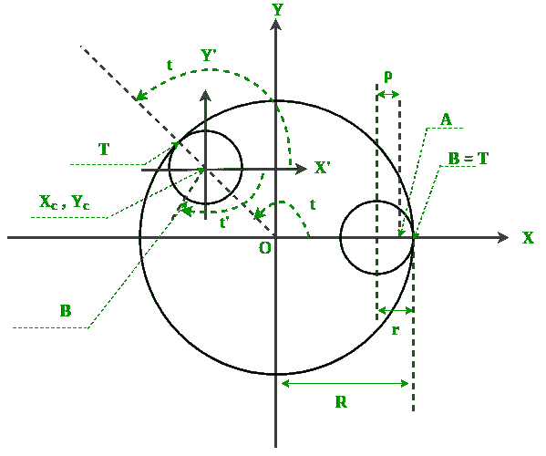
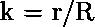

# 使用 Python 中的螺旋图进行分形

> 原文:[https://www . geeksforgeeks . org/fractal-use-spiro graph-python/](https://www.geeksforgeeks.org/fractal-using-spirograph-python/)

**简介**

使用塑料齿轮和彩色笔制作复杂图案的螺旋图玩具。一个**分形**是一条曲线，它是使用一个循环的模式发展起来的，在一个低的尺度上无限重复。分形用于模拟结构(如雪花)或描述部分混沌现象。
螺旋图可以用来绘制各种分形。其中一些在下面给出

您可以访问中的[优势-方程-blogspot .了解更多带有参数方程的分形设计。其中一些在下面给出](http://benice-equation.blogspot.in/2012/01/fractal-spirograph.html)

**帷幕背后的数学**

这是形成螺旋图分形的两个参数方程，要理解这些方程，你必须考虑螺旋图的广义图形。



关于数学部分，你可以参考[维基](https://en.wikipedia.org/wiki/Spirograph#Mathematical_basis)，尽管我会在这里简短地解释一点数学。如果我们对数学背后的东西感兴趣，那么你可以查看参考链接。到目前为止，这些不同的曲线可以用一个参数方程来绘制，通过改变方程的一些值，我们可以得到不同的分形。这是参数方程:

![  x(t) = R[(1-k)cost + lkcos(((1-k)/k)t)],  y(t) = R[(1-k)sint - lksin(((1-k)/k)t). ](img/21994b653a78dce98864b5881d71d6fd.png "Rendered by QuickLaTeX.com")

哪里，



r 是一个缩放参数，不影响肺活量图的结构。

还有，


所以，现在让我们试着用代码实现它。

```
#importing the required libraries
import random, argparse
import math
import turtle
from PIL import Image
from datetime import datetime    
from fractions import gcd

# A class that draws a spirograph
class Spiro:
    # constructor
    def __init__(self, xc, yc, col, R, r, l):

        # create own turtle
        self.t = turtle.Turtle()
        # set cursor shape
        self.t.shape('turtle')
        # set step in degrees
        self.step = 5
        # set drawing complete flag
        self.drawingComplete = False

        # set parameters
        self.setparams(xc, yc, col, R, r, l)

        # initiatize drawing
        self.restart()

    # set parameters
    def setparams(self, xc, yc, col, R, r, l):
        # spirograph parameters
        self.xc = xc
        self.yc = yc
        self.R = int(R)
        self.r = int(r)
        self.l = l
        self.col = col
        # reduce r/R to smallest form by dividing with GCD
        gcdVal = gcd(self.r, self.R)
        self.nRot = self.r//gcdVal
        # get ratio of radii
        self.k = r/float(R)
        # set color
        self.t.color(*col)
        # current angle
        self.a = 0

    # restart drawing
    def restart(self):
        # set flag
        self.drawingComplete = False
        # show turtle
        self.t.showturtle()
        # go to first point
        self.t.up()
        R, k, l = self.R, self.k, self.l
        a = 0.0
        x = R*((1-k)*math.cos(a) + l*k*math.cos((1-k)*a/k))
        y = R*((1-k)*math.sin(a) - l*k*math.sin((1-k)*a/k))
        self.t.setpos(self.xc + x, self.yc + y)
        self.t.down()

    # draw the whole thing
    def draw(self):
        # draw rest of points
        R, k, l = self.R, self.k, self.l
        for i in range(0, 360*self.nRot + 1, self.step):
            a = math.radians(i)
            x = R*((1-k)*math.cos(a) + l*k*math.cos((1-k)*a/k))
            y = R*((1-k)*math.sin(a) - l*k*math.sin((1-k)*a/k))
            self.t.setpos(self.xc + x, self.yc + y)
        # done - hide turtle
        self.t.hideturtle()

    # update by one step
    def update(self):
        # skip if done
        if self.drawingComplete:
            return
        # increment angle
        self.a += self.step
        # draw step
        R, k, l = self.R, self.k, self.l
        # set angle
        a = math.radians(self.a)
        x = self.R*((1-k)*math.cos(a) + l*k*math.cos((1-k)*a/k))
        y = self.R*((1-k)*math.sin(a) - l*k*math.sin((1-k)*a/k))
        self.t.setpos(self.xc + x, self.yc + y)
        # check if drawing is complete and set flag
        if self.a >= 360*self.nRot:
            self.drawingComplete = True
            # done - hide turtle
            self.t.hideturtle()

    # clear everything
    def clear(self):
        self.t.clear()

# A class for animating spirographs
class SpiroAnimator:
    # constructor
    def __init__(self, N):
        # timer value in milliseconds
        self.deltaT = 10
        # get window dimensions
        self.width = turtle.window_width()
        self.height = turtle.window_height()
        # create spiro objects
        self.spiros = []
        for i in range(N):
            # generate random parameters
            rparams = self.genRandomParams()
            # set spiro params
            spiro = Spiro(*rparams)
            self.spiros.append(spiro)
        # call timer
        turtle.ontimer(self.update, self.deltaT)

    # restart sprio drawing
    def restart(self):
        for spiro in self.spiros:
            # clear
            spiro.clear()
            # generate random parameters
            rparams = self.genRandomParams()
            # set spiro params
            spiro.setparams(*rparams)
            # restart drawing
            spiro.restart()

    # generate random parameters
    def genRandomParams(self):
        width, height = self.width, self.height
        R = random.randint(50, min(width, height)//2)
        r = random.randint(10, 9*R//10)
        l = random.uniform(0.1, 0.9)
        xc = random.randint(-width//2, width//2)
        yc = random.randint(-height//2, height//2)
        col = (random.random(),
               random.random(),
               random.random())
        return (xc, yc, col, R, r, l)

    def update(self):
        # update all spiros
        nComplete = 0
        for spiro in self.spiros:
            # update
            spiro.update()
            # count completed ones
            if spiro.drawingComplete:
                nComplete+= 1
        # if all spiros are complete, restart
        if nComplete == len(self.spiros):
            self.restart()
        # call timer
        turtle.ontimer(self.update, self.deltaT)

    # toggle turtle on/off
    def toggleTurtles(self):
        for spiro in self.spiros:
            if spiro.t.isvisible():
                spiro.t.hideturtle()
            else:
                spiro.t.showturtle()

# save spiros to image
def saveDrawing():
    # hide turtle
    turtle.hideturtle()
    # generate unique file name
    dateStr = (datetime.now()).strftime("%d%b%Y-%H%M%S")
    fileName = 'spiro-' + dateStr 
    print('saving drawing to %s.eps/png' % fileName)
    # get tkinter canvas
    canvas = turtle.getcanvas()
    # save postscipt image
    canvas.postscript(file = fileName + '.eps')
    # use PIL to convert to PNG
    img = Image.open(fileName + '.eps')
    img.save(fileName + '.png', 'png')
    # show turtle
    turtle.showturtle()

# main() function
def main():
    # use sys.argv if needed
    print('generating spirograph...')
    # create parser
    descStr = """This program draws spirographs using the Turtle module. 
    When run with no arguments, this program draws random spirographs.

    Terminology:

    R: radius of outer circle.
    r: radius of inner circle.
    l: ratio of hole distance to r.
    """
    parser = argparse.ArgumentParser(description=descStr)

    # add expected arguments
    parser.add_argument('--sparams', nargs=3, dest='sparams', required=False, 
                        help="The three arguments in sparams: R, r, l.")

    # parse args
    args = parser.parse_args()

    # set to 80% screen width
    turtle.setup(width=0.8)

    # set cursor shape
    turtle.shape('turtle')

    # set title
    turtle.title("Spirographs!")
    # add key handler for saving images
    turtle.onkey(saveDrawing, "s")
    # start listening 
    turtle.listen()

    # hide main turtle cursor
    turtle.hideturtle()

    # checks args and draw
    if args.sparams:
        params = [float(x) for x in args.sparams]
        # draw spirograph with given parameters
        # black by default
        col = (0.0, 0.0, 0.0)
        spiro = Spiro(0, 0, col, *params)
        spiro.draw()
    else:
        # create animator object
        spiroAnim = SpiroAnimator(4)
        # add key handler to toggle turtle cursor
        turtle.onkey(spiroAnim.toggleTurtles, "t")
        # add key handler to restart animation
        turtle.onkey(spiroAnim.restart, "space")

    # start turtle main loop
    turtle.mainloop()

# call main
if __name__ == '__main__':
    main()
```

输出:

```

<video class="wp-video-shortcode" id="video-163481-1" width="665" height="374" preload="metadata" controls=""><source type="video/mp4" src="https://media.geeksforgeeks.org/wp-content/uploads/2017-11-01-at-17-28-59.mp4?_=1">[https://media.geeksforgeeks.org/wp-content/uploads/2017-11-01-at-17-28-59.mp4](https://media.geeksforgeeks.org/wp-content/uploads/2017-11-01-at-17-28-59.mp4)</video>

```

上面的程序绘制了 4 种不同的螺旋图分形，尝试生成其他分形，然后在评论中上传你的 github 链接。如果出现任何错误，我很乐意帮助你。

本文由 [**Subhajit Saha**](https://www.linkedin.com/in/subhajit-saha-06aa29131/) 供稿。如果你喜欢 GeeksforGeeks 并想投稿，你也可以使用[contribute.geeksforgeeks.org](http://www.contribute.geeksforgeeks.org)写一篇文章或者把你的文章邮寄到 contribute@geeksforgeeks.org。看到你的文章出现在极客博客主页上，帮助其他极客。

如果你发现任何不正确的地方，或者你想分享更多关于上面讨论的话题的信息，请写评论。