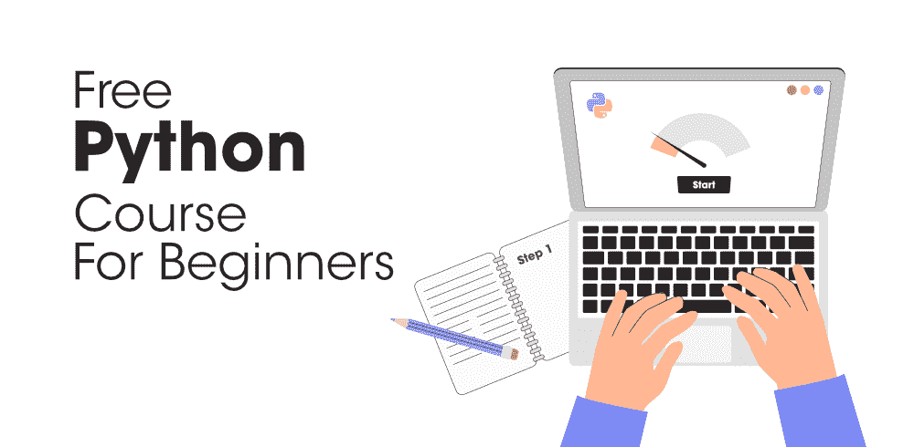

# 初学者免费 Python 课程

> 原文:[https://www . geesforgeks . org/free-python-初学者课程/](https://www.geeksforgeeks.org/free-python-course-for-beginners/)

无论你是在寻找机器学习、数据科学还是网站开发的职业，Python 语言的知识在所有这些领域都非常相关。由于 Python 在许多领域被广泛使用，几乎每个科技巨头都喜欢 Python，比如谷歌、脸书、YouTube 等，因为它们各自的平台或业务。

现在，你一定在想，如果 Python 如此受欢迎，并且 Python 开发人员在各个技术领域都有巨大的机会——那么为什么个人不去做呢？**原因是大部分个人，尤其是初学者，不知道学习 Python 的实际路线图。他们不知道从哪里开始，应该学什么，需要开发什么项目等等。**

*但是……心满意足地，为了让所有初学者的事情变得更容易——geeks forgeeks 正在提供一个惊人的机会，一个面向初学者的免费 Python 课程！*

### 课程详情

这实际上是一门基于研讨会的课程，它的设计方式需要各种理论和活动，让您的孩子了解 Python 的基础。这些理论和活动将以一种最有趣和最令人兴奋的方式通过一系列研讨会进行教授。

课程已于 2021 年 1 月 05 日**开始，您可以从这里 直接 [**报名参加课程。**](https://practice.geeksforgeeks.org/courses/start-with-python-kids)**

### **课程内容**

**本次免费限时研讨会将提供的详细内容如下:**

### **第一天:[Python 的第一个字节](https://practice.geeksforgeeks.org/tracks/pw-1/?batchId=321)**

*   **[Python 的安装](https://youtu.be/y5f3qrfflgw?t=885)**
*   **[你的第一个 Python 程序](https://youtu.be/y5f3qrfflgw?t=1608)**
*   **[使用 Python 进行数学计算](https://youtu.be/y5f3qrfflgw?t=2324)**
*   **[编程风格和文档](https://youtu.be/y5f3qrfflgw?t=3025)

    *   [*适当间距*](https://youtu.be/y5f3qrfflgw?t=3029)
    *   [*评论和评论风格*](https://youtu.be/y5f3qrfflgw?t=3166)** 
*   **[编程错误](https://youtu.be/y5f3qrfflgw?t=3912):

    *   [*语法错误*](https://youtu.be/y5f3qrfflgw?t=4050)
    *   [*运行时错误*](https://youtu.be/y5f3qrfflgw?t=4234)
    *   [*逻辑错误*](https://youtu.be/y5f3qrfflgw?t=4383)** 

### **第二天:[读懂用户心思](https://practice.geeksforgeeks.org/tracks/pw-2/?batchId=321)**

*   **[变量和值](https://youtu.be/tZA6OnuYLwY?t=141)**
*   **[读取用户输入](https://youtu.be/tZA6OnuYLwY?t=1988)**
*   **[多重分配](https://youtu.be/tZA6OnuYLwY?t=2892)**
*   **[同时分配](https://youtu.be/tZA6OnuYLwY?t=3499)**

### **第三天:[数字可操作](https://practice.geeksforgeeks.org/tracks/pw-3/?batchId=321)**

*   **[数字](https://youtu.be/xuayO3TNBVU?t=109)**
*   **[算术运算符](https://youtu.be/xuayO3TNBVU?t=753)**
*   **[操作员的真实应用](https://youtu.be/xuayO3TNBVU?t=1872)**

### **第 4 天:[代码是选择性的，如果……](https://practice.geeksforgeeks.org/tracks/pw-4/?batchId=321)**

*   **[为什么选择陈述？](https://youtu.be/vL8Q4BmCWuE?t=136)**
*   **[if 语句解释流程图](https://youtu.be/vL8Q4BmCWuE?t=318)**
*   **[比较运算符](https://youtu.be/vL8Q4BmCWuE?t=982)**
*   **[布尔型](https://youtu.be/vL8Q4BmCWuE?t=1087)**
*   **[带流程图的 if-else 语句](https://youtu.be/vL8Q4BmCWuE?t=2450)**
*   **[带流程图的 if-elif-else 语句](https://youtu.be/vL8Q4BmCWuE?t=3684)**

### **第五天:[走弯路 n 弯路 n 弯路…](https://practice.geeksforgeeks.org/tracks/pw-5/?batchId=321)**

*   **[为什么循环？](https://youtu.be/8lvDkaiejNM?t=92)**
*   **[带示例的循环](https://youtu.be/8lvDkaiejNM?t=255)**
*   **[同时循环流程图](https://youtu.be/8lvDkaiejNM?t=1296)**
*   **[用于循环 vs 同时循环](https://youtu.be/8lvDkaiejNM?t=1592)**
*   **[活动:猜数字游戏](https://youtu.be/8lvDkaiejNM?t=2522)**

### **第 6 天:[数学中的循环](https://practice.geeksforgeeks.org/tracks/pw-6/?batchId=321)**

*   **[循环在数学中的应用](https://youtu.be/nA2E-9bV4dk?t=136)

    *   [*寻找数字的因素*](https://youtu.be/nA2E-9bV4dk?t=178)
    *   [*两个数的最大公约数*](https://youtu.be/nA2E-9bV4dk?t=726)
    *   [*实现 GCD 的欧几里德算法*](https://youtu.be/nA2E-9bV4dk?t=1463)
    *   [*给定数的素性检验*](https://youtu.be/nA2E-9bV4dk?t=2290)** 
*   **[中断并继续语句](https://youtu.be/nA2E-9bV4dk?t=2897)**

### **第七天:[带功能回收码](https://practice.geeksforgeeks.org/tracks/pw-7/?batchId=321)**

*   **[为什么是函数？](https://youtu.be/dmsgiBOUiG4?t=144)**
*   **[功能介绍](https://youtu.be/dmsgiBOUiG4?t=1031)

    *   [*定义功能*](https://youtu.be/dmsgiBOUiG4?t=1043)
    *   [*呼叫功能*](https://youtu.be/dmsgiBOUiG4?t=1250)
    *   [*带或不带返回值的函数*](https://youtu.be/dmsgiBOUiG4?t=1535)** 
*   **[用功能实现以前的代码](https://youtu.be/dmsgiBOUiG4?t=2589)**
*   **[python 中常见的函数:abs()、max()、min()、pow()、round()](https://youtu.be/dmsgiBOUiG4?t=3569)**
*   **[数学 python 函数:floor()、ceil()、sqrt()](https://youtu.be/dmsgiBOUiG4?t=3772)**

### **第 8 天:[有用模块](https://practice.geeksforgeeks.org/tracks/pw-8/?batchId=321)**

*   **[模块如何有用？](https://youtu.be/0-uSqGpEH7Q?t=110)**
*   **[时间模块](https://youtu.be/0-uSqGpEH7Q?t=320)

    *   [*time.time()*](https://youtu.be/0-uSqGpEH7Q?t=345)
    *   [*time.ctime()*](https://youtu.be/0-uSqGpEH7Q?t=531)
    *   ** 
*   ***[活动:调度间隔](https://youtu.be/0-uSqGpEH7Q?t=823)***
*   ***[操作系统模块](https://youtu.be/0-uSqGpEH7Q?t=1618)

    *   [*创建目录*](https://youtu.be/0-uSqGpEH7Q?t=1933)
    *   [*更改当前工作目录*](https://youtu.be/0-uSqGpEH7Q?t=2149)
    *   [*清除目录*](https://youtu.be/0-uSqGpEH7Q?t=2382)
    *   [*列出文件和子目录*](https://youtu.be/0-uSqGpEH7Q?t=2514)
    *   [*重命名文件*](https://youtu.be/0-uSqGpEH7Q?t=2677)*** 
*   ***[活动:全部重命名](https://youtu.be/0-uSqGpEH7Q?t=2861)***

### ***第九天:[无音乐弦乐演奏](https://practice.geeksforgeeks.org/tracks/pw-9/?batchId=321)***

*   ***[弦的定义](https://youtu.be/f6X_SqoKPxE?t=129)***
*   ***[创建字符串](https://youtu.be/f6X_SqoKPxE?t=217)***
*   ***[字符串功能](https://youtu.be/f6X_SqoKPxE?t=569)

    *   [T1】len()T3】](https://youtu.be/f6X_SqoKPxE?t=575)
    *   [*max()*](https://youtu.be/f6X_SqoKPxE?t=744)
    *   [*min()*](https://youtu.be/f6X_SqoKPxE?t=982)*** 
*   ***[索引操作符](https://youtu.be/f6X_SqoKPxE?t=1041)***
*   ***[切片操作员](https://youtu.be/f6X_SqoKPxE?t=1445)***
*   ***[串联(+)](https://youtu.be/f6X_SqoKPxE?t=1657) 和[重复(*)运算符](https://youtu.be/f6X_SqoKPxE?t=1828)***
*   ***[输入和输出操作符](https://youtu.be/f6X_SqoKPxE?t=1909)***
*   ***[比较字符串](https://youtu.be/f6X_SqoKPxE?t=2014)***
*   ***[搜索子串](https://youtu.be/f6X_SqoKPxE?t=2280)

    *   [*【end with()*](https://youtu.be/f6X_SqoKPxE?t=2290)
    *   [*【启动()*](https://youtu.be/f6X_SqoKPxE?t=2412)
    *   [*找到()*](https://youtu.be/f6X_SqoKPxE?t=2479)
    *   [*【rfnd()*](https://youtu.be/f6X_SqoKPxE?t=2544)
    *   [*计数()*](https://youtu.be/f6X_SqoKPxE?t=2635)*** 
*   ***[转换字符串](https://youtu.be/f6X_SqoKPxE?t=2675)

    *   [*大写()*](https://youtu.be/f6X_SqoKPxE?t=2706)
    *   [*降低()*](https://youtu.be/f6X_SqoKPxE?t=2821)
    *   [*上()*](https://youtu.be/f6X_SqoKPxE?t=2854)
    *   [*称号()*](https://youtu.be/f6X_SqoKPxE?t=2874)
    *   [*【交换案()*](https://youtu.be/f6X_SqoKPxE?t=2915)
    *   [*替换()*](https://youtu.be/f6X_SqoKPxE?t=2946)*** 
*   ***[活动:回文串](https://youtu.be/f6X_SqoKPxE?t=3022)***

### ***第 10 天:[列表中接下来是什么](https://practice.geeksforgeeks.org/tracks/pw-10/?batchId=321)***

*   ***[需要列表吗？](https://youtu.be/dZvh_ETLyHA?t=264)***
*   ***[创建列表](https://youtu.be/dZvh_ETLyHA?t=679)***
*   ***[列表功能](https://youtu.be/dZvh_ETLyHA?t=929)***
*   ***[索引运算符[ ]](https://youtu.be/dZvh_ETLyHA?t=1364)***
*   ***[运算符中的+、*、和 in/not](https://youtu.be/dZvh_ETLyHA?t=1688)***
*   ***[在 For 循环中遍历元素](https://youtu.be/dZvh_ETLyHA?t=2237)***

### ***常见问题解答***

*****Q1。完成课程后，我会获得任何认证吗？*****

*****Ans。**可以，一旦完成课程并达到证书标准，考生就可以获得课程完成证书。要获得证书，一个人需要获得至少 40 分的总分。***

*****Q2。谁有资格注册这门课程？*****

*****Ans。**本课程面向每一位想要以有趣有趣的方式开始使用 Python 的学生，不收取任何费用。***

*****Q3。如何注册课程？*****

*****Ans。**您需要点击上面提供的注册链接注册研讨会课程，或者也可以从官方课程页面注册。***

*****Q4。该计划中是否有疑问支持？*****

*****Ans。**没有，这个程序没有解疑支持。然而，整个课程的设计将解决你在讲座视频中的所有疑问。***

****不用说，Python 目前正主导着科技世界，并且在即将到来的时代也拥有统治一切的潜力。那么，你还在等什么？**加入我们这个激动人心的 5 周旅程，以最有趣的方式开始使用 Python！**T3】****