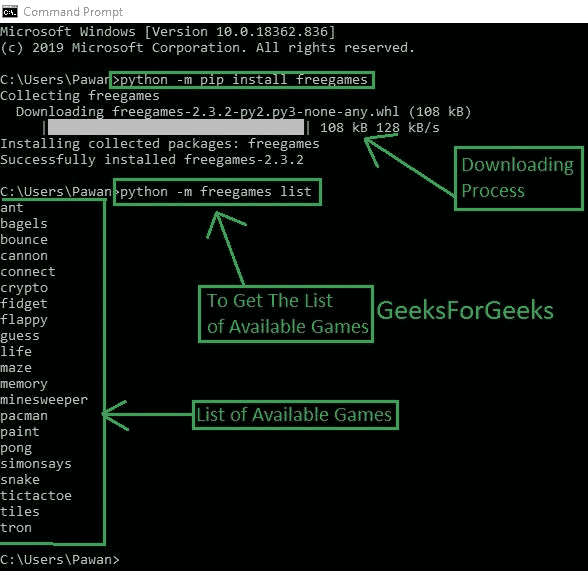
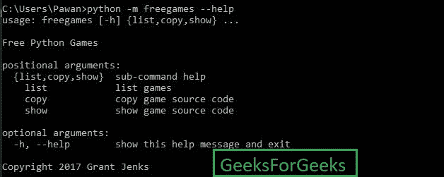
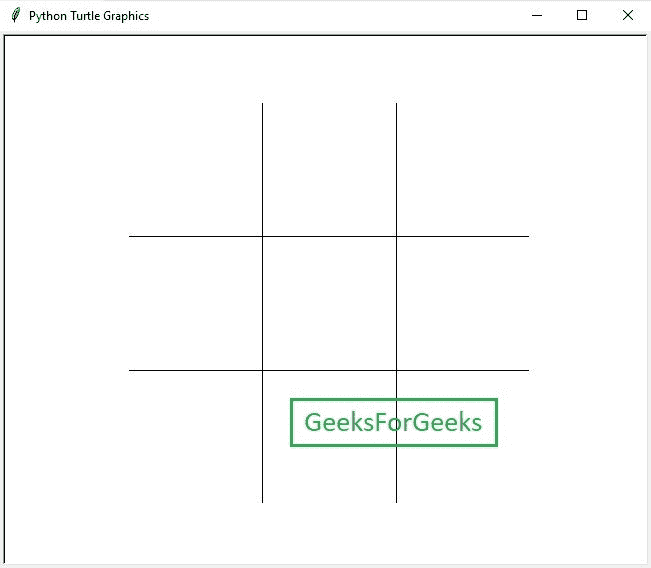

# Python 中的 FreeGames 模块

> 原文:[https://www.geeksforgeeks.org/freegames-module-in-python/](https://www.geeksforgeeks.org/freegames-module-in-python/)

Python 为您提供免费游戏，获取它们非常简单，您可以在您的计算机上运行它。那么，你对如何得到它们感到好奇吗？只需遵循这些简单的步骤:

**步骤#1:**

*   进入命令提示符，输入以下命令

    ```py
    python -m pip install freegames
    ```

*   等到安装过程完成
*   这个过程结束后，你就可以走了。

**第 2 步:**

*   让我们来看看 python 免费提供了多少款游戏和哪些游戏。要检查，请键入以下命令

    ```py
    python -m freegames list
    ```

*   点击进入后，会显示可用游戏列表
    

    Python 中的免费游戏

**第三步:**

*   免费 Python 游戏支持命令行界面(命令行界面是一种基于文本的用户界面，用于查看和管理计算机文件。命令行界面也称为命令行用户界面、控制台用户界面和角色用户界面)。
*   To get the help for the CLI type the below command

    ```py
    python -m freegames --help
    ```

    

    命令行界面

**步骤#4:**

*   要运行列表类型中的任何可用游戏，请键入以下命令。

    ```py
    python -m freegames.gamename"
    ```

*   之后只需点击进入运行游戏
*   你可以看到巨蟒龟图形将被显示。
    

    井字头(微塔式机)