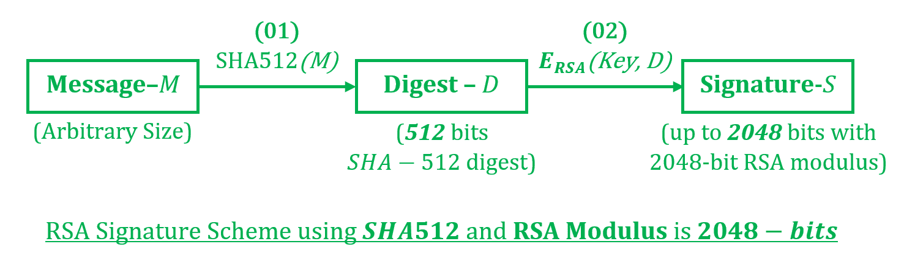

# Python 中可变哈希大小的全域哈希

> 原文:[https://www . geeksforgeeks . org/python 中带可变哈希大小的完整域哈希/](https://www.geeksforgeeks.org/full-domain-hashing-with-variable-hash-size-in-python/)

密码散列函数是一类特殊的散列函数，它具有某些特性，使其适用于密码学。这是一种将任意大小的数据映射到固定大小的位串(散列函数)的数学算法，该散列函数也被设计为单向函数，也就是说，一个不可反转的函数。在本文中，让我们了解一种具有可变散列大小的散列类型。
传统的 [**RSA 签名方案**](https://www.geeksforgeeks.org/rsa-digital-signature-scheme-using-python/) 基于以下步骤序列:

1.  获取要数字签名的消息–**M**
2.  使用 SHA 或其他哈希算法生成消息摘要–**H =哈希(M)**
3.  使用签名者的私钥加密消息摘要。加密结果是消息的签名–**S = E(private key，H)**

上述方案的一个潜在缺陷是 **RSA 系统最终未被充分利用**。让我们假设 RSA 模数的数量级为 *2048* 位。这意味着输入可以是高达 *2048* 位的任何值。然而，在签名方案中，RSA 系统的输入始终与哈希摘要的大小相同。因此，例如，如果签名方案中使用了[**【SHA-512】**](https://www.geeksforgeeks.org/sha-512-hash-in-java/)，那么 RSA 函数的所有输入将始终为 512 位。这使得大多数(**>)99%的 RSA 输入空间未被利用。由于输入空间利用不足，这会降低 RSA 系统的整体安全级别。** 



RSA 签名方案中的**全域散列** (FDH)方案通过将消息散列到 RSA 密码系统的全域上来缓解这种利用不足。因此，FDH 的目标是:

> 使用图像大小/摘要大小等于 RSA 模
> 大小的函数对消息进行散列

实现能够产生任意大小摘要的函数的两种基本方法是:

1.  重复散列消息(稍加修改)并连接
2.  使用**可扩展输出函数(XOF)** 哈希方法

**<u>【级联重复哈希】</u>**
虽然 SHA1、SHA256、SHA512 等传统哈希算法几乎没有足够的范围覆盖 RSA 系统的输入域，但我们可以通过这些哈希函数的重复应用来构建一个全域哈希方法。标准散列函数，比如 SHA512，被反复应用于消息，每次都将结果串联起来。这样做，直到达到所需的位数。
为了引入散列函数的随机化行为，在执行散列之前，在每次迭代时对消息进行一些修改，而不是重复散列相同的消息。这种修改的一个例子是在散列之前将迭代计数连接到消息。因此，FDH 函数被实现为:

如果 SHA512 散列被计算并连接 **N** 次，则总散列将具有 **N * 512** 的比特大小。假设该值大于所需的位数**‘K’**，我们可以提取前导的 **K** 位来获得所需的长度哈希。
以下是上述方法的实施:

## 蟒蛇 3

```
# Python program to demonstrate
# repeated hashing with
# concatenation

import binascii
from math import ceil
from hashlib import sha256

# Function to perform Full Domain
# Hash of 'message' using
# SHA512 with a digest of
# N bits
def fdh(message, n):

    result = []

    # Produce enough SHA512 digests
    # to make a composite digest
    # greater than or equal to N bits
    for i in range(ceil(n / 256)):

        # Append iteration count
        # to the message
        currentMsg = str(message) + str(i)

        # Add current hash to results list
        result.append(sha256((currentMsg).encode()).hexdigest())

    # Append all the computed hashes
    result = ''.join(result)

    # Obtaining binary representating
    resAsBinary = ''.join(format(ord(x), 'b') for x in result)

    # Trimming the hash to the
    # required size by taking
    # only the leading bits
    resAsBinary = resAsBinary[:n]

    # Converting back to the
    # ASCII from binary format
    return binascii.unhexlify('00%x' % int(resAsBinary, 2)).hex()

# Driver code
if __name__ == '__main__':
    # Message to be hashed
    message = "GeeksForGeeks"

    # Generate a 600 bit
    # hash using SHA256
    print(fdh(message, 600))
```

**Output:** 

00 cf 161 c 36 df 4db 9 e 30d 79 cf 9 CB 3d 72 e 1934 cbaeb 9 EB 8638 f0f 1872679 e 1 df 9c 3932 c 77 c 70 c 98 EFA 64d 34 e 3166 c 5 b 698738 b 36d 9 b 87261 c 5 AE 3 c 61883 c 98 e 19b 362 db 1 c 73658 f 0 e 4 c 9

**<u>使用可扩展输出函数(XOF)哈希方法</u>**
可扩展输出函数是一类哈希函数，与传统哈希函数不同，它可以在消息摘要中生成任意大的位序列。这与由固定输出大小定义的常规散列函数形成强烈对比。在最近推出的 [**SHA-3**](https://en.wikipedia.org/wiki/SHA-3) 方案中，XOF 采用了 **SHAKE128** 和 **SHAKE256** 算法。它们遵循 [**海绵构造**](https://en.wikipedia.org/wiki/Sponge_function) 的一般属性。海绵函数可以生成任意长度的输出。名称中的 128 和 256 表示其最大安全级别(以位为单位)，如 [FIPS 202](http://nvlpubs.nist.gov/nistpubs/FIPS/NIST.FIPS.202.pdf) 第 A.1 和 A.2 节所述。
为了利用 Python 中 SHA-3 的功能，可以如下使用 **PyCryptodome** 库:

## 蟒蛇 3

```
# Python program to demonstrate
# the SHA-3 algorithm

from Crypto.Hash import SHAKE256
from binascii import hexlify

# Instantiate the SHAKE256 object
shake = SHAKE256.new()

# Set the message to be hashed
shake.update(b'GeeksForGeeks')

# Print a hash output of 50 bits size
print(hexlify(shake.read(50)))
```

**输出:**

> b65d 6 df 8d 88198 69 B3 cf 59 b 859d 72971 b 93 f 102 ca 20 af 812 b 931714 a 558 c 7 a 134 CB 3 bb 08335 f 470 c 890 BD 1d 509283558“
> ”

**注意:**上面的代码不会在联机 IDE 上运行，因为联机 IDE 缺少 Crypto 库。