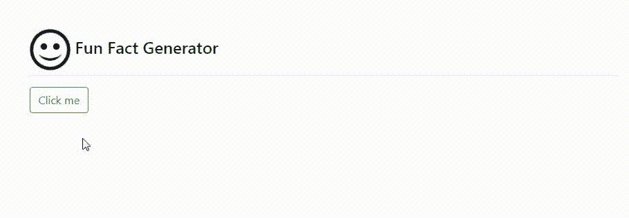

# Python 中的趣味事实生成器网络应用

> 原文:[https://www . geesforgeks . org/fun-fact-generator-web-app-in-python/](https://www.geeksforgeeks.org/fun-fact-generator-web-app-in-python/)

在本文中，我们将讨论如何使用 PyWebio 模块在 Python 中创建一个有趣的事实生成器网络应用程序。本质上，它将随机创建有趣的事实，并在网络界面上显示它们。该脚本将借助 **GET** 方法从**useessfacts . jsph . pl**中检索数据，我们将使用**请求**和 **JSON** 模块分别获取和加载数据。数据加载后，只需在字典中传递文本，这样我们就只能得到笑话。为了在网络上创建一个简单的交互界面，我们将使用 **PyWebIO** 模块。

PyWebIO 包含在浏览器上获取用户输入输出，将浏览器变成“富文本终端”的功能，可用于构建简单的 web 应用程序或基于浏览器的 GUI 应用程序。有了这个模块，任何人都可以在没有任何 HTML 和 JS 的先验知识或开销的情况下生成一个 web 应用程序。

可以使用以下命令安装:

```py
pip install pywebio
```

## 入门指南

按照以下步骤创建一个有趣的因素生成器网络应用程序。

*   导入所有必需的模块
*   使用 **requests.request()** 方法发送 **GET** 请求，并使用 **json.loads()** 函数解析有效的 **JSON** 消息并将其转换为 Python 字典。由于**请求**功能会创建一个项目字典，我们只需要文本，所以我们会在 json 模块内部传递 **response.text** 。
*   现在，因为我们需要文本，即事实，我们将在**数据列表**中传递文本，并使用 **pywebio** 模块中定义的**样式**功能打印事实。因为数据是一个包含几个无用项目的随机笑话的字典，我们将只得到文本部分。

下面给出了使用上述方法的完整实现。

**程序:**

## 蟒蛇 3

```py
# import the following modules
import json
import requests
from pywebio.input import *
from pywebio.output import *
from pywebio.session import *

def get_fun_fact(_):

    # Clear the above screen
    clear()

    put_html("<p align=""left""><h2>  \
             Fun Fact Generator</h2></p>
")

    # URL from where we will fetch the data
    url = "https://uselessfacts.jsph.pl/random.json?language=en"

    # Use GET request
    response = requests.request("GET", url)  

    # Load the request in json file
    data = json.loads(response.text)

    # we will need 'text' from the list, so 
    # pass 'text' in the list
    useless_fact = data['text']

    # Put the facts in the blue colour
    # Put the click me button
    style(put_text(useless_fact), 'color:blue; font-size: 30px')
    put_buttons(
        [dict(label='Click me', value='outline-success', 
              color='outline-success')], onclick=get_fun_fact)  

# Driver Function
if __name__ == '__main__':

    # Put a heading "Fun Fact Generator"
    put_html("<p align=""left""><h2>  \
             Fun Fact Generator</h2></p>
")

    # hold the session for long time
    # Put a Click me button
    put_buttons(
        [dict(label='Click me', value='outline-success', 
              color='outline-success')], onclick=get_fun_fact)  
hold()  
```

**输出:**

