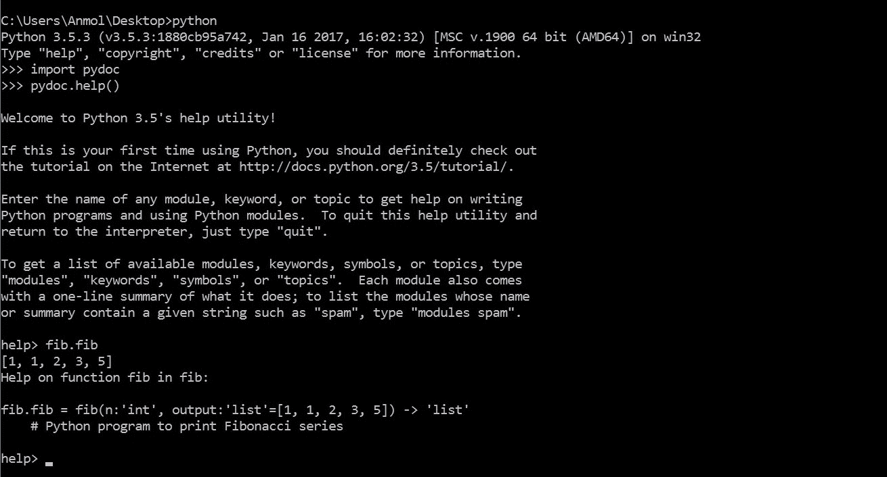
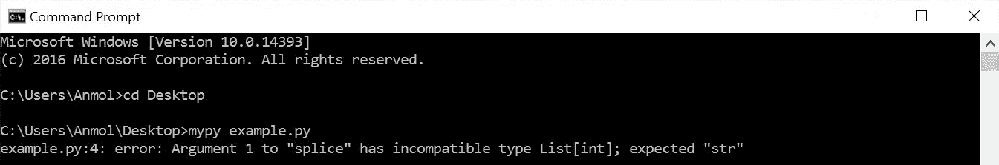
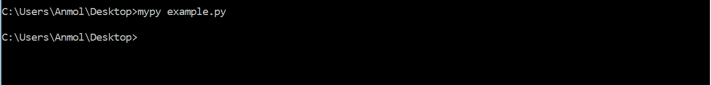
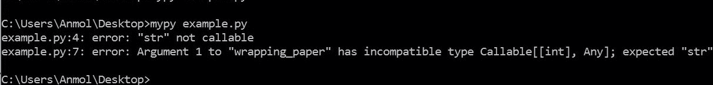
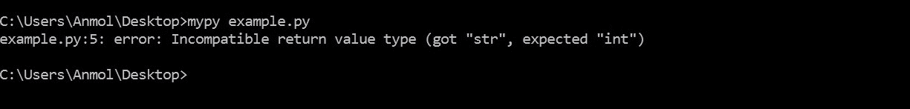
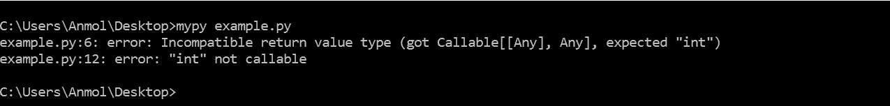

# Python 中的函数注释

> 原文:[https://www.geeksforgeeks.org/function-annotations-python/](https://www.geeksforgeeks.org/function-annotations-python/)

**基本术语**

**PEP:** PEP 代表 Python 增强提案。这是一个描述 Python 或其过程或环境的新特性的设计文档。它还向 python 社区提供信息。
PEP 是提出主要新特性的主要机制，例如–Python Web 服务器网关接口，收集社区对问题的意见并记录已经用 Python 实现的设计决策。

**函数注释–PEP 3107:**PEP-3107 介绍了在 Python 中添加任意元数据注释的概念和语法。它是在 Python3 中引入的，以前是在 python 2.x 中使用外部库实现的

**什么是函数注释？**

函数注释是任意的 python 表达式，与函数的各个部分相关联。这些表达式是在编译时计算的，在 python 的运行时环境中没有生命。Python 没有给这些注释附加任何意义。当被第三方库解释时，比如 mypy，它们会夺走生命。

**函数注释的目的:**
函数注释的好处只能通过第三方库获得。好处的类型取决于库的类型，例如

1.  Python supports dynamic typing and hence no module is provided for type checking. Annotations like

    ```py
    [def foo(a:”int”, b:”float”=5.0)  -> ”int”]
    ```

    (下一节将详细描述语法)可用于收集关于参数类型和函数返回类型的信息，以跟踪函数中发生的类型变化。mypy 就是这样一个库。

2.  库可以使用基于字符串的注释在编译时提供关于各种方法、类和模块的功能的更好的帮助消息。

**函数注释的语法**

它们就像参数名称后面的可选参数。

**Note:**

*   **简单参数的注释:**参数名后面跟“:”，然后跟表达式。注释语法如下所示。

    ```py
    def foobar(a: expression, b: expression = 5): 
    ```

    *   **多余参数的注释:**多余参数，例如*args 和**kwargs，允许在函数调用中传递任意数量的参数。这些参数的注释语法如下所示。

    ```py
    def foobar(*args: expression, *kwargs: expression): 
    ```

    *   **嵌套参数的注释:**嵌套参数是 python 2x 的一个有用特性，在函数调用中传递元组，并进行自动解包。python 3x 中删除了该功能，应该进行手动解包。注释是在变量之后而不是元组之后完成的，如下所示。

    ```py
    def foobar((a: expression, b: expression), (c: expression, d: expression)): 
    ```

    *   **Annotations for return type :** Annotating return type is slightly different from annotating function arguments. The ‘->’ is followed by expression which is further followed by ‘:’. Annotation syntax of return type is shown below.

    ```py
    def foobar(a: expression)->expression:
    ```

    **语法**

    ```py
    decorator    :  ‘@’ name_  [‘(’ [arglist] ‘)’] NEWLINE
    decorators   :  decorator+
    funcdef      :  [decorators] ‘def’ NAME parameters [‘->’] ‘:’ suite
    parameters   :  ‘(’ [typedarglist] ‘)’
    typedarglist :  (( tfpdef [‘=’ test] ‘, ’)* (‘*’ [tname]
    (‘, ’ tname [‘=’ test])* [‘, ’ ‘ **’ tname] | ‘**’ tname)
    | tfpdef [‘=’ test (‘, ’ tfpdef [‘=’ test])* [‘, ’]])
    tname        :  NAME [‘:’ test]
    tfpdef       :  tname | ‘(’ tfplist ‘)’
    tfplist      :  tfpdef (‘, ’ tfpdef)* [‘, ’]

    ```

    **可视化语法:**解析树由上述语法形成，以更好地可视化 python 函数的语法和函数注释。
    T3】

    **样本代码**

    下面的代码将澄清一个事实，即函数注释在运行时不会被计算。代码打印斐波那契数列到 n 位置。

    ```py
    # Python program to print Fibonacci series
    def fib(n:'int', output:'list'=[])-> 'list':
        if n == 0:
            return output
        else:
            if len(output)< 2:
                output.append(1)
                fib(n-1, output)
            else:
                last = output[-1]
                second_last = output[-2]
                output.append(last + second_last)
                fib(n-1, output)
            return output
    print(fib(5))
    ```

    ```py
    Output: [1, 1, 2, 3, 5]
    ```

    注意:函数注释只在 python 3x 中支持。

    **访问功能注释**

    **1。使用“__annotations__”**:上述代码中的函数注释可以通过特殊属性“_ _ annotations _ _”进行访问。它输出具有特殊关键字“return”的字典和具有注释参数名称的其他关键字。下面的代码将打印注释。

    ```py
    # Python program to illustrate Function Annotations
    def fib(n:'int', output:'list'=[])-> 'list':
        if n == 0:
            return output
        else:
            if len(output)< 2:
                output.append(1)
                fib(n-1, output)
            else:
                last = output[-1]
                second_last = output[-2]
                output.append(last + second_last)
                fib(n-1, output)
            return output
    print(fib.__annotations__)
    ```

    ```py
    Output: {'return': 'list', 'n': 'int', 'output': 'list'}

    ```

    **2。使用标准模块“pydoc”**:“pydoc”是一个标准的 python 模块，它返回 python 模块内部的文档(如果有)。它有一个特殊的“help()”方法，该方法提供了一个交互式外壳来获取任何关键字、方法、类或模块的帮助。“help()”可用于访问函数注释。下图显示了上述斐波那契数列代码中的函数注释。模块名为“fib.py”。

    

    **3。使用标准模块“inspect”**:“inspect”模块提供了几个有用的函数来帮助获取关于活动对象的信息，例如模块、类、方法、函数、回溯、框架对象和代码对象。我们可以使用模块的“getfullargspec”方法来获取包含注释的函数的完整信息。

    ```py
    # Python program to illustrate Function Annotations
    import inspect
    def fib(n:'int', output:'list'=[])-> 'list':
        if n == 0:
            return output
        else:
            if len(output)< 2:
                output.append(1)
                fib(n-1, output)
            else:
                last = output[-1]
                second_last = output[-2]
                output.append(last + second_last)
                fib(n-1, output)
            return output
    print(inspect.getfullargspec(fib))
    ```

    ```py
    Output: FullArgSpec(args=['n', 'output'], varargs=None,
     varkw=None, defaults=([], ), kwonlyargs=[],
    kwonlydefaults=None, annotations=
    {'output': 'list', 'return': 'list', 'n': 'int'})
    ```

    **函数注释的应用**

    *   **使用“mypy”:**“mypy”是一个外部库，借助函数注释提供静态类型检查。
        下载 python 2x 的 mypy
         ```py
    pip install mypy
    ```

    巨蟒 3x

    ```py
    pip install git+git://github.com/JukkaL/mypy.git
    ```

    例 1:

    ```py
    # String slicing function that returns a string from start index to end index.
    def slice(string:str, start: int, end: int) -> str:
        return string[start:end]

    slice([1, 2, 3, 4, 5], 2, 4)
    ```

    将上述代码保存为示例. py，并在安装 mypy 后运行以下命令。确保您在保存文件的目录中。

    ```py
    mypy example.py
    ```

    你会得到以下结果。
    ***   **Things are little different when the [decorators](https://www.geeksforgeeks.org/function-decorators-in-python-set-1-introduction/) are involved.
    **Example 2(part a): Type checking of the parameters of the wrapped up function ‘gift_func’ and ‘wrapped’**

    ```py
    def wrapping_paper(func):
        def wrapped(gift:int):
            return 'I got a wrapped up {} for you'.format(str(func(gift)))
        return wrapped

    @wrapping_paper
    def gift_func(giftname:int):
        return giftname

    print(gift_func('gtx 5000'))
    ```

    起初，将字符串作为参数传递似乎会返回一个错误，因为所需的数据类型是在“gift_func”和“wrapped”中注释的“int”。mypy 没有在包装函数参数中建立类型检查，但是可以检查装饰器的类型检查和包装函数的返回类型。因此，从上面的代码中可以预期以下结果。
    ** *   ****Example 2(part b): Typechecking of the parameters of the decorator ‘wrapping_paper’.**

    ```py
    def wrapping_paper(func:str):    
        def wrapped(gift:int):
            return 'I got a wrapped up {} for you'.format(str(func(gift)))
        return wrapped

    @wrapping_paper
    def gift_func(giftname:int):
        return giftname

    print(gift_func('gtx 5000'))
    ```

    现在，您将获得以下结果。
    ** *   ****Example 2(part c): Typechecking of the return type of ‘gift_func’ and ‘wrapped’**

    ```py
    # Suppose we want the return type to be int
    from typing import Callable
    def wrapping_paper(func):
        def wrapped(gift) -> int:
            return 'I got a wrapped up {} for you'.format(str(func(gift)))
        return wrapped

    @wrapping_paper
    def gift_func(giftname) -> int:
        return giftname

    print(gift_func('gtx 5000'))
    ```

    您将得到以下结果。
    ** *   ****Example 2(part d) Typechecking of the return type of the wrapper function ‘wrapping_paper’**

    ```py
    # Suppose we want the return type to be int
    from typing import Callable
    def wrapping_paper(func) -> int:
        def wrapped(gift):
            return 'I got a wrapped up {} for you'.format(str(func(gift)))
        return wrapped

    @wrapping_paper
    def gift_func(giftname):
        return giftname

    print(gift_func('gtx 5000'))
    ```

    你会得到如下结果

    本文由 **Anmol Chachra** 供稿。如果你喜欢 GeeksforGeeks 并想投稿，你也可以使用[contribute.geeksforgeeks.org](http://www.contribute.geeksforgeeks.org)写一篇文章或者把你的文章邮寄到 contribute@geeksforgeeks.org。看到你的文章出现在极客博客主页上，帮助其他极客。

    如果你发现任何不正确的地方，或者你想分享更多关于上面讨论的话题的信息，请写评论。**