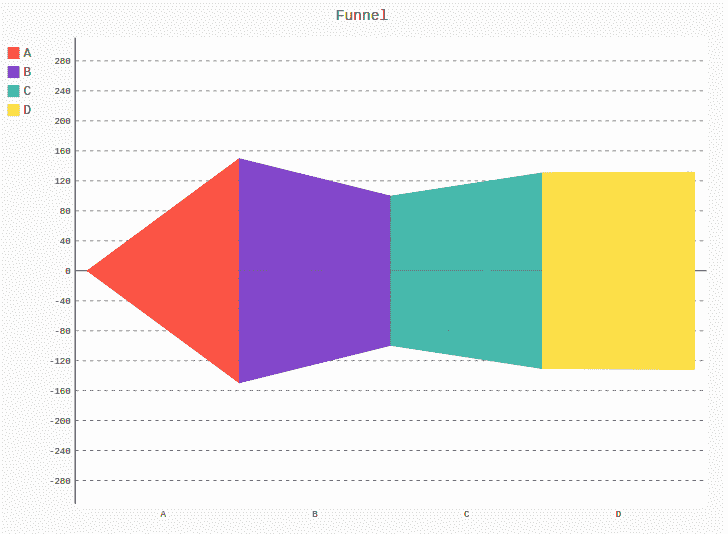
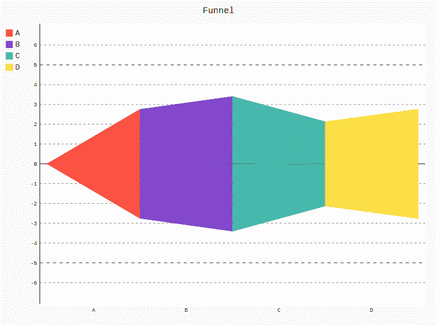

# Pygal 的漏斗图

> 原文:[https://www.geeksforgeeks.org/funnel-chart-in-pygal/](https://www.geeksforgeeks.org/funnel-chart-in-pygal/)

**Pygal** 是一个 Python 模块，主要用于构建 SVG(标量矢量图形)图形和图表。SVG 是一种基于矢量的 XML 格式的图形，可以在任何编辑器中编辑。Pygal 可以用最少的代码行创建图表，这些代码行易于理解和编写。

## 皮格尔的漏斗

**漏斗图**是一种图表类型，通常用于表示销售和服务流程中的各个阶段，并允许显示每个阶段的收入金额。该图表对于识别组织销售和服务进度中的潜在错误非常有益。漏斗图类似于堆积条形图。漏斗图有助于汇总数据并跟踪销售转化率和保留率。此外，它还可以用来跟踪商业战略的成功。可以使用`Funnel()`方法创建。

**语法:**

```py
funnel_chart = pygal.Funnel()
```

**例 1:**

```py
# importing pygal
import pygal

# creating the chart object
funnel = pygal.Funnel()

# naming the title
funnel.title = 'Funnel'        

# Random data
funnel.add('A', [26, 22, 39, 39, 32, 30, 33, 24, 24, 30])
funnel.add('B', [31, 40, None, None, None, None, 40, 32, 25, 31])
funnel.add('C', [37, 27, 31, 20, None, 32, 24, 39, 29, 22])
funnel.add('D', [38, None, 20, 29, 33, 23, 32, 33, 32, 23])

funnel
```

**输出:**



**例 2:**

```py
# importing pygal
import pygal
import numpy

# creating the chart object
funnel = pygal.Funnel()

# naming the title
funnel.title = 'Funnel'        

# Random data
funnel.add('A', numpy.random.rand(10))
funnel.add('B', numpy.random.rand(10))
funnel.add('C', numpy.random.rand(10))
funnel.add('D', numpy.random.rand(10))

funnel
```

**输出:**

