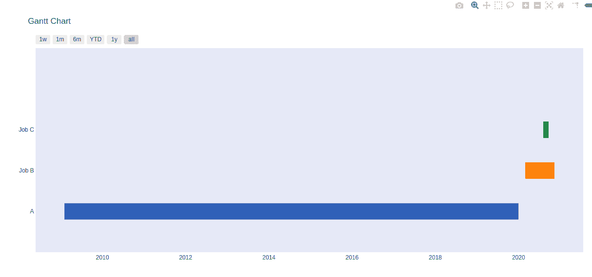
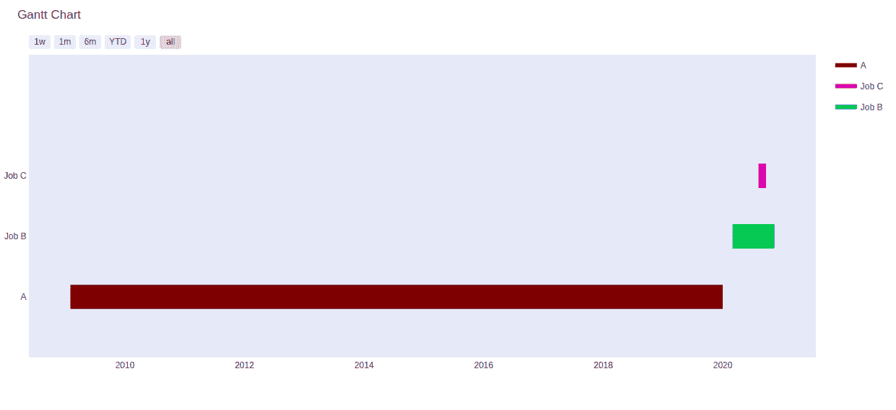

# 图表中的甘特图

> 原文:[https://www.geeksforgeeks.org/gantt-chart-in-plotly/](https://www.geeksforgeeks.org/gantt-chart-in-plotly/)

Plotly 是一个 Python 库，用于设计图形，尤其是交互式图形。它可以绘制各种图形和图表，如直方图、条形图、箱线图、展开图等。它主要用于数据分析以及财务分析。plotly 是一个交互式可视化库。

## 线条图

甘特图与描绘项目日程的条形图平行。在甘特图中，任务在纵轴上执行，时间间隔在横轴上执行。图表中横条的宽度显示了两种活动的持久性。甘特图由许多不同的元素组成。主要的 8 个关键组件是:

*   任务列表
*   时间表
*   国际日期变更线
*   酒吧
*   里程碑
*   属国
*   进步
*   分配的资源

> **语法:**plot . figure _ factory . create _ gant(df，colors=None，index_col=None，show_colorbar=False，reverse_colors=False，title= '甘特图'，bar_width=0.2，showgrid_x=False，showgrid_y=False，height=600，width=None，tasks=None，task _ names = None，data=None，group_tasks=False，show_hover_fill=True)
> 
> **参数:**
> 
> **df:** 甘特图的输入数据。必须是数据帧或列表。
> 
> **颜色:**一个绘图比例名称、一个 rgb 或 hex 颜色、一个颜色元组或一个**颜色列表**
> 
> **show_colorbar:** 确定 colorbar 是否可见。仅当索引列中的值为数字时适用。
> 
> **显示 _ 悬停 _ 填充:**启用/禁用图表填充区域的悬停文本。
> 
> **标题:**图表标题
> 
> **高度:**图表的高度
> 
> **重量:**图表的重量

**例 1:**

## 蟒蛇 3

```
import plotly.figure_factory as ff

df = [dict(Task="A", Start='2020-01-01', Finish='2009-02-02'),
      dict(Task="Job B", Start='2020-03-01', Finish='2020-11-11'),
      dict(Task="Job C", Start='2020-08-06', Finish='2020-09-21')]

fig = ff.create_gantt(df)
fig.show()
```

**输出:**



**例 2:**

## 蟒蛇 3

```
import plotly.figure_factory as ff

df = [dict(Task="A", Start='2020-01-01', Finish='2009-02-02'),
      dict(Task="Job B", Start='2020-03-01', Finish='2020-11-11'),
      dict(Task="Job C", Start='2020-08-06', Finish='2020-09-21')]

colors = ['#7a0504', (0.2, 0.7, 0.3), 'rgb(210, 60, 180)']

fig = ff.create_gantt(df, show_colorbar = True, colors = colors    )
fig.show()
```

**输出:**

