# 门控循环单位网络

> 原文:[https://www . geesforgeks . org/gated-recursive-unit-networks/](https://www.geeksforgeeks.org/gated-recurrent-unit-networks/)

**先决条件:递归神经网络、长短期记忆网络**

为了解决基本递归神经网络运行过程中经常遇到的消失-爆炸梯度问题，开发了许多变体。最著名的变体之一是**长短期记忆网络(LSTM)** 。一个不太为人知但同样有效的变体是**门控循环单位网络(GRU)** 。

与 LSTM 不同，它仅由三个门组成，不维持内部单元状态。存储在 LSTM 循环单元的内部单元状态中的信息被合并到门控循环单元的隐藏状态中。这些集体信息被传递到下一个门控循环单元。GRU 的不同大门如下所述

1.  **更新门(z):** 它决定了有多少过去的知识需要传递到未来。它类似于 LSTM 循环单位中的输出门。
2.  **重置门(r):** 它决定了要忘记多少过去的知识。它类似于 LSTM 循环单元中输入门和遗忘门的组合。
3.  **电流记忆门(**  **):** 在典型的门控循环单位网络讨论中，经常被忽略。它被并入复位门，就像输入调制门是输入门的一个子部分一样，用于将一些非线性引入输入，并使输入为零均值。使其成为重置门的一个子部分的另一个原因是为了减少以前的信息对传递到未来的当前信息的影响。

门控递归单元网络的基本工作流程与基本递归神经网络的工作流程相似，两者的主要区别在于每个递归单元的内部工作，因为门控递归单元网络由调节当前输入和先前隐藏状态的门组成。

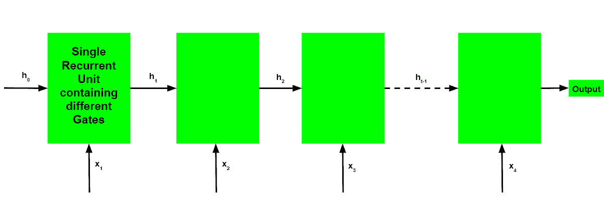

**门控循环单元的工作:**

*   将输入的当前输入和之前的隐藏状态作为向量。
*   按照下面给出的步骤计算三个不同门的值
    1.  对于每个门，通过在相关向量和每个门的相应权重之间执行逐元素乘法(hadmard 乘积)来计算参数化的当前输入和先前隐藏的状态向量。
    2.  在参数化向量上对每个门元素应用各自的激活函数。下面给出的是具有激活功能的闸门列表，适用于闸门。

```py
Update Gate : Sigmoid Function
Reset Gate  : Sigmoid Function
```

*   The process of calculating the Current Memory Gate is a little different. First, the Hadmard product of the Reset Gate and the previously hidden state vector is calculated. Then this vector is parameterized and then added to the parameterized current input vector. 

    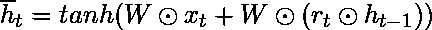

*   To calculate the current hidden state, first, a vector of ones and the same dimensions as that of the input is defined. This vector will be called ones and mathematically be denoted by 1\. First, calculate the hadmard product of the update gate and the previously hidden state vector. Then generate a new vector by subtracting the update gate from ones and then calculate the hadmard product of the newly generated vector with the current memory gate. Finally, add the two vectors to get the currently hidden state vector.
    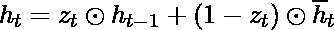

    上述工作陈述如下

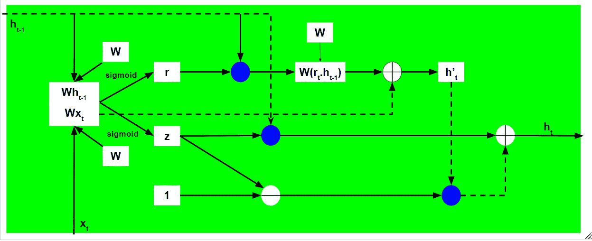

请注意，蓝色圆圈表示元素式乘法。圆圈中的正号表示矢量加法，负号表示矢量减法(带负值的矢量加法)。权重矩阵 W 包含当前输入向量和每个门的先前隐藏状态的不同权重。

就像递归神经网络一样，GRU 网络也在每个时间步长生成一个输出，该输出用于使用梯度下降来训练网络。


请注意，就像工作流程一样，GRU 网络的训练过程也与基本递归神经网络的训练过程类似，只是每个递归单元的内部工作不同。

门控循环单位网络的时间反向传播算法类似于长短期记忆网络，不同之处仅在于差分链的形成。

设为各时间步的预测输出，为各时间步的实际输出。那么每个时间步长的误差由下式给出


因此，总误差由所有时间步长的误差总和给出。


类似地，值可以计算为每个时间步长的梯度之和。


使用链式法则，并利用是的函数并且确实是的函数的事实，出现以下表达式:-

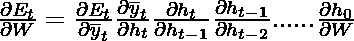

因此，总误差梯度由下式给出


请注意，梯度方程包含一系列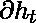，看起来类似于基本的递归神经网络，但由于导数的内部工作原理，该方程的工作原理不同。

**门控递归单元如何解决渐变消失的问题？**

梯度的值由从开始的导数链控制。回忆一下的表达方式:-


使用上述表达式，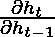的值为:-

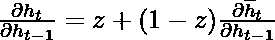

回忆一下的表达方式:-

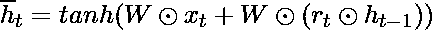

用上面的表达式计算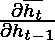的值:-

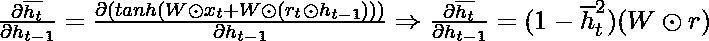

由于更新门和复位门都使用 sigmoid 函数作为其激活函数，因此两者都可以取值 0 或 1。

**情况 1(z = 1):**

在这种情况下，不考虑的值，术语等于 z，而 z 又等于 1。

**2A 案例(z=0，r=0):**

在这种情况下，术语等于 0。

**2B 案例(z=0，r=1):**

在这种情况下，术语等于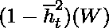。该值由可训练的权重矩阵控制，因此网络学习调整权重，使得术语更接近 1。

因此，通过时间的反向传播算法以这样的方式调整各自的权重，使得导数链的值尽可能接近 1。